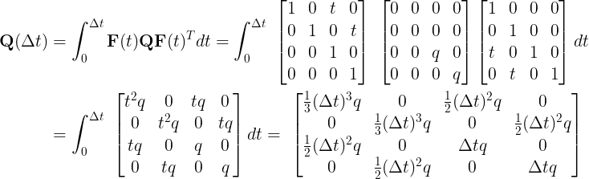

# Process Noise Covariance Q

> Part of: **Extended Kalman Filters**

## Video

[Watch on YouTube](https://www.youtube.com/watch?v=Y6YYVGr0lMk)

## Summary

**Kalman Filter Process Noise Covariance Q**

This README file summarizes the key concepts related to the process noise covariance Q in the prediction step of the Kalman Filter. The process noise covariance Q reflects everything that does not fit the constant velocity assumption, such as acceleration.

### Key Concepts

* **Process Noise**: The process noise with covariance Q represents all the uncertainties in the system that are not accounted for by the constant velocity assumption.
* **Zero Mean Process Noise**: The expectation of the process noise is always zero, meaning it has no bias.
* **Q Matrix**: The continuous Q matrix is a 2x2 matrix that depends on the timestep Delta t and a design parameter lowercase q.
* **Discretization Formula for Q**: The discretization formula for Q is derived from the continuous Q matrix and depends on the timestep Delta t and lowercase q.

### Practical Notes

* When choosing the value of lowercase q, consider the expected maximum change in velocity. For highly dynamic maneuvers, a higher process noise (e.g., 8 m/s^2) may be necessary.
* In practice, it can be challenging to design a single fusion system that works for all situations, such as self-driving cars. One solution is to use two separate fusion parameterizations: one for normal situations and another for collision avoidance scenarios with a more sensitive parameterization.

**Example Code**
```markdown
// Example Q matrix in continuous form
Q = [[0.5 * Delta_t, 0],
     [0, 0.5 * Delta_t]]

// Discretized Q formula
Q_discrete = (Delta_t / 2) * [[1, 0],
                             [0, 1]]
```
Note: The code examples are for illustration purposes only and may not be directly applicable to specific use cases.

## Transcript

Here we are in the lesson map. Let's take a closer look at the process known as Q in the prediction step. We just learned that the time elapsed between two measurements, Delta t may vary in practical applications, and we learned how to build up a 4D state matrix F depending on Delta t. So we will update F at each timestep. Similarly, we have to calculate the process noise covariance Q for this timestep.

Remember that the process noise new with covariance Q reflects everything that does not fit our constant velocity assumption, for example, acceleration. We assume the process noise to be zero mean, so the expectation of the process noise is always zero. Therefore, the process noise is not included in the Kalman Filter state prediction, but we need the covariance Q to correctly update our estimation error covariance P. We can assume the noise to acceleration to only affect the velocity because this will implicitly also affect the position in the next step, therefore, the continuous Q matrix looks like this. Discretization leads to the following formula for Q.

You can find the derivation below this video. It is not required to understand each derivation step in detail, although it would be a good exercise to calculate the steps on your own if you want to go the extra mile. The important thing here is that Q depends on the timestep Delta t, as well as on a design parameter lowercase q. You should choose lowercase q, depending on the expected maximum change in velocity. For highly dynamic maneuvers, you could use a higher process noise, for example, eight meters per second square would fit for emergency braking whereas for normal situations on a highway, smaller values would be sufficient.

This shows how difficult it is in practice to realize a single fusion system for all situations that occur with a self-driving car. One solution can be to use two separate fusion parameterizations. One parameterization to realize a smooth fusion output for normal situations, and a parallel collision avoidance fusion with a much more sensitive parameterization.

## Images


*Calculating Q*

## Additional Content

## Process Noise Covariance Q
If we assume the noise through acceleration in

$x$

and

$y$

to be equal,

$\nu_x = \nu_{y}$

, the continuous process noise covariance

$\mathbf Q$

can be modelled as:

$$\mathbf{Q}= E\left[\nu\nu^T\right]
 = 
\begin{pmatrix}
0 & 0 & 0 & 0  \\
0 & 0 & 0 & 0 \\
0 & 0  & E\left[\nu_{ x}^2\right] & 0 \\
0 & 0 & 0 & E\left[\nu_{ y}^2\right]
\end{pmatrix}
=
\begin{pmatrix}
0 & 0 & 0 & 0 \\
0 & 0 & 0 & 0 \\
0 &  0 & q & 0 \\
 0 & 0 & 0 & q
\end{pmatrix}$$

Discretizing the continuous model leads to a formula for **Q** depending on

$\Delta t$

.
Here

$q$

is a design parameter and should be chosen depending on the expected maximum change in velocity. For highly dynamic maneuvers, we could use a higher process noise, e.g.

$q=\left(8\,\frac{\text m}{s^2}\right)^2$

would fit for emergency braking, whereas for normal situations on a highway e.g.

$q=\left(3\,\frac{\text m}{s^2}\right)^2$

could be an adequate choice.
