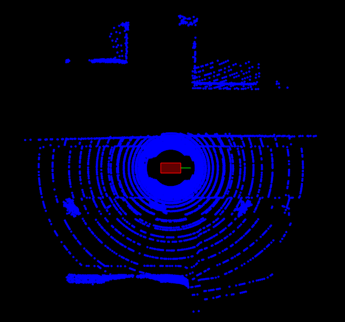
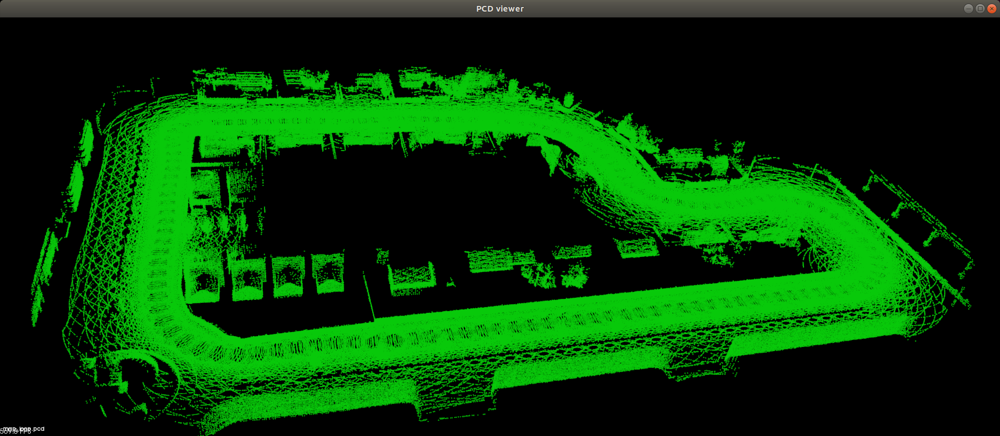

# Mapping in the Simulator

> Part of: **Utilizing Scan Matching**

## Video

[Watch on YouTube](https://www.youtube.com/watch?v=u69dPYViWqw)

## Summary

**README: Mapping with CARLA Simulator**

This project involves using the CARLA simulator to create maps of an environment. The main goal is to understand how to transform lidar data from a local reference frame to a global reference frame, and then use this transformed data to generate a map.

### Key Concepts

* **Transformation Matrix**: A four-by-four matrix used to convert coordinates from one reference frame to another.
* **Pose**: A representation of an object's position and orientation in 3D space.
* **Lidar Sensor Frame of Reference**: The coordinate system used by the lidar sensor to measure distances and angles.
* **Global Reference Frame**: The overall coordinate system used to represent the environment.
* **CARLA Simulator**: An open-source simulator for autonomous driving environments.
* **PCL (Point Cloud Library)**: A library for processing 3D point cloud data.

### Practical Notes

To complete this exercise, you will need to:

1. Get a transformation matrix from pose using the `transform_3d_from_helper` function.
2. Multiply the transformation matrix by local points from the lidar sensor to convert them to the global reference frame.
3. Run the CARLA simulator and move the car around in the environment using the arrow keys, acceleration, and steering controls.
4. Use the PCL library to visualize the transformed point cloud data and create a map of the environment.
5. Save the final map as a `.pcd` file by pressing the `S` key.

Note: This exercise assumes you have already set up the CARLA simulator and have access to the necessary software and hardware.

## Transcript

All right. Now we're going to look at one of my favorite sections, and there's a lot of fun [inaudible] this as well. This is a mapping, and now we really get to have some fun and use the Carlo Simulator as well and generate some maps given its lighter data. In this exercise, what you'll be working with is so if we come down here, we have this lidar listener. Here you're just going to do two things, in order to create a map.

You'll be familiar with this from the other exercises. Get a transformation matrix from pose since here pose is being passed into the listener here. Pose first initializes 000 of this positional rotation, and so just take that pose, turn it into a four-by-four matrix using the transform 3D from Helper. Then I'll just go ahead and multiply that by local point. That'll do the conversion.

This local points from the lidar and it's currently in the lidar sensor frame of reference, then doing that transformation will just bring it to that global reference frame. Just go ahead. That transformations are four by four times this four by one local point, and we can see that's a four by one here, the four elements. Then that is all you need to do for this exercise, but also this exercise, its main purpose is to introduce you to running the Carlo Simulator and moving the Carlo around in the environment. So in the next video, we'll look at starting the program and how to do that.

Let's run the Macro program. From the workspace, let's go into desktop, go into the terminator, and then cd into home, workspace, c3-mapping, and then let's go ahead and we're going to want to create two tabs. So could do "Control Shift T" when creating a new tab. Then in this one, we'll go ahead and run CARLA. In order to that, we need to do su-student, and it says permission denied.

But you can see, I'm still student anyway. Then I want to go back into home, workspace, c3, and then do run CARLA, said its launch CARLA and then back in this window here. Let's go ahead and make that. Now, we have this cloud mapper and launch that. It's interfacing with the CARLA headless mode that we launched in the other window, and we can see our car here.

We can start dragging it around by pressing on the "Arrow keys". You can see right now, that it's as taking all the scans, and it's putting it all here in the origin because this reference frame is just the LIDAR sensor. After you complete the exercise and you do the transformation, that's coming from the simulator, the actual pose, then you'll start to see a map that makes sense. But here, I'm just pressing up, and tapping up on the keyboard to get the acceleration going, and then I can hit down on the keyboard just to make it stop. I can move the keyboard left and right to change this steering angle here.

That's represented by this green line that's coming out of here. I can get the cursor on speed, and then I can drive around. Now, I'm blind right now because all my scans that I'm getting are just being piled up over here in that LIDAR reference frame. But, after you get that transformation going, you can actually drive around, and create maps out of CARLA. Let's see some other buttons you can hit "a" to do a top-down alignment right away.

You're over here, you can hit "a" you can go backwards, you can hit "down" on the keyboard to drive in reverse. Yeah, so use this, they get familiar with driving around. This is a pretty interesting, everything's running over in the CARLA simulator and then PCL is just visualizing everything. Use this exercise to complete the transform then you can create maps. The final step here is if you hit "S", it takes that and it saves it as a map.

Let's see, save PCD map, and now that'll be saved as my mapped dot PCD.

## Images

*Red box is the car, steering angle is green line extending out front of the car. Scans come in as blue point clouds.*

*Point cloud map created by driving around in a loop. Point cloud is about 28MB and consists of 895018 points.*

## Additional Content

## Mapping: The Code
### Mapping Demo
## Moving the Car in the Simulator

In this exercise you will learn how to make your own point cloud maps which you can use in the final project of this course. You will also become familiar with running and controlling the Carla simulator in parallel with your code. The Carla simulator is launched first separately in background mode by running `./run_carla.sh`. Then the mapping code is started by running `./cloud_mapper` which visualizes the simulated car's position and it's 3D scans of the environment.  For your first task try launching the `cloud_mapper` program  and using the following listed keys below to control the simulated car. The car has a green line extending out of it which represents the car's set steering angle.

## Controlling the car

You will be manually controlling the simulation car. To do this PCL has a listener in its viewer window. First click on the view window to activate the keyboard listener and then the following keys can be used to actuate the car. Note in order not to overwhelm the listener refrain from holding down keys and instead just tap keys.

### Throttle ( UP Key )

Each tap will increase the throttle power. Three presses is a good amount of throttle power.

### Reverse/Stop ( Down Key )

A single tap will stop the car and reset the throttle to zero if it is moving. If the car is not moving it will apply throttle in the reverse direction.

### Steer ( Left/Right Keys )

Tap these keys to incrementally change the steer angle. The green line extruding out in front of the red box in the image above represents the steer value and its end point will move left/right depending on the current value.

### Center Camera ( a )

Press this key to recenter the camera with a top down view of the car.

### Rotate Camera ( mouse left click and drag )

### Pan Camera ( mouse middle button and drag)

### Zoom (mouse scroll)
## Mapping

The simulator is continuously scanning the environment with a virtual lidar which you can choose to customize its settings. Every time the car moves every so many meters and so much time has passed the scan gets added to the overall collected point cloud map. Currently the scans are in the same local reference frame as the car. This means they will also be centered at the origin (0,0) and the car's angle starts at 0 degrees on the x axis. When you drive around in the simulator you will notice scans stack up on top of each other with incorrect rotation. Your task for the mapping section of this exercise is to correct the scans transform by using the input pose information passed into `lidar->Listen()` function. The pose variable contains the ground truth for the cars location and orientation provided by the simulator. You can use `transform3D` to convert the input pose to a 4 x 4 matrix. Then multiply the transform matrix with the position vector of the scan point to complete the correction. After making the correction you will then be able to create accurate point cloud maps like the one seen below. As a final step  you will be filtering the overall point cloud down by using a Voxel filter like you have done in previous exercises. This ensures the resolution is consistent across the entire map and helps prevent from having to filter it later again when using it for scan matching. You can save the map by pressing the **s** key on the keyboard, which saves it as `my_map.pcd`.
