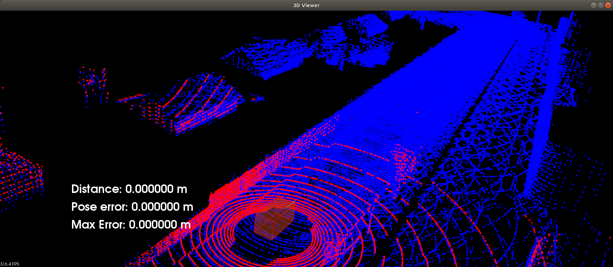
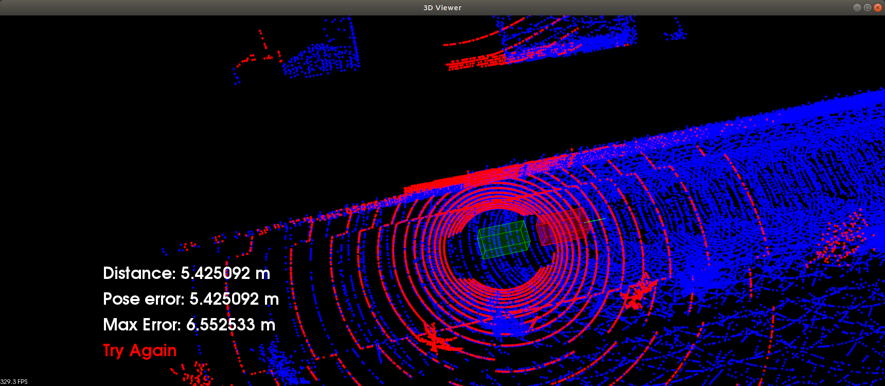

# Project Overview

> Part of: **Scan Matching Localization**

## Video

[Watch on YouTube](https://www.youtube.com/watch?v=-Vcgba_jakk)

## Summary

**Final Project: Carla Simulator and Scan Matching**

This README file provides an overview of the final project in the Udacity course, which involves working with the Carla simulator and implementing scan matching using point clouds.

### Key Concepts

* **Carla Simulator**: An open-source driving simulator used for autonomous vehicle development.
* **Point Clouds**: 3D representations of a scene captured by sensors such as LIDAR.
* **ICP (Iterative Closest Point) Algorithm**: A method for registering two point clouds to determine the transformation between them.
* **NDT (Normal Distributions Transform) Algorithm**: An alternative method for registration that uses normal distributions to represent the uncertainty in the point cloud.
* **Scan Matching**: The process of matching a new scan with a map point cloud to localize the vehicle in the environment.

### Practical Notes

To complete this project, you will need to:

1. Set up the Carla simulator and connect it to your virtual agent.
2. Create a LIDAR sensor and visualize the point cloud scan using either ICP or NDT algorithm.
3. Load the map point cloud and render it in the scene as a blue cloud.
4. Run the `cloud_loc` executable to visualize the current scan, map cloud, pose error, and max error.
5. Use the keyboard controls to move the car around the environment and observe how the red scan stays put while the green car moves.

Note: The project involves implementing scan matching using either ICP or NDT algorithm, which will be covered in more detail in subsequent lessons.

## Transcript

Welcome to the final project. Let's go over the starter code for doing the final project. Now, and this is working with the Carla simulator and mean, we're going ahead connecting with Carla, we're grabbing our virtual agent, creating this LIDAR. We have this lidar or listener which is providing input to what Carla's environment looks like in the form of these point clouds. Then when we come down here and look, we have a new scan.

Every new scan, this is where you come in and you'll be taking that point cloud scan and you'll be using either ICP or NDT to localize the virtual car in the simulator environment. To do this, you'll be learning everything you've learned in the previous lessons to go ahead and do that. Right now, it's just going to be visualizing this scan cloud. That scan cloud is what you'll be working with to do scan matching in reference to the map point cloud. Right now that scan cloud is just going to be visualized in red.

Let's go ahead and take a look at the map sealer; important part for doing our scan matching. That will just be loaded up here as this map cloud and that will be rendered as well in the scene in blue. That's what the code looks like. We can go ahead and see what this looks like by going into the desktop here. I'm going to go ahead and launch Carla first and then create new tab.

Go to home workspace c3. Now if I go ahead and run cmake. , as well as make, just takes about maybe 15 or 20 seconds. There it goes. Now, I see that I have this cloud_loc.

I run that and resize my window here. What I am seeing is the current scan in red, that's my scan cloud, I see the map cloud in blue, and I'm seeing how far I've driven, and the pose error, and the max error that I've received. All of these are zero so far, so I'm just going to hit up on the keyboard three times 1, 2, 3 and I'll start moving. You'll see that the red scan's staying put, it's still all in reference to the LIDAR sensor, so it's treating that as its reference frame. You can see my distances increasing.

That pose error is the same as the distance and same with the max error because it's still thinks I'm back at the origin. Once you actually fill in scan matching, then you'll be able to localize and keep up with that red car over there with the green one. Just move around the environment. The controls for the car are exactly the same as in the mapping exercise. You can move it around, give it the turn, can even crash into things.

There we go. Then if you hit A, you can get it's top-down view as well. Yeah, I really hope you enjoy the project.

## Images


*The display is all rendered using the PCL viewer. Car as red box, 'map.pcd' showing as blue point cloud and current lidar scan as red point cloud.*


*When starting out the pose estimation stays set on the starting pose. Green box shows the pose estimate and red scan is now misaligned with the map. When a pose error of 1.2m is exceeded a message displays "TRY AGAIN"*

## Additional Content

## Project Overview
In this final project your goal will be to localize a car driving in simulation for at least 170m from the starting position and never exceeding a distance pose error of 1.2m. The simulation car is equipped with a lidar, provided by the simulator at regular intervals are lidar scans. There is also a point cloud map `map.pcd` already available, and by using point registration matching between the map and scans localization for the car can be accomplished. This point cloud map has been extracted from the [CARLA simulator](https://carla.org/).

All work will be done in the project workspace included later in this lesson.


## Controlling the car
You will be manually controlling the simulation car. To do this PCL has a listener in its viewer window. First click on the view window to activate the keyboard listener and then the following keys can be used to actuate the car. Note in order not to overwhelm the listener refrain from holding down keys and instead just tap keys.

### Throttle ( UP Key )
Each tap will increase the throttle power. Three presses is a good amount of throttle power.

### Reverse/Stop ( Down Key )
A single tap will stop the car and reset the throttle to zero if it is moving. If the car is not moving it will apply throttle in the reverse direction.

### Steer ( Left/Right Keys )
Tap these keys to incrementally change the steer angle. The green line extruding out in front of the red box in the image above represents the steer value and its end point will move left/right depending on the current value.

### Center Camera ( a )
Press this key to recenter the camera with a top down view of the car.

### Rotate Camera ( mouse left click and drag )

### Pan Camera ( mouse middle button and drag)

### Zoom (mouse scroll)

## Getting Started

When you first move the car you will notice that the red scan doesn't move from the starting position. You will also notice a green box being left at the start position. The green box represents the localized estimation pose which stays set at the starting position, as well as the red scan from the perspective of the car's local coordinate system. Your job will be to change the pose estimation value; in the TODO section of `c3-main.cpp` you can see where to do this (this is detailed further on the next page as well). You will use what you learned throughout this module to match lidar scans with the map to best fit the estimation pose with the map. You can use ICP, NDT or a mix of both of them. You can even tweak lidar parameters in the the CANDO section of 'c3-main.cpp' and experiment with the trade off between higher resolutions and higher speeds. Using a voxel filter on scans is highly recommended to speed up sensing. You will find it is more challenging to localize the car when it is moving compared to when it is just sitting still due to the speed of convergence from scan matching as well as how quickly scans are received. 
All the dependencies to run the project are provided in a Udacity workspace, though if you have a strong local system then you can get a performance/speed boost from setting up and running there. To get started in the workspace do the following steps.
### 1. Compile the code (Terminal Tab 1)

```bash
cd /home/workspace/c3-project

cmake .

make
```

### 2. Launch the simulator in a new terminal tab (Terminal Tab 2)

```bash
su - student

cd /home/workspace

./run-carla.sh
```

### 3. Run the project code back in the first tab (Terminal Tab 1)

```bash
cd /home/workspace/

./cloud_loc
```
Here is a video showing the results near an accomplished run, driving over 170m with a pose error never having exceeded 1.2m.
