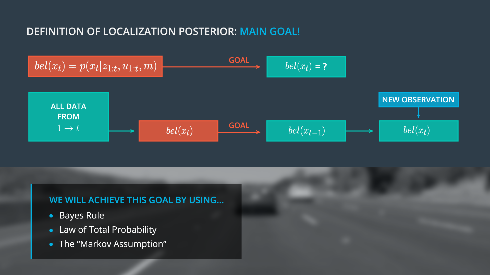
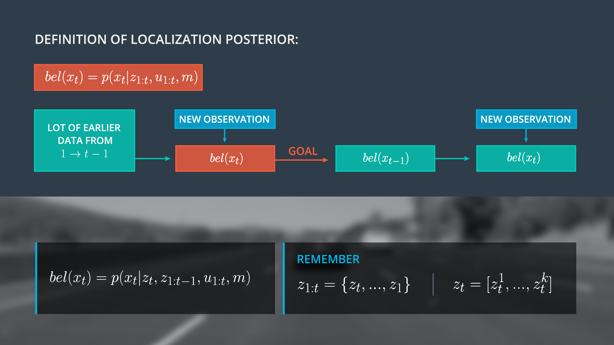
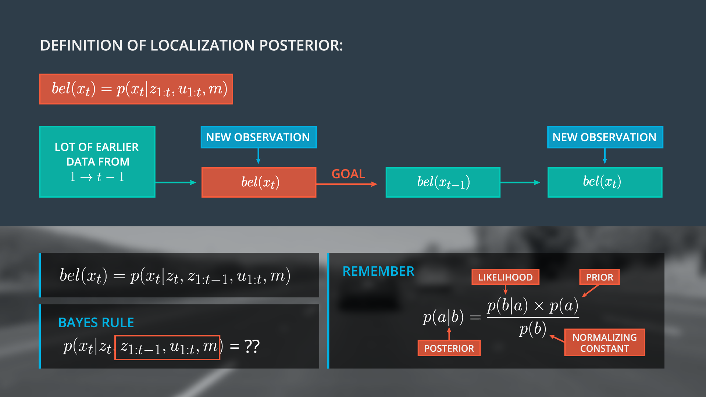

# Apply Bayes Rule with Additional Conditions

> Part of: **Markov Localization**

## Video

[Watch on YouTube](https://www.youtube.com/watch?v=RsHS2o3zjcw)

## Summary

**Bayes Localization Filter and Markov Localization**
=====================================================

This project focuses on implementing a recursive state estimator using probabilistic rules and laws, specifically the Bayes Rule and The Law of Total Probability. We aim to create a system that can update its current belief based on new observation information without carrying around historical data.

### Key Concepts

* **Recursive State Estimator**: A method for updating the current state estimate using previous estimates and new observation information.
* **Bayes Localization Filter (BLF) / Markov Localization**: An estimator that uses probabilistic rules to update its current belief based on new observations, allowing it to avoid carrying historical data.
* **Bayes Rule**: The most fundamental consideration in probabilistic inference, used to update probabilities based on new evidence.
* **Law of Total Probability**: A rule for updating probabilities when there are multiple possible causes or conditions.
* **Markov Assumption**: Making assumptions about the dependencies between certain values to simplify calculations.

### Practical Notes

To implement the Bayes Localization Filter and Markov Localization, you will need to:

* Split observation vectors into current observations and previous information
* Apply Bayes Rule with multiple conditions to update probabilities
* Use the Law of Total Probability to account for multiple possible causes or conditions
* Make meaningful assumptions about dependencies between values using the Markov Assumption

Note: The instructor provides a hint to assume `xt` is A and `ot` is B, but you should apply Bayes Rule with all necessary conditions.

## Transcript

<v English>Before we switch to the code example,</v> <v English>you defines the posterior in this way.</v> <v English>You already learned that the tiny details that over</v> <v English>here are observation vector could be a lot of data,</v> <v English>and we do not want to carry the whole observation history to estimate the state beliefs.</v> <v English>The idea is now,</v> <v English>that we manipulate the posterior over here,</v> <v English>such in a way that you get a recursive state estimator.</v> <v English>We have to show that the current belief over here,</v> <v English>can be expressed by a belief one step earlier and</v> <v English>then update the current belief only with new observation information.</v> <v English>We call this estimator the Bayes Localization Filter or Markov Localization.</v> <v English>This will allow us to avoid having to carry</v> <v English>around all historical observation and motion data.</v> <v English>To achieve this recursive structure,</v> <v English>you have to apply probabilistic rules and laws like the Bayes Rule,</v> <v English>or The Law of Total Probability.</v> <v English>You already heard about this in Sebastian's Lessons.</v> <v English>So, this should not be something new for you.</v> <v English>I will also teach about The Markov Assumption.</v> <v English>This involves, making meaningful assumptions</v> <v English>about the dependencies between on certain values.</v> <v English>So our goal on the next steps is to define the posterior in a recursive way.</v> <v English>This means, we want to fill out this box here on the right side.</v> <v English>The first thing what I'm doing is,</v> <v English>I split a whole observation vector into</v> <v English>the current observations and our previous informations.</v> <v English>This is important to achieve the recursive structure,</v> <v English>as a reminder you see again the definition of observations on the right side.</v> <v English>Now, we apply Bayse rule.</v> <v English>You already learned about Bayse rule and the previous lessons.</v> <v English>And Sebastian already told you,</v> <v English>Bayse rule is the most fundamental consideration in probabilistic inference.</v> <v English>The tricky part is here,</v> <v English>that you have more than one variables on the right side.</v> <v English>Which means you have to apply Bayse rule with multiple conditions.</v> <v English>Now my question is for you.</v> <v English>Could you apply Bayse rule for the localization posterior?</v> <v English>As a hint to assume the state xt is A.</v> <v English>And the observation vectors that T is B,</v> <v English>and please do not forget the other conditions.</v>

## Images

## Additional Content

We aim to estimate state beliefs

$bel(x_t)$

without the need to carry our entire observation history.  We will accomplish this by manipulating our posterior

$p(x_t|z_{1:t-1},\mu_{1:t},m)$

, obtaining a recursive state estimator.  For this to work, we must demonstrate that our current belief

$bel(x_t)$

can be expressed by the belief one step earlier

$bel(x_{t-1})$

, then use new data to update only the current belief.  This recursive filter is known as the Bayes Localization filter or Markov Localization, and enables us to avoid carrying historical observation and motion data.  We will achieve this recursive state estimator using Bayes Rule, the Law of Total Probability, and the Markov Assumption.

We take the first step towards our recursive structure by splitting our observation vector

$z_{1:t}$

into current observations

$z_t$

and previous information

$z_{1:t-1}$

.  The posterior can then be rewritten as

$p(x_t|z_t,z_{1:t-1},u_{1:t}, m)$

.

Now, we apply Bayes' rule, with an additional challenge, the presence of multiple distributions on the right side (likelihood, prior, normalizing constant).  How can we best handle multiple conditions within Bayes Rule?  As a hint, we can use substitution, where

$x_t$

is a, and the observation vector at time t, is b.  Don’t forget to include

$u$

and

$m$

as well.

### Bayes Rule

$$P(a \mid b) = \frac{P(b \mid a) \, P(a)}{P(b)}$$

### Quiz

Please apply Bayes Rule to determine the right side of Bayes rule, where the posterior,

$P(a|b)$

, is

$p(x_t|z_t,z_{1:t-1},u_{1:t},m)$

(A)

$$\frac{p(x_t|z_t,z_{1:t-1},u_{1:t},m)p(z_t|x_t,z_{1:t-1},u_{1:t},m)}{p(z_t|z_{1:t-1},u_{1:t},m)}$$

(B)

$$\frac{p(z_t|x_t,z_{1:t-1},u_{1:t},m)p(x_t|z_{1:t-1},u_{1:t},m)}{p(z_t|z_{1:t-1},u_{1:t},m)}$$

(C)

$$\frac{p(z_t|x_t,z_{1:t-1},u_{1:t},m)p(x_t|z_{1:t-1},u_{1:t},m)}{p(x_t|z_{1:t-1},u_{1:t},m)}$$
