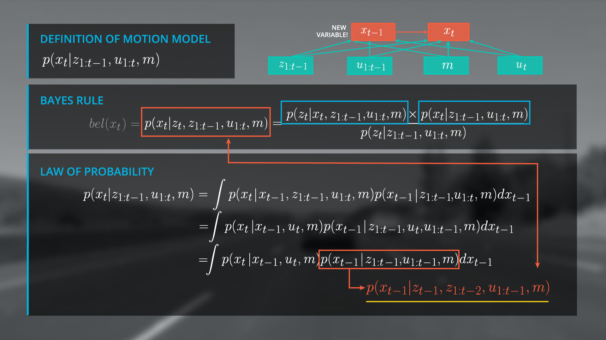
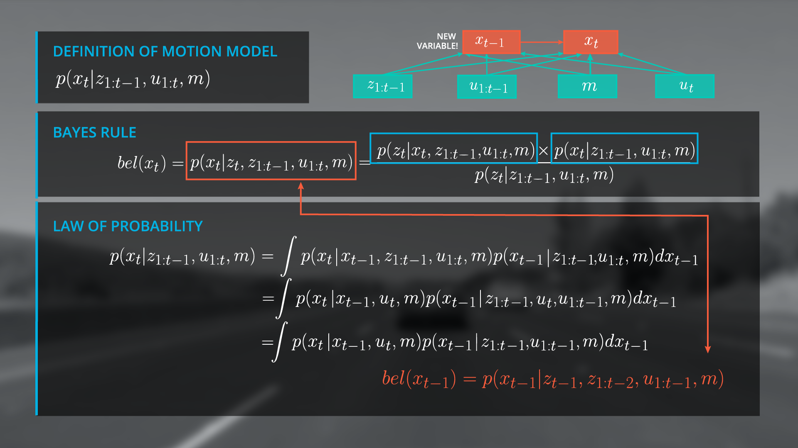
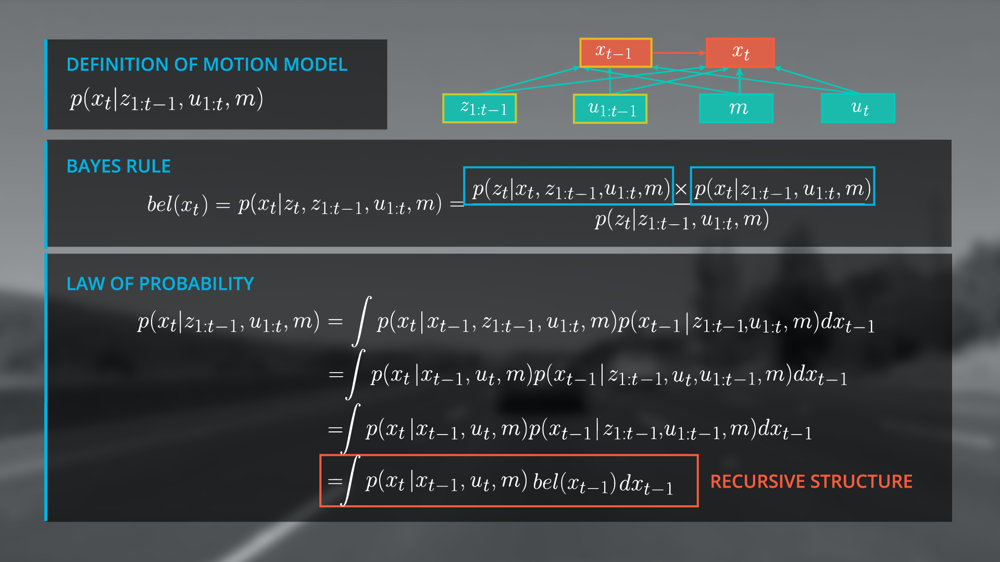
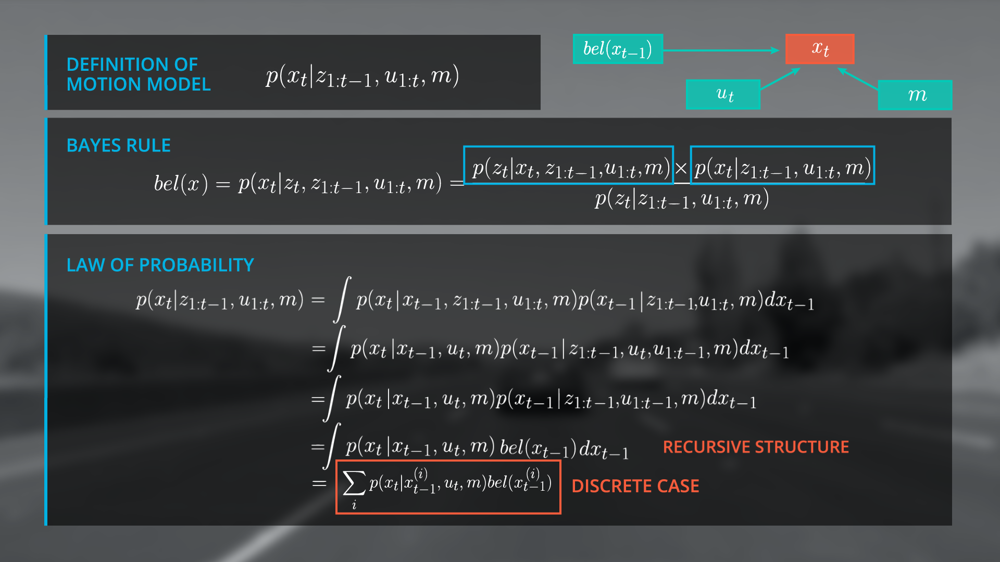

# Recursive Structure

> Part of: **Markov Localization**

## Video

[Watch on YouTube](https://www.youtube.com/watch?v=d0GrWJeVFjU)

## Summary

**Recursive Bayesian Filter: Key Concepts**

This lesson covers an essential step in implementing a recursive Bayesian filter. The main idea is to derive a recursive update formula that allows us to predict the current state using previous beliefs.

* **Recursive Update Formula**: A mathematical expression that updates the belief of the current state based on the previous belief and transition model.
* **Markov Assumption**: A fundamental concept in probabilistic reasoning, which assumes that the future state depends only on the current state and not on any past states.
* **Law of Total Probability**: A theorem used to calculate the probability of an event by considering all possible causes or conditions.
* **Convolution**: A mathematical operation that combines two functions to produce a new function.

**Practical Notes**

To implement the recursive filter structure, you will need to:

* Initialize the belief at x_t with a meaningful assumption, depending on the localization scenario. For example, using GPS to get an initial course estimate.
* Derive the recursive update formula by applying the law of total probability and Markov Assumption.
* Implement a motion model in C++ to predict the current state based on previous beliefs.

Note: This lesson builds upon concepts introduced in Sebastian's lesson for localization.

## Transcript

<v English>Let me show you why we achieved a really, really important step.</v> <v English>First, I rewrite the second term over here in this way,</v> <v English>where I split x_1 to t minus one,</v> <v English>to z_t minus one,</v> <v English>and z_1 to t minus two.</v> <v English>If you compare this with our formula from the very beginning over here,</v> <v English>you can see that this term here is</v> <v English>exactly the belief from the previous timestep, t minus one.</v> <v English>Now, we can rewrite the integral with a belief x_t minus one inside.</v> <v English>The amazing thing is,</v> <v English>that we have a recursive update formula.</v> <v English>You use to estimate its state from</v> <v English>the previous timestep for the prediction of the current one.</v> <v English>This is one of the most important steps as a recursive Bayesian filter</v> <v English>because we are independent from the whole observation and control history.</v> <v English>So, in the graph structure,</v> <v English>I replace this part over here with the belief x_t minus one.</v> <v English>Finally, you can replace the integral by a sum over all</v> <v English>x_i's because you have a discrete localization scenario in this case.</v> <v English>By the way, you already saw this formula in Sebastian's lesson for localization.</v> <v English>The process of predicting x_t with the previous beliefs,</v> <v English>x_t minus one, and the transition model is technically a convolution.</v> <v English>Now, you also know the full mathematical background and how to derive this module.</v> <v English>If you take a look to the formula again,</v> <v English>it is essential that the belief at x_t</v> <v English>equals zero is initialized with meaningful assumption.</v> <v English>It depends on the localization scenario how you set the belief,</v> <v English>or in other words, how you initialize your filter.</v> <v English>For example, you can use GPS to get a course estimate where you are.</v> <v English>So, let's sum up to this point.</v> <v English>You learned again, how to apply the law of</v> <v English>total probability by including the new variable, x_t minus one.</v> <v English>You also learned about the Markov Assumption,</v> <v English>which is very important for probabilistic reasoning.</v> <v English>And finally, you learned how to derive the recursive filter structure.</v> <v English>Next, you will implement a motion model in C++.</v> <v English>You will also learn how to initialize our localizer,</v> <v English>which means, defining the belief of the state at the very beginning.</v> <v English>So, let's do it.</v>

## Images

## Additional Content

We have achieved a very important step towards the final form of our recursive state estimator.  Let’s see why.  If we rewrite the second term in our integral to split

$z_{1-t}$

to

$z_{t-1}$

and

$z_{t-2}$

we arrive at a function that is exactly the belief from the previous time step, namely

$bel(x_{t-1})$

. 

Now we can rewrite out integral as the belief of

$x_{t-1}$

.
The amazing thing is that we have a recursive update formula and can now use the estimated state from the previous time step to predict the current state at t. This is a critical step in a recursive Bayesian filter because it renders us independent from the entire observation and control history. So in the graph structure, we will replace the previous state terms (highlighted) with our belief of the state at

$x$

at

$t-1$

(next image).
Finally, we replace the integral by a sum over all

$x_i$

because we have a discrete localization scenario in this case, to get the same formula in Sebastian's lesson for localization. The process of predicting

$x_t$

with a previous beliefs (

$x_{t-1}$

) and the transition model is technically a convolution.  If you take a look to the formula again, it is essential that the belief at

$x_t = 0$

is initialized with a meaningful assumption. It depends on the localization scenario how you set the belief or in other words, how you initialize your filter.  For example, you can use GPS to get a coarse estimate of your location.
