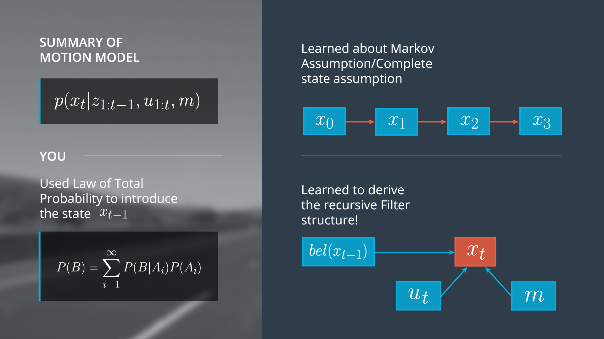

# Lesson Breakpoint

> Part of: **Markov Localization**

## Images

## Additional Content

Awesome work! Summing up, here is what we have learned so far:

- How to apply the law of total probability by including the new variable

$x_{t-1}$

.
- The Markov assumption, which is very important for probabilistic reasoning, and allows us to make recursive state estimation without carrying our entire history of information
- How to derive the recursive filter structure.

This is a lesson breakpoint, as it's a good place to pause if you're trying to decide how to tackle this longer lesson. While you'll still use the earlier concepts later on, we'll next be implementing a motion model in C++ and learning how to initialize our localizer.

Whether it's a ten minute break to absorb all the information so far, or coming back tomorrow for more, we'll look forward to seeing you back in the classroom!
