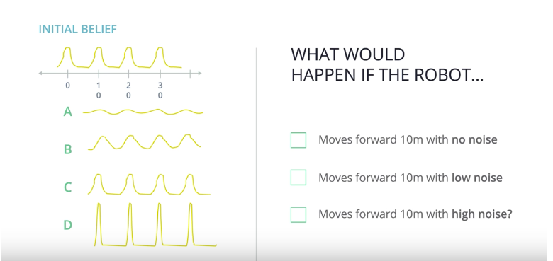

# Noise in Motion Model: Quiz

> Part of: **Markov Localization**

## Video

[Watch on YouTube](https://www.youtube.com/watch?v=zRbT36RTlhs)

## Summary

**Bayesian Localization in 1D Space**
=====================================

This README file summarizes the key concepts and practical notes from a lesson on Bayesian localization in one-dimensional space.

### Key Concepts
* **Uniform Distribution**: The initial belief of the robot's location, representing maximum confusion or uncertainty.
* **Non-Uniform Distribution**: The updated belief after incorporating new information, such as proximity to a tree.
* **Motion Model**: The process of updating the belief based on the robot's movement, including noise levels (no noise, low noise, high noise).
* **Bayesian Localization**: A method for estimating the robot's location using probabilistic inference and Bayes' theorem.

### Practical Notes
The lesson demonstrates how to update the initial uniform distribution with new information about the robot's proximity to a tree. The instructor asks students to consider how the belief changes after moving 10 meters to the right under different noise conditions (no noise, low noise, high noise). This exercise illustrates the application of Bayesian localization in real-world scenarios.

Note: The lesson does not provide explicit code or formulas for implementing Bayesian localization. However, it lays the foundation for understanding the key concepts and principles involved in this technique.

## Transcript

<v English>Assume you have a 1D</v>
<v English>space between 0 and 30 meters.</v> <v English>At the very beginning,</v>
<v English>the robot or the car</v> <v English>has no clue where it is.</v> <v English>So our initial belief would</v>
<v English>be the uniform distribution,</v> <v English>which means maximum confusion.</v> <v English>Now we assume the car knows it</v>
<v English>is parked closely to a tree.</v> <v English>Then, the initial belief</v>
<v English>would look like this.</v> <v English>And here's my question to you.</v> <v English>How does that belief look</v>
<v English>like after we move 10 meters</v> <v English>to the right with no noise, with</v>
<v English>low noise, and with high noise?</v> <v English>And these are the</v>
<v English>four possible answers.</v>

## Images

*quiz screenshot *

## Additional Content

Here is a screenshot of the quiz for reference:
