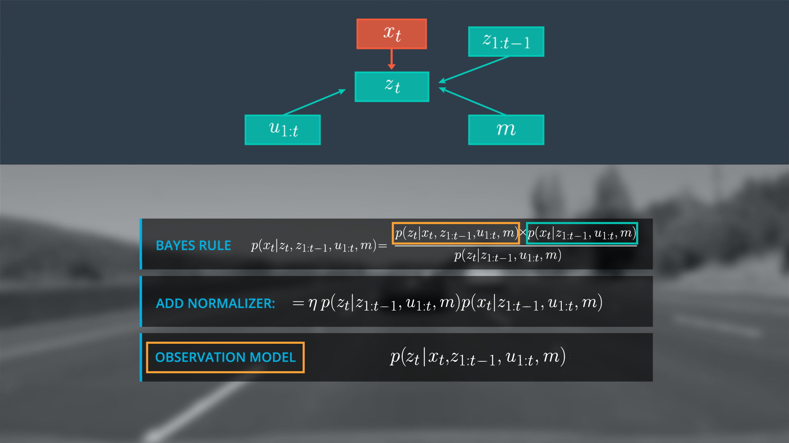
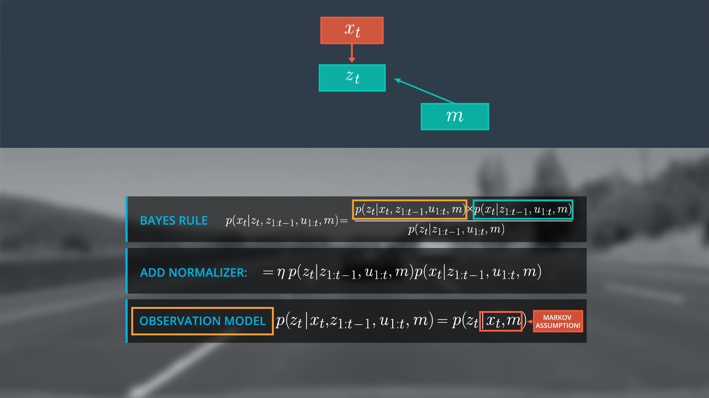
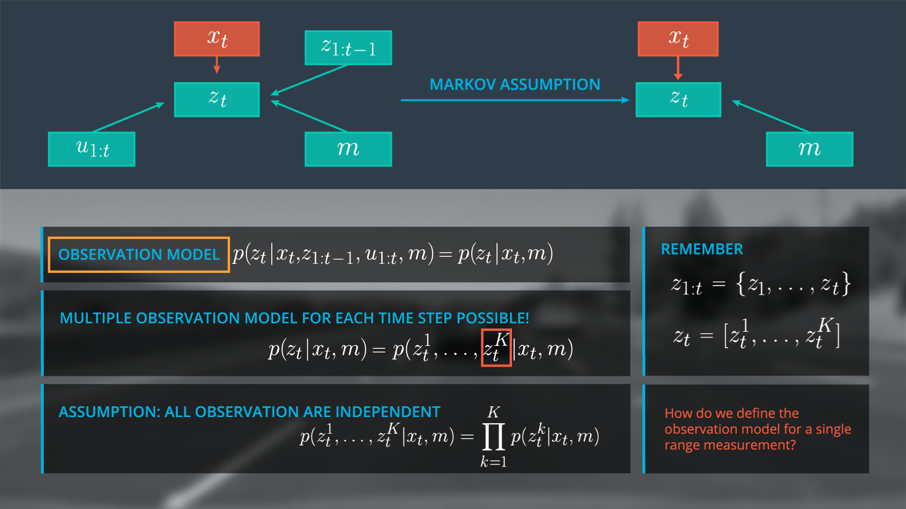
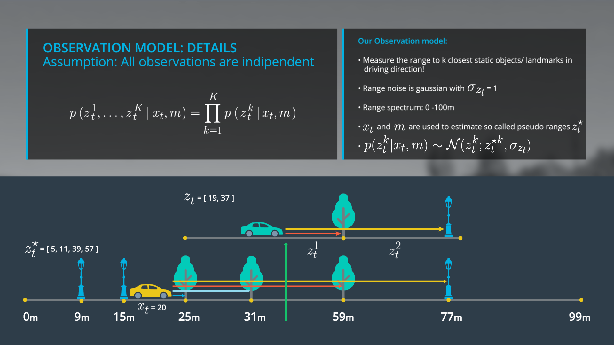

# Markov Assumption for Observation Model

> Part of: **Markov Localization**

## Video

[Watch on YouTube](https://www.youtube.com/watch?v=dyDjINdrIz0)

## Summary

**Markov Assumption and Observation Model**

This project focuses on implementing a localization system using a Markov assumption and an observation model. The goal is to estimate the position of a vehicle based on sensor measurements.

### Key Concepts

* **Markov Assumption**: The assumption that the current state of the system (vehicle position) depends only on its previous state, not on any earlier states.
	+ This allows us to simplify the posterior distribution and focus on the current state.
* **Observation Model**: A mathematical representation of how sensor measurements are related to the vehicle's position.
	+ The observation model is a product of individual probability distributions for each range measurement.
* **Gaussian Distribution**: Used to model the noise behavior of individual range values.
	+ The standard deviation of the Gaussian distribution represents the uncertainty in the measurement.
* **Pseudo Ranges**: Estimated true range values based on the vehicle's position and the map.

### Practical Notes

To implement the observation model, you will need to:

* Use a given `x_t` (vehicle position) and the map to estimate pseudo ranges.
* Model the noise behavior of individual range values using a Gaussian distribution with a standard deviation of one meter.
* Define the observation model as a probability distribution over normal distributions for each single range measurement.

Example code in C++ may be used to implement the observation model, but this is not provided in the transcript.

## Transcript

<v English>Here, the Markov Assumption will help us again.</v> <v English>Since you assume you're now this tagged x_t,</v> <v English>it doesn't really matter what the car observes and how it moves before x_t.</v> <v English>These values were already used to estimate x_t,</v> <v English>and that t will not benefit from these values.</v> <v English>This means, we assume that that t is independent</v> <v English>of all previous observations and the controls.</v> <v English>Again, this is an example of the use of the Markov Assumption.</v> <v English>And I can simplify our posterior distribution to p of z_t,</v> <v English>only depends on x_t and the map.</v> <v English>Let's take a closer look to the observation model.</v> <v English>Do you remember that that t is or could be a vector of multiple observations?</v> <v English>This means, we rewrite the observation model in this way.</v> <v English>Now we assume that the noise behavior of the individual range values</v> <v English>z_t_1 to z_t_K is independent.</v> <v English>This also means that all observations are independent.</v> <v English>And it allows us to represent a observation model as a product</v> <v English>of the individual probability distributions of each single range measurement.</v> <v English>Now the question is,</v> <v English>how we should define the observation model forcing a range measurement?</v> <v English>In general, there are a lot of different observation models,</v> <v English>because we have a lot of different sensors like lidars,</v> <v English>cameras, radars, or ultransonic sensors.</v> <v English>And each sensor has a specific noise behavior and performance.</v> <v English>The observation model also depends on the type of the map.</v> <v English>You can have dense 2D or 3D grid maps or sparse feature-based maps.</v> <v English>In our 1D example,</v> <v English>we assume that our sensor measures that</v> <v English>range to the n closest objects in driving direction.</v> <v English>As shown on the right side,</v> <v English>the car measures 90 meters to the first and 37 meters to the second object.</v> <v English>As stated before, the objects represents the landmarks in our map.</v> <v English>Here, we assume the observation noise can be modeled</v> <v English>as a Gaussian with a standard deviation of one meter.</v> <v English>We also assume that our sensor can measure in a range between zero and 100 meters.</v> <v English>To implement observation model,</v> <v English>you use a given x_t and the given map to estimate so called pseudo ranges.</v> <v English>These pseudo ranges represent a true range values and as assumption,</v> <v English>your car would stand at the specific position,</v> <v English>x_t, and the map.</v> <v English>For example, assume your car is standing here at position 20,</v> <v English>and would observe five meters to the first,</v> <v English>11 meters to the second,</v> <v English>39 metres to the third,</v> <v English>and 57 meters to the last landmark.</v> <v English>Compared to the real observations,</v> <v English>this position seems very unlikely, right?</v> <v English>So observation would rather fit to a position around 40.</v> <v English>Based on this example,</v> <v English>the observation model for a single range measurement is</v> <v English>defined by the probability of the following normal distribution,</v> <v English>defined by the mean z-star_t_K and our sigma.</v> <v English>These insights allows you to implement observation model in C++.</v> <v English>But before you go back to the coding part,</v> <v English>I would like to finalize the theory of the base localization further.</v>

## Images

## Additional Content

The Markov assumption can help us simplify the observation model.  Recall that the Markov Assumption is that the next state is dependent only upon the preceding states and that preceding state information has already been used in our state estimation.  As such, we can ignore terms in our observation model prior to

$x_t$

since these values have already been accounted for in our current state and assume that t is independent of previous observations and controls.  
With these assumptions we simplify our posterior distribution such that the observations at t are dependent only on x at time t and the map.
Since

$z_t$

can be a vector of multiple observations we rewrite our observation model to account for the observation models for each single range measurement.  We assume that the noise behavior of the individual range values

$z_t^1$

to

$z_t^k$

is independent and that our observations are independent, allowing us to represent the observation model as a product over the individual probability distributions of each single range measurement.  Now we must determine how to define the observation model for a single range measurement.
In general there exists a variety of observation models due to different sensor, sensor specific noise behavior and performance, and map types.  For our 1D example we assume that our sensor measures to the n closest objects in the driving direction, which represent the landmarks on our map.  We also assume that observation noise can be modeled as a Gaussian with a standard deviation of 1 meter and that our sensor can measure in a range of 0 – 100 meters.

To implement the observation model we use the given state

$x_t$

,  and the given map to estimate pseudo ranges, which represent the true range values under the assumption that your car would stand at a specific position

$x_t$

, on the map.   For example, if our car is standing at position 20 it would make use

$x_t$

,  and m to make pseudo range (

$z_t^*$

) observations in the order of the first landmark to the last landmark or 5, 11, 39, and 57 meters.  Compared to our real observations (

$z_t$

= [19, 37]) the position

$x_t$

,  = 20 seems unlikely and our observation would rather fit to a position around 40.  

Based on this example the observation model for a single range measurement is defined by the probability of the following normal distribution

$p(z_t^k|x_t )\tilde\ N(z_t^k,z_t^{*k},\sigma z_t)$

where

$z_t^{*k}$

is the mean.  This insight will ultimately allow us to implement the observation model in c++.
