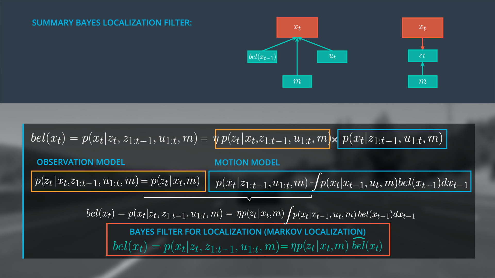
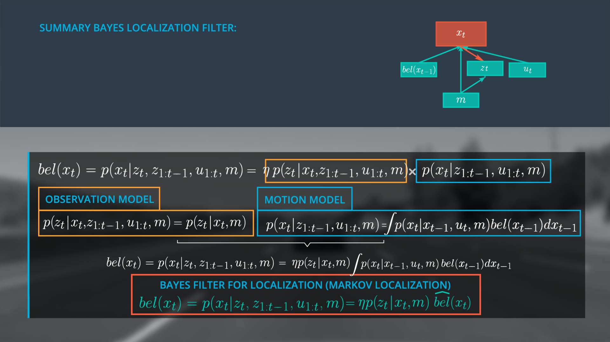
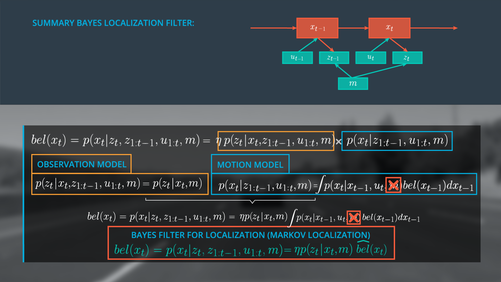

# Finalize the Bayes Localization Filter

> Part of: **Markov Localization**

## Video

[Watch on YouTube](https://www.youtube.com/watch?v=teVw2J-_6ZE)

## Summary

**Bayes' Rule and Markov Localization**
=====================================

This project covers the application of Bayes' rule and Markov localization for state estimation. The goal is to understand how to use these concepts to estimate a robot's location.

### Key Concepts
* **Bayes' Rule**: A mathematical formula used to update the probability of a hypothesis based on new evidence.
* **Markov Assumption**: Assumes that the current state depends only on the previous state, and not on any other states.
* **Motion Model**: Describes how the robot's location changes over time, using the law of total probability and odds.
* **Prediction Step**: The process of predicting the robot's new location based on its previous location and observations.
* **Markov Localization**: A general base filter for localization that uses Bayes' rule to estimate a robot's location.

### Practical Notes
The lesson provides an example of how to apply these concepts to state estimation. The code patterns shown in the lesson can be used as a starting point for implementing Markov localization in your own projects. Note that in practice, it is common to neglect the map and motion model, simplifying the filter dependencies.

**Example Code**
```python
# Bayes' Rule formula
def bayes_rule(prior, likelihood):
    return prior * likelihood

# Motion Model formula
def motion_model(belief_prev, transition_model):
    return belief_prev * transition_model

# Prediction Step formula
def prediction_step(belief_prev, observation, control):
    return bayes_rule(motion_model(belief_prev, transition_model), likelihood(observation))
```
This code snippet demonstrates how to implement Bayes' rule and the motion model using Python. The `prediction_step` function combines these two concepts to estimate a robot's new location based on its previous location and observations.

## Transcript

<v English>At the beginning of this lesson,</v> <v English>we started with using Bayes' rule.</v> <v English>The belief of x_t as a normalized ether,</v> <v English>multiplied with the observation and the motion.</v> <v English>We simplified the observation model to p of</v> <v English>z_t only given x_t and the map using the Markov Assumption.</v> <v English>For the motion model,</v> <v English>we used to law of total probability and odds of</v> <v English>the Markov Assumption to get the desired recursive structure.</v> <v English>The motion model includes the belief at t minus one and our transition model.</v> <v English>Finally, the belief at x_t can be written as the following.</v> <v English>The motion model is also called the prediction step for the belief x_t</v> <v English>which can be expressed by the belief x_t covered with a little hat.</v> <v English>This formula represents a general base filter for localization</v> <v English>and is also called Markov Localization.</v> <v English>You can also represent the filter dependencies as a graph by combining both subgraphs.</v> <v English>To estimate the new state, x_t,</v> <v English>we only take into account</v> <v English>the previous belief state and only the current observations and controls.</v> <v English>The state x_t and z_t also depends on the map.</v> <v English>In literature, you will often find the representation without the belief x_t.</v> <v English>There's also common practice to neglect the map and the motion model.</v> <v English>This means, we remove the map, m,</v> <v English>over here and also remove the dependencies in the graph.</v>

## Images







## Additional Content

We have accomplished a lot in this lesson. 
- Starting with the generalized form of Bayes Rule, we expressed our posterior, the belief of x at t as

$\eta$

(normalizer) multiplied with the observation model and the motion model.  
- We simplified the observation model using the Markov assumption to determine the probability of z at time t, given only x at time t, and the map.
- We expressed the motion model as a recursive state estimator using the Markov assumption and the law of total probability, resulting in a model that includes our belief at t – 1 and our transition model.
- Finally we derived the general Bayes Filter for Localization (Markov Localization) by expressing our belief of x at t as a simplified version of our original posterior expression (top equation),

$\eta$

multiplied by the simplified observation model and the motion model.  Here the motion model is written as

$\hat{bel}$

, a prediction model.

The Bayes Localization Filter dependencies can be represented as a graph, by combining our sub-graphs.  To estimate the new state x at t we only need to consider the previous belief state, the current observations and controls, and the map.
It is a common practice to represent this filter without the belief

$x_t$

and to remove the map from the motion model.  Ultimately we define

$bel(x_t)$

as the following expression.
### Bayes Filter for Localization (Markov Localization)

$$bel(x_t) = p(x_t|z_t,z_{1:t-1},\mu_{1:t},m) = \eta *p(z_t|x_t,m) \hat{bel}(x_t)$$
