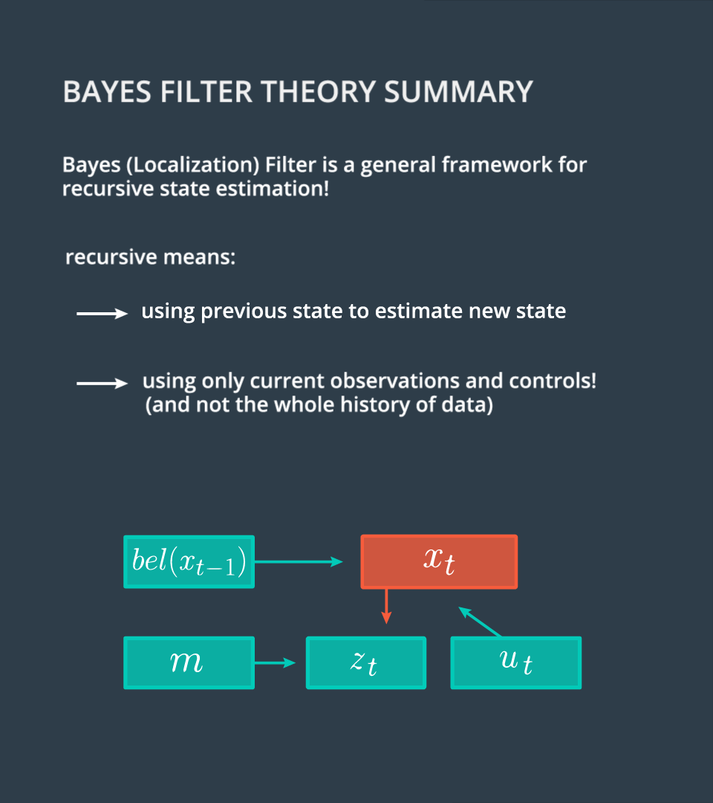
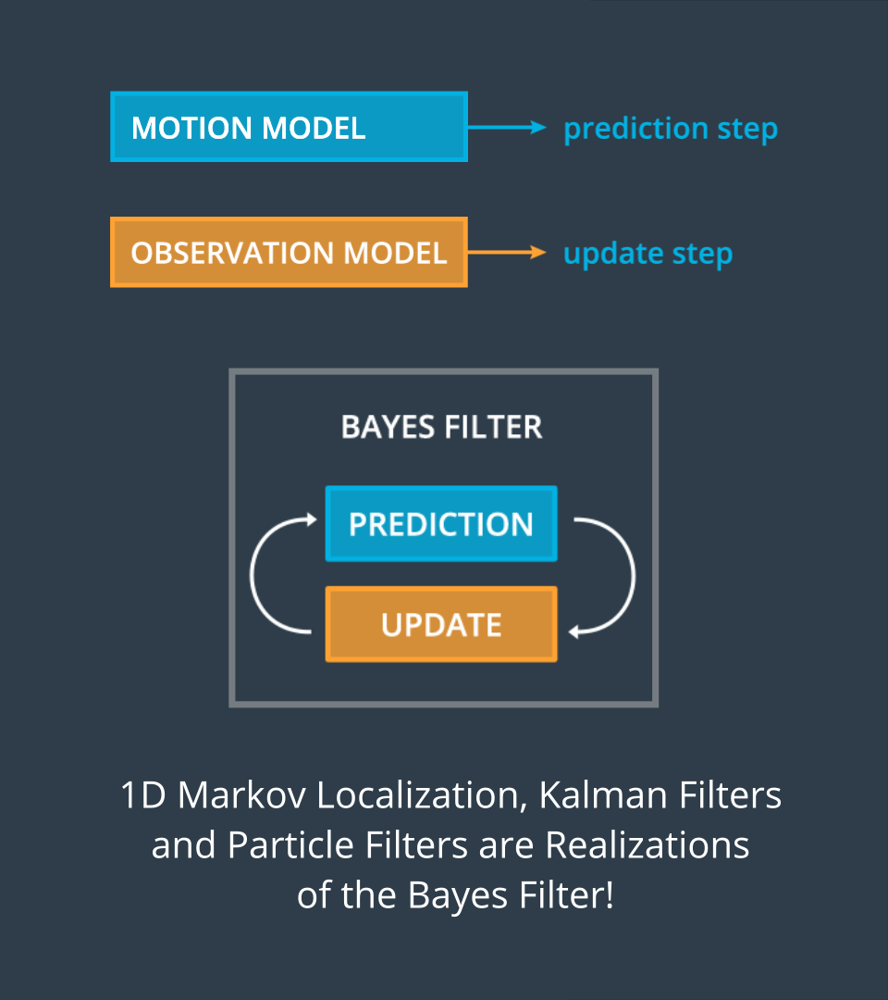

# Bayes Filter Theory Summary

> Part of: **Markov Localization**

## Video

[Watch on YouTube](https://www.youtube.com/watch?v=lMyu2-PZGuk)

## Summary

**Bayes Localization Filter: A General Framework for Recursive State Estimation**

The Bayes localization filter, also known as the Bayes filter, is a fundamental concept in robotics and computer vision. It provides a general framework for recursive state estimation, which means that it uses previous states to estimate new states based on current observations and controls.

**Key Concepts:**

* **Recursive State Estimation**: The process of using previous states to estimate new states.
* **Bayes Filter**: A general framework for recursive state estimation.
* **Motion Model**: Describes the predictions step of the filter, which predicts the next state given the current state and control inputs.
* **Observation Model**: Describes the update step of the filter, which updates the state probabilities based on current observations.
* **Probabilistic Reasoning**: The use of probability theory to reason about uncertainty in state estimation.

**Practical Notes:**

* The Bayes localization filter is a general framework that can be used for various applications, including 1D localization and particle filters.
* Real-world applications include self-driving cars and robotics, where accurate state estimation is crucial for navigation and control.
* The C++ example code will be finalized in the next steps to demonstrate the implementation of the Bayes filter.

## Transcript

<v English>Since I went</v>
<v English>through a lot of math,</v> <v English>I want to present the core</v>
<v English>achievements of the last steps.</v> <v English>So let's sum it up.</v> <v English>The Bayes localization</v>
<v English>filter, or Bayes filter,</v> <v English>is a general framework for</v>
<v English>recursive state estimation.</v> <v English>Recursive means that we</v>
<v English>use the previous state</v> <v English>to estimate the new state by</v>
<v English>using only current observations</v> <v English>and controls, and not the</v>
<v English>whole history of data.</v> <v English>The motion model describes the</v>
<v English>predictions step of the filter.</v> <v English>The observation model</v>
<v English>is the update step</v> <v English>to estimate the new</v>
<v English>state probabilities.</v> <v English>You already heard about this</v>
<v English>interaction between prediction</v> <v English>and update step before.</v> <v English>For example, when Andray</v>
<v English>talked about common filters</v> <v English>in the fusion lesson.</v> <v English>This means the current 1D</v>
<v English>localization, common filters,</v> <v English>and also particle</v>
<v English>filters are realizations</v> <v English>of the Bayes filter.</v> <v English>Now you understand probabilistic</v>
<v English>reasoning, and recursive</v> <v English>of state estimation.</v> <v English>This is an amazing achievement,</v>
<v English>not only for localization,</v> <v English>but also for the whole</v>
<v English>self-driving car nanodegree.</v> <v English>Now that you know all</v>
<v English>the theory behind it,</v> <v English>let's go back to the C++ example</v>
<v English>and finalize the localizer.</v>

## Images

## Additional Content

The image above sums up the core achievements of this lesson.
- The Bayes Localization Filter Markov Localization is a general framework for recursive state estimation.
- That means this framework allows us to use the previous state (state at t-1) to estimate a new state (state at t) using only current observations and controls (observations and control at t), rather than the entire data history (data from 0:t).

- The motion model describes the prediction step of the filter while the observation model is the update step.
- The state estimation using the Bayes filter is dependent upon the interaction between prediction (motion model) and update (observation model steps) and all the localization methods discussed so far are realizations of the Bayes filter.
- In the next few sections we will learn how to estimate pseudo ranges, calculate the observation model probability, and complete the implementation of the observation model in C++.
