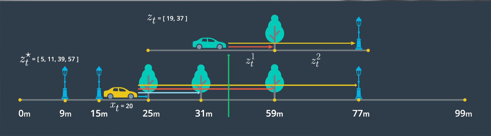

# Observation Model Probability

> Part of: **Markov Localization**

## Images



## Additional Content

We will complete our Bayes' filter by implementing the observation model.  The observation model uses pseudo range estimates and observation measurements as inputs.  Let's recap what is meant by a pseudo range estimate and an observation measurement.  

For the figure below, the top 1d map (green car) shows our observation measurements.  These are the distances from our actual car position at time t,  to landmarks, as detected by sensors.  In this example, those distances are 19m and 37m.   

The bottom 1d map (yellow car) shows our pseudo range estimates.  These are the distances we would expect given the landmarks and assuming a given position x at time t, of 20m.  In this example, those distances are 5, 11, 39, and 57m.    


The observation model will be implemented by performing the following at each time step:

- Measure the range to landmarks up to 100m from the vehicle, in the driving direction (forward)
- Estimate a pseudo range from each landmark by subtracting pseudo position from the landmark position
- Match each pseudo range estimate to its closest observation measurement
- For each pseudo range and observation measurement pair, calculate a probability by passing relevant values to norm_pdf: ```norm_pdf(observation_measurement, pseudo_range_estimate, observation_stdev)``` 
- Return the product of all probabilities

Why do we multiply all the probabilities in the last step?  Our final signal (probability) must reflect all pseudo range, observation pairs.  This blends our signal.  For example, if we have a high probability match (small difference between the pseudo range estimate and the observation measurement) and low probability match (large difference between the pseudo range estimate and the observation measurement), our resultant probability will be somewhere in between, reflecting the overall belief we have in that state.

Let's practice this process using the following information and ```norm_pdf```.

- **pseudo position:** x = 10m
- **vector of landmark positions from our map:** [6m, 15m, 21m, 40m]
- **observation measurements:** [5.5m, 11m]
- **observation standard deviation:** 1.0m

- 6m is not in the driving direction, so we reject this
- The remaining calculations are shown within the vector: [15-10,21-10,40-10] = **[5,11,30]**

Show Solution

[(5.5,5),(11,11)]

Show Solution

Recall that our observation model probability can be determined through ```norm_pdf(observation_measurement, pseudo_range_estimate, observation_stdev)```.

Use the following with ```norm_pdf``` pressing "test run" to return each probability.

```python
float value = 5.5; //TODO: assign a value, the difference in distances
float parameter = 5; //set as control parameter or observation measurement
float stdev = 1.0; //position or observation standard deviation
```
and 

```python
float value = 11; //TODO: assign a value, the difference in distances
float parameter = 11; //set as control parameter or observation measurement
float stdev = 1.0; //position or observation standard deviation
```

### Result in vector form
[3.99E-1,3.52E-1]  Please note that grader allows any order and allows for slight differences in precision.

Show Solution

3.99E-01 * 3.52E-01 =  __1.40E-01__  Please note that the grader allows for slight differences in precision.

Show Solution

Now that we have implemented the observation model manually, we will try out a code implementation in the next few concepts.
