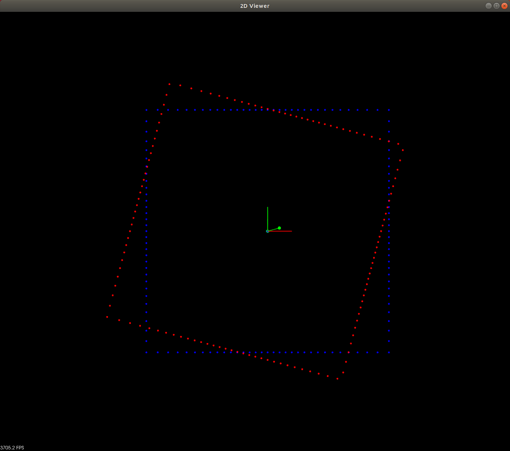
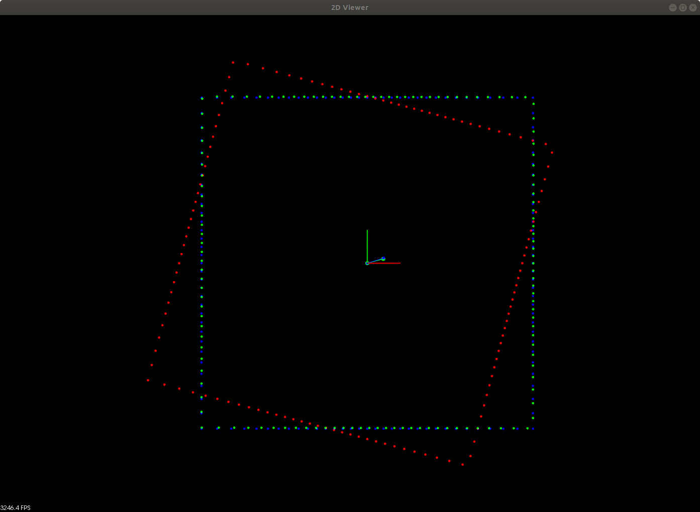
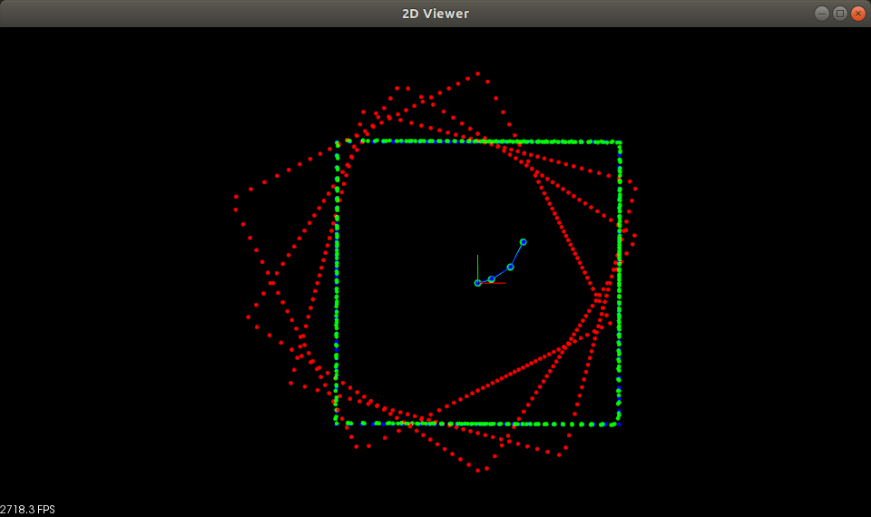
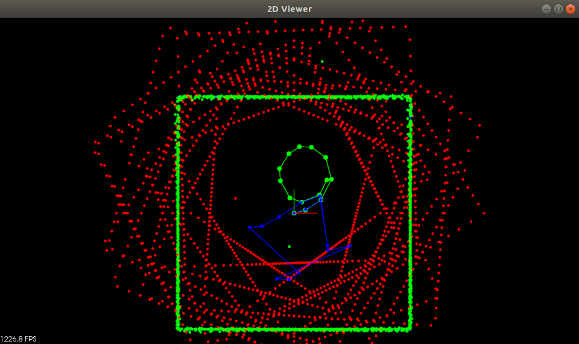
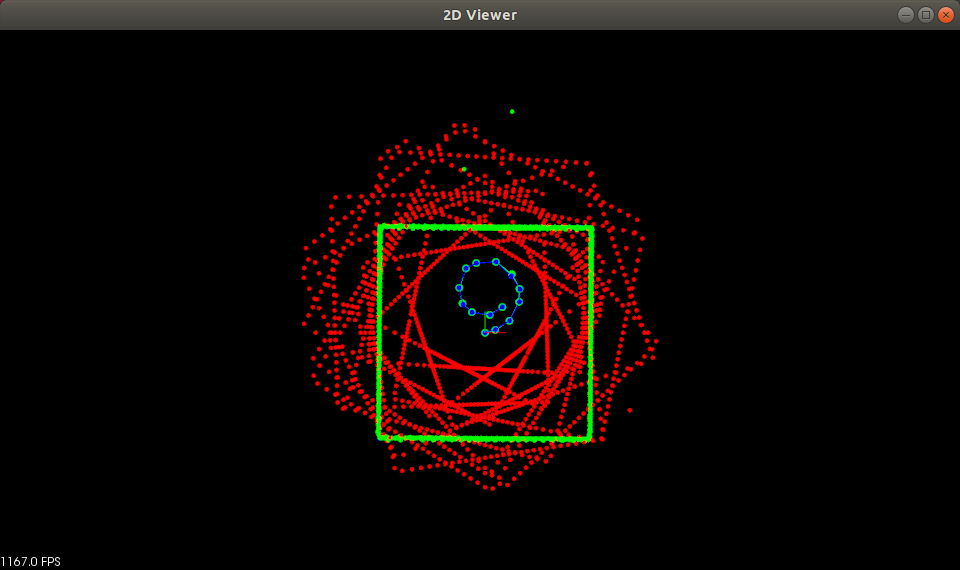

# Introduction to ICP

> Part of: **Creating Scan Matching Algorithms**

## Video

[Watch on YouTube](https://www.youtube.com/watch?v=0DTWcjerYFk)

## Summary

**Scan Matching with ICP**
=========================

This project involves using Scan Matching with Iterative Closest Point (ICP) to localize a robot moving around a room with a single LiDAR sensor. The goal is to fill in the ICP function, which takes in source and target points, and returns a transformation that best overlaps the two point clouds.

**Key Concepts**
----------------

* **Scan Matching**: A technique used to align two 3D point clouds by finding the optimal transformation between them.
* **Iterative Closest Point (ICP)**: An algorithm used for scan matching, which iteratively refines the alignment of two point clouds until convergence is reached.
* **Convergence**: The state where the associations between points in the source and target point clouds are no longer changing.
* **Transformation Matrix**: A 4x4 matrix that represents a rigid transformation (rotation, translation) applied to a point cloud.

**Practical Notes**
-------------------

To complete this project, you will need to:

1. Fill in the ICP function by setting the number of iterations to a value large enough for convergence.
2. Create a PCL object that performs ICP and call its `align` method to get the transformation matrix.
3. Transform the source point cloud using the obtained transformation matrix.
4. Visualize the transformed point cloud in green, along with the target map point cloud (in blue).
5. Save the estimated location as a starting pose for future iterations.

Note that saving the estimated location is crucial for parts 2 and 3 of the exercise, where the robot moves multiple steps or performs a full rotation around the room. Without this step, localization may not be accurate.

## Transcript

For this first exercise, you'll be working with scan matching to localize a robot moving around a room that has a single LiDAR sensor. To complete this exercise, you'll be primarily filling in the ICP function. You'll create a PCL object that does ICP, give it the target in source points and call align, that'll return and transform that best overlaps the source and target points. You'll also increase the iterations, right now, it's set to zero. You'll want to do a high enough iterations that you achieve convergence.

The ICP function converges when the associations are no longer changing. Then also for this part 1, you'll be transforming that as red scan, the source scan with that transform, and then it should align with the room and you can visualize it. This is this very helpful to see. Then for parts 2 and 3, you'll see it's important to actually save the transform that you have and use it for next time as the closest starting point. It's key that in ICP and scan matching that the two scans are pretty close to each other, so you can save the last transform to do that.

We also saw that in the second slide too, when you're stitching together all those different Delta Ds, those scans need to be pretty close with each other. Here's some steps for completing the ICP function right here. You'll get a pose like we saw in the transformation slide matrix. You'll get a pose, convert that to a transformation matrix, helper.cpp/h have some functions for doing that. Transform the source by that starting pose that you get, so that's essential for completing parts 2 and 3.

You can get away without doing that in parts 1. Create the PCL or ICP object, set its base parameters so that's going to be the transform source, the target iterations and then call align to get the transform, and then finally multiply transform with the starting pose too. That's what you want to return. If your starting pose, you want to get the full transformation and so you include that by multiplying that starting pose with what you said as a starting to get that full transformation view. That's how you can complete the first exercise for scan matching.

Let's check out completing the first exercise, which is learning about scan matching and using it to localize a robot moving around the room. Primarily you'll be completing this scan matching function here, ICP, using the instructions in the classroom. Right now it's just returning an identity matrix so it'll be node change on any points that it tries to transform. Checking out main, the first thing that's done is creating this PCL viewer, which is going to be doing all the visualization and then next we're creating a room. The room is centered at the origin, it has a width of 10 and a height of 10.

Along with the room, we have the robot which is moving around the room and has a Lidar for perceiving the room and it has a location zero zero and an orientation zero. It also has a max range of a 100 and a resolution of a 128 and all of this is defined in helper.h right here for this struct Lidar. Basically what that is doing is some recasting with the room that's made up of line segments to generate point cloud data. So we have this robot and we are keeping track of where it's been with this vector of poses and we also have this locator which is all these estimated poses that is coming from doing skin matching. The robot starts off in the center of the room and it does a scan of the room, and this is going to be the map that it uses, this initial scan.

Then there are several parts of this exercise. Part 1 where the robot takes a single-step, so you can try to localize it from a single-step and once you have that working, you can turn these parts to true and try them out. In part 2, the robot is moving three steps, in part 3, the robot is doing a full rotation around the room with random steps. So in the PCL viewer, we're visualizing the map in blue and we start off the pose at the center of the room with orientation zero, and then the robot takes a move, it scans the room. Here's where you come in and help the robot localize, and to do this, you're using scan matching with ICP.

You'll fill up the ICP function and set the number of iterations to something larger than zero, something large enough where it will actually converge to the map. Try that out and see what amount makes it converge and then you can get this transformed from doing that. You can save that with this get pose. Then that pushes it back into the locator and so we'll keep track of all the SMA locations as well as ground truth locations, of the robot. We want those to overlap.

So far, everything here will get you enough to pass part 1, but to pass part 2 and 3, you'll see that this step is actually pretty important to save your estimated location and use it as a starting pose for next time. If you don't do this, you'll see parts 2 and 3 will not localize to well. Also, this is nice to see. You can use a transform and apply it on the red scan and you can get that to align with the room and show that with the PCL viewer, you can show it in green. Every time the robot's taking a step, doing the scan, doing the localization, you create this nice border for the room and green.

That's also just nice to verify that your transformation is correct, if it's overlapping, if the transform on the scan is overlapping really well with the target map point cloud. Those are all the steps. What's done here last is visualizing the ground truth poses as dots and connecting line segments as well as the estimated location dots in line segments connecting them. That you get from doing the scan matching. It's saved in locator.

For filling out ICP, the classroom has some good instructions for doing this. Go ahead and give it a try.

## Images


*Robot moves one step from the center shown with green points and connecting lines. First scan is in blue while second scan is red. *


*Since this example is in 2D just focus on the left  side showing the robot's local coordinate frame. What the robot sees directly in front of it gets mapped to 0 degrees along the x axis. The angles on the right in red will be the same as a flat angle in 2D.*


*End result for Part 1*




*Starting pose is always the initial robot position. Contains incorrect ICP convergence estimates.*


*ICP uses last estimated position each time as the starting pose.*

## Additional Content

## Introduction to ICP
In this first exercise you will be using ICP to recover the path taken by robot traveling around a room that is only equipped with a single lidar sensor. In this exercise everything will as simplified as possible, so the environment will be in 2D, that means the lidar is also scanning 2D point clouds. Below is what it looks like after the robot starting from the center of the room takes one move and scans the environment.
The first scan that the robot took from the center is in blue. The robot then moves from the center shown by the green line segment and takes a second scan shown in red. Both scans are from the perspective of the robots local coordinate system, this means 0 degrees along the x axis is what the robot sees directly in front of it. This is why the red scan looks out of alignment with the blue scan. Diagram of the robots local coordinate frame shown below.
The misalignment between the blue and red scans above actually translates to the distance and direction of the step taken by the robot shown by the green line segment. By doing a process to align the red and blue scans you can actually recover the robots new pose in the global map reference frame. This is exactly what you will do using ICP. Your first task in this exercise then will be to fill out the function `ICP` in `icp1-main.cpp`. In this first exercise you will be implementing ICP through PCL, in the next section of this lesson you will learn how to code up ICP from scratch.
## Implementing ICP function with PCL
Currently the function just returns an identity matrix. Any matrix multiplied by the identity matrix just remains the same.  The following steps can be done to complete the ICP function. The notation for **source** is the second red scan and **target** is what you are trying to align the scan to, which in this case is the first blue point cloud scan of the room.

```
Eigen::Matrix4d ICP(PointCloudT::Ptr target, PointCloudT::Ptr source, Pose startingPose, int iterations)
```

### 1. Transform the **source** to the **startingPose**

### 2. Create the PCL icp object

### 3. Set the icp object's values

### 4. Call align on the icp object

### 5. If icp converged get the icp objects output transform and adjust it by the **startingPose**, return the adjusted transform

### 6. If icp did not converge log the message and return original identity matrix

An [example of using ICP in PCL can be found here](https://pointclouds.org/documentation/tutorials/iterative_closest_point.html) which covers the steps above.

A transformation on a point cloud can be done by using `pcl::transformPointCloud` and providing a 4 x4 transformation matrix.  For example:

```bash
#INPUT `pcl::PointCloud

` input point cloud

#OUTPUT `pcl::PointCloud` output point cloud

#TRANSFORM `Eigen::Matrix4d` transformation matrix
```

```
pcl::transformPointCloud (#INPUT, #OUTPUT,  #TRANSFORM );
```

Also the function `transfrom2D` from `helper.h` can be used to convert the input `Pose` object to a matrix.
## Setting ICP Hyper-parameters

The main hyper-parameters for ICP are shown below. Along with these settings there are other parameters that are possible to change and experiment with to see which values give the best results. For the [full list of ICP parameters see this link](http://docs.ros.org/en/hydro/api/pcl/html/classpcl_1_1IterativeClosestPoint.html).

```bash
##ITERATIONS `int` set from the function header value **iterations**

##SOURCE `pcl::PointCloud::Ptr` set from the function header value **source**

##TARGET `pcl::PointCloud::Ptr` set from the function header value **target**

##DIS `double` if this value is too small then correspondences can't be made
```

```
icp.setMaximumIterations (##ITERATIONS);
icp.setInputSource (##SOURCE);
icp.setInputTarget (##TARGET);
icp.setMaxCorrespondenceDistance (##DIS);
```
## Recovering the Robot's Position

Once you have completed the `ICP` function, set the ICP iteration count hyper parameter which is called below in `main` to a value greater than 0. Then to finish Part 1 of this exercise perform the transformation on the second red scan by using ICP's output transform and render the scan. You can use the PCL transformation function and renderPointCloud point cloud functions to do this.

```cpp
// perform the transformation on the scan using transform from ICP
pcl::transformPointCloud (#INPUT, #OUTPUT,  #TRANSFORM );


##CLOUD`pcl::PointCloud::Ptr`
##VIS_NAME string (name of object to visualize)

// Create a new point cloud Ptr 
PointCloudT::Ptr  #CLOUD_NAME (new PointCloudT);


// render the correct scan ( function from helper.cpp )
renderPointCloud(viewer, #CLOUD, #VIS_NAME, Color(0,1,0));
```
The end result is shown below with the green scan showing the red scan corrected by the transform from ICP, and now aligning well with the blue scan. The blue points and lines show the recovered position of the robot from the ICP transform, notice that it's very close with the ground truth (green points and lines).
## Parts 2 and 3

Once you can get the robot to localize like in the above image, finish the exercise by trying parts 2 and 3. Simply set the if condition to true for those sections to activate them. Part 2 will have the robot move 2 more steps. This is where you can see the initial pose is very important for ICP to converge. If the starting pose used was always the robot's initial pose from the middle of the room then ICP will fail to converge at the last step. So the starting pose always needs to be close to the actual position in order for ICP to work well. The bottom image shows Part 3 with using starting pose as initial pose vs previous steps estimated pose.
Once your robot can localize for three steps, finish the exercise by trying part 3. In part 3 the robot will complete a full rotation around the room with random movements.
To complete the exercise you should be able to obtain the image above with estimated path very closely aligning with the actual path taken. Also the final image with all the scans correctly transformed creates the green square, that after moving around the entire room is almost completely filled in. Note that the 2D lidar doing the scanning is not always 100% accurate and might sometimes have some noise, see the green points that are not on the green square. ICP is robust enough thought to still be able to localize even when the measurements have some small variances .
