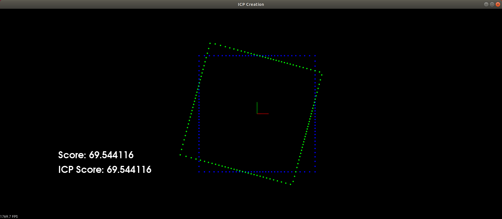
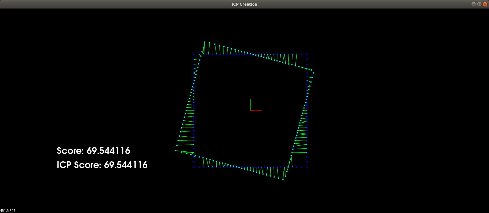

# Creating ICP: The Code

> Part of: **Creating Scan Matching Algorithms**

## Video

[Watch on YouTube](https://www.youtube.com/watch?v=EsDB8gQ1UFk)

## Summary

**README: Interactive Closest Point (ICP) Exercise**

This exercise guides you through creating an ICP algorithm to transform a source point cloud based on its initial pose. The goal is to minimize the sum of association pairs using the score function.

### Key Concepts

* **ICP Algorithm**: A method for registering two 3D point clouds by iteratively refining their transformation.
* **Nearest Neighbor Function**: Returns a vector of indices corresponding to the closest target points for each source point.
* **KDtree**: A data structure used in nearest neighbor searches, implemented using PCL (Point Cloud Library).
* **Pair Points**: A function that creates a vector of pairs containing two PCL points, which can be visualized and used for ICP calculations.
* **SVD Transform**: Singular Value Decomposition is used to calculate rotation and translation matrices from the centroids and centered vectors.

### Practical Notes

To complete this exercise, you will need to:

1. Implement the nearest neighbor function using a KDtree to find the closest target points for each source point.
2. Fill in the pair points function to create pairs of PCL points based on the associations found by nearest neighbor.
3. Implement the ICP algorithm, which involves:
	* Transforming the source point cloud based on its initial pose
	* Calculating centroids and centered vectors
	* Performing SVD calculations to determine rotation and translation matrices
	* Returning a final transformation matrix

Note: This exercise uses PCL (Point Cloud Library) for point cloud processing and visualization.

## Transcript

Now I would like to introduce you to the second exercise of this lesson, which is creating ICP. Let's go through it together and see what's going on. First of all, this is a very interactive lesson. The PCL viewer has this listener and so you can interact with it. What this allows you do is you can actually move around the source scan using the right, left, up, and down arrow keys, that translate that scan, and you can also rotate it.

Counterclockwise with k and clockwise with l and then hitting space each time we'll be doing matching. For each iteration, you can hit space and see how it's progressing through each iteration. Also, n is how you can set a new pose. In this exercise we had that default pose offset that we're trying to correct from, but you can define your own using the arrow keys and then see how ICP does with this new pose that you've set. Also, this is fun to see, but if you hit b, you can actually use the best associations.

Then you can see that ICP could be done in one shot. If the genie was to tell you, hey these are the best Association pairs, then you could just do the SVD transform and be done in one go and one iteration. That's just interesting to see there how ICP is so dependent on what associations it has. We have the score function, which the classroom is talking about, and that is telling us the sum of all those association pairs, so we're trying to minimize that. The first function you'll be filling in is this nearest neighbor and that is going to return this vector of ints, these indexes for the target.

If you're going through source starting at 0 and do the total number of points and source, that would be the elements, the indices of the vector, and then the value at that index would be the target index. To do this, you'll be creating a KDtree using PCL and then iterating through all the source points and seeing which target point is closest to it, and adding that index. There's also this distance parameter. How big will that circle actually spread out on the source point? If it doesn't find anything, you can just set negative 1 for that value in the vector and then they'll be ignored later.

After completing nearest neighbor, you have this vector of corresponding indices. You can then fill in pair points, which is going to create a vector of pair, and that pair is going to contain two PCL points. We can do some things with these. We can visualize those associations, then once we have these two points using that render line function from the helper we'll be using it for the ICP. That's just going through the vector here.

It has the target and the source and you can then grab those points directly and create a pair out of them. Now, the ICP is this primary function to be filled out here. There's quite a few steps, but the main idea is to transform that source based on your starting pose, then create these matrices, the centroids, the centered vectors, and then perform those calculations shown in the classroom and the slides using the SVD to calculate the matrices, the rotation, and translation, which are filled in here. They're in this format, and then you can return that final transformation matrix. Those are the three functions you'll be filling in.

Let's take a look at the overview for main. We have this PCL viewer. We have this registered keyboard callback that we're assigning to it so you can interact with it. More loading the target, and the source point clouds rendering those, creating this score text on the viewer. Then while the viewers running, if matching happens, so if the space bar is pressed, then it's going to go through this process here, and basically, render.

So based on the current pose, render, that source scan. Also, it's going to call this nearest neighbor that creates the associations, and then ICPs associations. Now, what that means is ICP is going to end up calling that pair of points, which is that second function here within this, in order to do all the matrices that it needs. It goes ahead and gets that pose from the transform ICP then it can render that scan by looking at how it transforms the source scan. It can calculate the score as two scores.

So it's the initial score from transformInit that's started out the initial pose. Then how about the score after doing ICP? Then see this side-by-side, and you'd expect the ICP to be lower, and better score than this initial one. The other options here are moving the scan around yourself with the keyboard so that's sort of this u-pose. That's transforming it, rendering it so you can visually see yourself moving that scan around.

Then it looks at PairPoint associations, and looks at the score of that. So you can try moving it around, and seeing what the score looks like after you move that around. That's it for the overview.

## Images


*Calculated score from associations after pressing **space** key on viewer. Target point cloud is blue and source point cloud is showing first in red and then in green after pressing **space**.*


*Associations visualized as line segments connecting each respective source point to it's closest target point.*

## Additional Content

## Creating ICP - The Code
In this next exercise you will be implementing the ICP, Iterative Closest Point, algorithm from scratch. As you saw in the last exercise ICP converges in iterations. During each iteration every point in the source point cloud is associated to the nearest point in the target point cloud. Once associations are made a transform is done which minimizes the least square distance between every association pair. ICP converges to the point where it can't change anymore when the source target point associations don't change after a transform. A score value can be calculated which is the sum of distances of every association pair. The score value gives you an idea of how well the source point cloud overlaps with the target point cloud. The lower the score the better the two point clouds overlap. For the first part of this exercise you will be writing a function which calculates the associations pairs, and once you have that you can test it by viewing score in the viewer from the `Score` function. The below image shows what it looks like when associations are made between source and target with the score value after pressing **space** key.
You will be completing the `NN` function in `icp2-main.cpp` in order to create the associations. Before starting on `NN` function though lets take a look at the `Score` function to understand how points in the point cloud can be accessed and how associations are used to calculate the score. Below is the code from `Score`.

```
double Score(vector

pairs, PointCloudT::Ptr target, PointCloudT::Ptr source, Eigen::Matrix4d transform){
	double score = 0;
	int index = 0;
	for(int i : pairs){
		Eigen::MatrixXd p(4, 1);
		p(0,0) = (*source)[index].x;
		p(1,0) = (*source)[index].y;
		p(2,0) = 0.0;
		p(3,0) = 1.0;
		Eigen::MatrixXd p2 = transform * p;
		PointT association = (*target)[i];
		score += sqrt( (p2(0,0) - association.x) * (p2(0,0) - association.x) + (p2(1,0) - association.y) * (p2(1,0) - association.y) );
		index++;
	}
	return score;
}
```
### Code Overview

1. Score gets initialized to zero

2. For each association pair the following is done.

   A. The source point has its transform applied and its corresponding target point accessed

   B.  The distance between the transformed source point and target point is calculated and added the Score

Note: This function could be modified to be the sum of squared distances instead, simply remove the `sqrt`. Whats important here is that the score value gives you a metric to compare how well certain transforms overlap with target compared to others.
## Making Associations

To complete the `NN` Nearest Neighbor function here is a high level overview of what you will do. FIrst the source will be transformed by `initTransform`, recall section **Introduction to ICP** for how to transform PCL point clouds. Then loop through each transformed source point and get the target point index that is the closest to that transformed source point. Simply push that target point index into `vector associations`. The index of associations is the index of the transformed source point and its value is the index of the target point. For example if you wanted to know what source point index 15 was closest to in the target you could just do `associations[15]` to get the target index, and then use that index to access target and view the point, `(*target)[target index]`. The interesting part of this function comes from efficiently getting the closest point, to do this you will want to use a KDTree. PCL has a KDTree object that you can use, here is how you can create and use one.

```
// Create KDTree object in PCL
pcl::KdTreeFLANN kdtree;
kdtree.setInputCloud (Point Cloud); // use the target point cloud as input

//Use KDTree object to get closest point
vector pointIdxRadiusSearch;
vector pointRadiusSquaredDistance;
#POINT `pcl::PointXYZ` (input point from transformed source) 
#DISTANCE `double` use distance parameter from `NN` header
kdtree.radiusSearch (#POINT, #DISTANCE, pointIdxRadiusSearch, pointRadiusSquaredDistance) // if no points found within distance returns -1.
// otherwise closest target point index is pointIdxRadiusSearch[0]
```

For further reference on creating and using a KDTree in PCL check out [this page](https://pointclouds.org/documentation/tutorials/kdtree_search.html).
## Visualizing Associations

Once you are able to make index associations in this next section you will take those associations of matching indices and convert them to matching points. The matching points will be saved as a `Pair` in the vector `pairs`. In this section you can also visualize what the associations actually look like by using the PCL `viewer` input parameter with `renderRay` function. Below shows what the associations look like where each association is visualized as a line segment connecting the source point to its nearest target point.
To complete the `PairPoints` function loop through each association and get the source point and it's corresponding target point. Here are some tips for how to that. One possible way to loop through each source point is to do `for(PointT point : source->points )`, also `PointT association = (*target)[i]` where i is the value from associations at a given source index. Below shows how to create a `Pair` of points along with how to use the `renderRay` function.

```
// create a Pair containing two pcl::PointXYZ
Pair(Point(point.x, point.y,0), Point(association.x, association.y,0))

viewer->removeShape(to_string(index)); // remove object name from viewer so can be used next time. An error message appears if trying to add it and its already contained.
renderRay(viewer, Point(point.x, point.y,0), Point(association.x, association.y,0), to_string(index), Color(0,1,0)); // render the associations line segments
```

## Moving the Transform

Once you have finished the `PairPoints` function you can test it by launching the program, pressing **space** and then using the arrow keys to move the transform and (K,L) keys to rotate the transform. The result of this is seeing how the association line segments change based on the the transform as well as the score value. A fun thing to try is to manually move the transform your self to find the smallest score value that you can. In the final section of this exercise you will learn what mathematical operation can find this optimal transform for you. The video below shows trying what it looks like moving the transform manually  using the keyboard keys.
## Calculating the Optimal Transform

You are now half way done implementing ICP. You found the associations between source and target and the final part is calculating the optimal transform which gives the lowest score possible for the association pairs. Finding the optimal transform involves linear algebra in which the point associations along with the mean point positions of source and target are converted into matrices. Then finding the optimal transform involves using a SVD Singular Value Decomposition. Everything is outlined in this document here. For finishing this exercise and completing the `ICP` function you will be using the equations in steps 1 - 5 in **Rigid motion computation – summary** from the link. Here is a summary of how to complete the `ICP` function.:

### Completing ICP Function

1. Transform source by `startingPose`, can use `transform3D` from helper.cpp to convert `startingPose` to a matrix 
1. calculate associations using the function `PairPoints`
1. Use steps 1 - 5 in **Rigid motion computation – summary** to find optimal Rotation and translation
1. Set `transformation_matrix` according to optimal rotation and translation

### Matrices and Linear Algebraic Functions

This section goes over how to achieve step **3** from above and doing the 5 steps in the document using **C++**. The depencies to use **Eigen** in this exercise are already set up which is an excellent library for doing matrix and linear alebra functions in **C++**. Below shows an example of how to create a matrix of `doubles` with any set size.

```
// Creating matrices of n x m, if (n,m) is not included then matrix will be resized later based on what it is assigned to
Eigen::MatrixXd X(n,m) // where n and m are any values that you define. This matrix will be called X

// Accessing and modifying matrix values
X( row, col ) // where row and col are the indices of the matrix to access or modify

// Getting the size of matrix
X.rows() // how many rows the matrix contains
X.cols() // how many columns the matrix contains

// Setting all values in a matrix to zero
X << Eigen::MatrixXd::Zero(n ,m);

// Take transpose of matrix
X.transpose()

// Taking the SVD of X, which gives svd.matrixV and svd.matrixU
JacobiSVD svd(X, ComputeFullV | ComputeFullU);

// Creating Identity matrix of arbitrary size n x m
Eigen::MatrixXd A
A.setIdentity(n, m)
// Could also do
Eigen::MatrixXd A = Eigen::MatrixXd::Identity(n, m)
```

## Using Optimal Rotation and Translation

Once you have calculated the optimal rotation and translation you can combine them to give the final `transformation_matrix`. The form will look like the structure below. Since in this example the point clouds are 2D the rotation matrix is 2 x 2 and the translation is 2 x 1.

[ R R 0 t ]

[ R R 0 t ]

[ 0 0 1 0 ]

[ 0 0 0 1 ]
## Testing ICP

If you followed all the steps above and completed the `ICP` function correctly you will achieve results like in the image below. After **space** is pressed you can use the keyboard to move the transform around and compare your manual score value to ICP score value from using the optimal transform. The ICP score value is the smallest score possible, for that association set so if using the keyboard the best you could ever do is match it. After the transform is done, a new iteration can be executed where there will be new association pairs because the source points moved from the last transform. By consecutively hitting **space** you can see how ICP converges the source point cloud into the target point cloud. There are some other keys that you can use to test ICP as well. By pressing **n** you can save your manual pose from the keyboard and use that as a starting position instead of the default one. Also pressing **b** showcases that the strength of ICP comes from how good the associations are. If you knew the best association pairs from the very beginning then ICP could solve for the best transformation in a single iteration.
