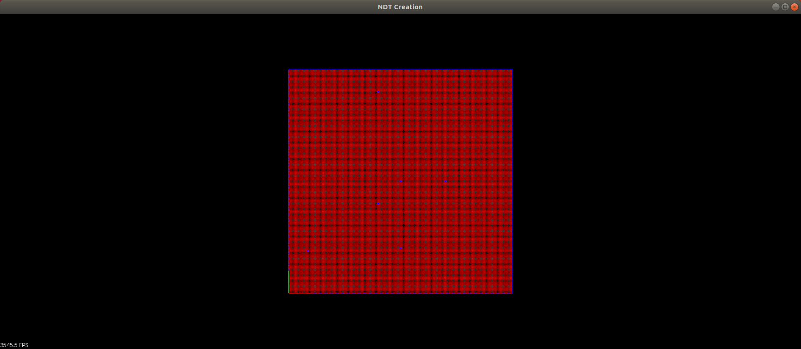
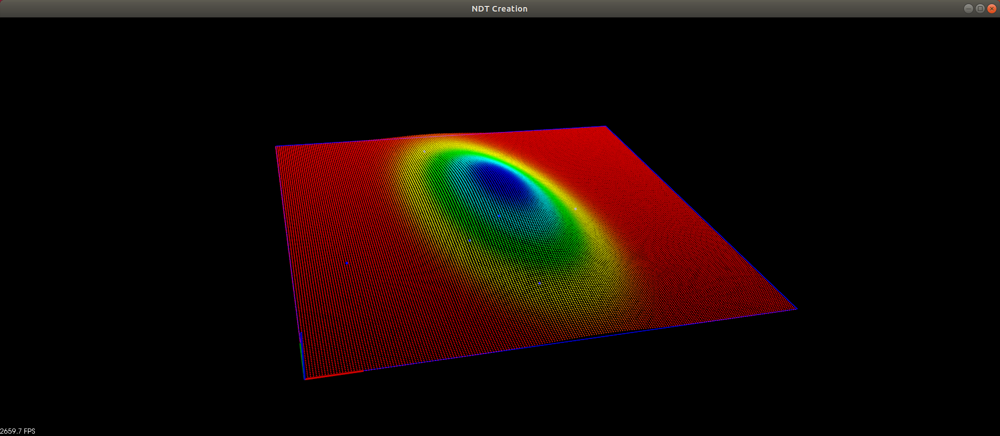
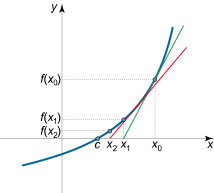
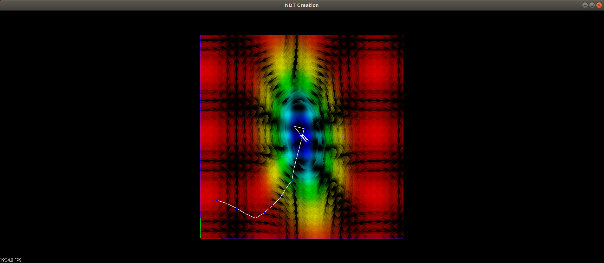
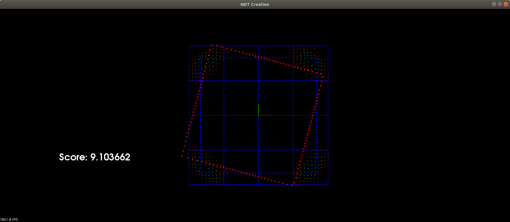

# Creating NDT

> Part of: **Creating Scan Matching Algorithms**

## Video

[Watch on YouTube](https://www.youtube.com/watch?v=VU6UiEPvwXA)

## Summary

**Summary of NDT (Normal Distributions Transform) Exercise**

This exercise guides students through creating a Normal Distributions Transform (NDT), a technique used in 3D point cloud registration. The goal is to understand how to use NDT to align two point clouds.

### Key Concepts

* **Probability Density Function (PDF)**: A mathematical function that describes the probability of finding a point within a given cell.
* **2D Gaussian**: A probability distribution that models the shape of a cell in 2D space.
* **Newton's Method**: An optimization algorithm used to find the maximum of a function, applied here to the PDF.
* **Hessian and Gradient Matrices**: Used in Newton's method to compute the direction of the maximum.
* **Positive Definite Matrix**: A matrix that is always positive when multiplied by a vector.
* **NDT Grid**: A grid that breaks up the space into regular-sized cells, used to compute the PDF.

### Practical Notes

To implement NDT, you will need to:

1. Define the probability density function (PDF) for each cell in the grid.
2. Use Newton's method to find the maximum of the PDF for each cell.
3. Compute the Hessian and gradient matrices for each cell.
4. Initialize the Hessian and gradient matrices as zeros.
5. Iterate through the target points, adding them to the grid and computing the PDF for each cell.
6. Load the source point cloud and iterate through its points, looking up the corresponding cell in the grid and computing the probability density function (PDF) for each point.
7. Use Newton's method to find the maximum of the PDF for each point.
8. Compute the transformation matrix T using the Hessian and gradient matrices.
9. Transform the source point cloud by applying the transformation matrix T.

Note: This exercise assumes prior knowledge of 3D point clouds, probability density functions, and optimization algorithms like Newton's method.

## Transcript

Now I'd like to introduce you to the third exercise in lesson 1 for creating NDT, so let's go over this exercise. It's very similar to creating ICP with this keyboard interface, where you can move around the scans, the same buttons as before there, and the functions you'll be filling in as this probability, that's just given the cell of a point, a mean and covariance, what's the probability of finding that point. You can see the equation in the classroom notes. Then you'll also be completing this PDF function, which will allow you to visualize what that cell looks like with its 2D Gaussian. If we're completing this, you're calculating this mean, this centroid of the points, as well as the covariance which is defining the shape of that 2D Gaussian.

Doing this matrix calculations is very similar to the matrix calculations you were doing before with ICP. Once you have the Q and the S, the mean and the covariance, that will properly define that 2D Gaussian. You also define the probability here and you'll be able to visualize what that cell Gaussian looks like, that PDF, probability density function, what that actually looks like. You'll be working on that PDF function and then the main function here is a Newton's method, which is the most evolved one here for completing that. See the notes in the classroom for more details and going through each of these steps here.

But essentially, the Hessian and the gradient matrices are being passed in as reference. They'll be added to here and then they'll be accessible outside the function sensor being passed in as reference. They're just being initialized as zero right here. Then let's go over the different parts. There's this functioning worth mentioning, which is positive definite.

It's important that the Hessian is positive definite to go in the right direction. This function can help you. In the parts below, you'll just be defining an increment in max value to do this linear search. Let's go over main. We have this PCL viewer with the keyboard interface in part 1.

That set the true here. The first thing that's going on is it is setting some test points into the cell and that's what's going to be used to define this Gaussian. We have this input cluster, and then the cell border is being drawn, and then PDF is being called. If you fill in PDF from here, with that probability function as well, then you can actually visualize what this input looks like from those five points. As well as what kind of 2D Gaussian that creates.

Then there's a test point and the goal of part 1 is understand Newton's method, and so the function that Newton's method is working on is that PDF, that probability density function. Newton's method will slowly figure out how to work its way from this test point up to the peak of that 2D Gaussian. The next parts here are increasing the number of iterations. This is actually working on Newton's method, so go ahead and increase this to a larger number right now. It's stuck at one iteration, and then h and g are being defined as zeros.

That's being passed into Newton's method. Once Newton's method is working correctly, then you'll be able to retrieve these since they're being passed in as reference and be able to use them. Then here's that positive definite function that we mentioned earlier above, to change increment max values here, and then we have this three by one T matrix. Then see the classroom notes for calculating this and it involves using h and g. Then once we have that transform, then we can actually figure out this vector.

We have this T, which is x translation, y translation in this Theta rotation here. We want to calculate the new point. We had this first starting point. Then we can see which direction to take it, and so that'll be this vector. We're going to change it by that increment defined by that transformation here.

Transform that point here and create a vector. Then from here, actually, what this is doing is it's setting a length for that vector. Here, it's a 0.5, so each step will be 0.5 for its magnitude, and then you can visualize that here. Then it'll also be visualized down below here with this render array. That's it for part 1.

Part 2. It's taking the same idea, so just a single point using that same idea that we've been working with with a target point cloud and a source point cloud. This same idea carries over. To do this, first load up the target PCD, visualize target, create this "ndtGrid", which will break up the space into these regular-sized cells. Feel free to change these parameters and see how that affects the overall problem.

Then we're going to iterate through the target points and add those to our grid. The grid is based off that target point cloud. Then this will draw the grid here and then display it. We have a certain resolution. Look through this here.

That's displaying our overall PDF of the target break. That's broken up into several cells. Now we get the target part and then there's the source. Loading the source, "source.pcd", visualizing it. Then you have the score that we can look at, which is going back and using that probability.

It's going through every source point, looking at probability, and adding those altogether from that NDT define grid. Then we can see that score. Then here, while the viewer hasn't stopped in going through, and this is where you hit space, the checkout each iteration. We have the H and g being initialized as zeros, and then go through all the source points, grab the cell from "ndtGrid" and doing this lookup with that point. Then we have this Theta X and Y defined by our pose, which is going to be changing each time.

We can transform that source point by that pose transform. Then you will be doing the calculation here for that. Then put that in the Newton's method. After that, just this step in making sure H is pos definite. Here, you can see the calculation for T using H and g.

Then it's interesting this alpha "computeStepLength". In part one [inaudible] is always being 0.5. This one, it's using a slightly more complicated way of doing that. You can check it up above in this computeStepLength. That's pretty interesting.

Even in the classroom, there's notes for checking out the source code for computing the step length from the PCL library. It's pretty interesting if you want to check it out. But yeah, that'll compute the step length, how far to go. Multiply that by T. Then this is just adding that Delta T to pose.

Then what's going on is going ahead and taking that pose that was altered here, getting matrix transform out of it so we can multiply it by sourcing at this transform scan of source. Calculate the entity score after doing that transform. Then that's displayed, and that'll be one iteration. Then it's displaying the "ndt_scan". Then this last part here is doing that upose where you can use the keyboard to move around the scan, and then you can dynamically see how that affects the score, which is interesting to take a look at.

## Images


*Five cell points shown as blue dots and red shown everywhere else because just outputting zero.*


*Cell PDF visualized in pcl viewer with 3D intensity point cloud. Can orbit around the point cloud to see the 3D structure of the 2D Gaussian also visualized with color intensity.*


*Using Newton's method to find the root of a function by following it's tangent lines defined by the function's derivative.*


*Newtons method iteratively moves the test point closer to the peak where probability score is the highest*


*Part 2*

## Additional Content

## Creating NDT: The Code
## Creating NDT

In this final exercise for lesson 2 you will be implementing NDT, Normal Distribution Transform, algorithm from scratch. The creation of NDT involves creating a probability density function from a target point cloud and then using newton's method to find a transform that maximizes the overall summation of source point values within that probability field. To create the probability density function the grid space is discretized into cells, and each cell has it's own 2D Gaussian from the target cloud's points that lie in that cell region. The 2D Gaussian represents the probability of finding a point throughout the cell region and is calculated based on mean and covariance of the points inside the cell. In the first part of this exercise you will be completing the functions `PDF` and `Probability` in  `ndt-main.cpp` to produce a single cell's probability density function and then visualize it. The cell will be a region from 0 to 10 in both x and y directions and contain a set of five contrived points. When you first launch the exercise the viewers will show the five points in blue and red everywhere else. This is because`Probability` is currently just returning zero and `PDF` returning zero matrices instead of the proper mean and covariance of the five points. What this looks like is shown below.
Once you calculate the correct 2 x 1 mean matrix and 2 x 2 covariance matrix in `PDF` and output the correct probability calculation in `Probability`, you will see what cell's probability density function looks like shown below.
## Creating a PDF

A very useful resource for completing this exercise is

[The Normal Distributions Transform: A New Approach to Laser Scan Matching](https://www.researchgate.net/publication/4045903_The_Normal_Distributions_Transform_A_New_Approach_to_Laser_Scan_Matching)

paper, which contains all calculations for building NDT. In section ***III. The Normal Distributions Transform*** steps 1 - 3 detail the equations to use in order to calculate the mean matrix, covariance matrix, and output the correct probability value. The steps are also summarized below.

1. In `PDF` calculate the mean matrix by adding all the (x,y) points and then dividing by the total number of points n,  to get 1/n [ sum x point, sum y points]. In this example n is 5.
1. In `PDF` calculate the covariance matrix by summing all the matrix products of `(point - mean) * (point-mean).transpose()` for each point and then divide by total number of points. Product of **2** x 1 matrix and 1 x **2** matrix is **2** x **2** matrix
1. In `Probability` calculate the probability  of point by using mean and covariance and doing `exp( -0.5 * (point - mean).transpose() * covariance.inverse() * (point - mean) )`. Product of **1** x 2 matrix with 2 x 2 matrix and 2 x **1** matrix is **1** x **1** matrix. Take the single 1 x 1 element of this matrix mulitply it by -0.5 and then raise **e** to that value to get the final value.

Verify your results for completing `PDF` and `Probability` by ensuring your results match the PDF image above.
## Newton's Method

You are now half way through Part 1 of this exercise and creating NDT by producing cell probability density functions. The next half is using newtons method to find a transform that gives source points their highest values within the probability field. To gently introduce this idea, the next part of this exercise will by using source point cloud of a single test point. Your goal then will be to use Newton's method to iteratively move the test point closer and closer to the peak of the probability density function. To understand how Newton's method can allow you to do this, its best to start with a simple introduction problem. A very common introduction to Newtons' method is using it to find the square root of a particular value. Newtons Method is able to do this by following each starting point's tangent intersection with the x axis. Each following intersection point becomes the next starting point and doing this iteratively will allow the point to converge. At it's essence its following the function's curvature defined by the derivative that allows newton's method to converge. [Here is a link that shows how to use Newton's method](https://www.math24.net/newtons-method/) to find roots of a function and how to calculate the square root of a value.
## Newton's Method with Multivariable Functions

You will be using this same idea with a function of multiple parameters,  following the curvatures of the function to lock onto a maximum/minimum point, think of gradient descent. The function will be the probability density function that you created earlier which is a function of x,y position. The process of doing Newton's method to find the transform with your PDF function of two variables will be transformed into a linear algebra problem with matrices representing first and second order partial derivatives of the PDF. In this next part you will be completing `NewtonsMethod` function in `ndt-main.cpp`. Section **V. Optimization using Newton's Algorithm** from the

[earlier paper on NDT](https://www.researchgate.net/publication/4045903_The_Normal_Distributions_Transform_A_New_Approach_to_Laser_Scan_Matching)

outlines how to calculate the optimal incremental change in the transform to get a higher height on the PDF curve. The function header for `NewtonsMethod` can be seen below. The function is void so it's not returning anything but notice that the inputs `g_previous` and `H_previous` are being passed by reference **&** so any changes to these variables inside the function will be present outside of it as well.

```
void NewtonsMethod(PointT point, double theta, Cell cell, Eigen::MatrixBase

& g_previous, Eigen:: MatrixBase& H_previous)
```

 The main components needed to get the transform of the function and given point come from the **H** matrix, the Hessen of the function and **g** matrix, transposed gradient of the function. Once you have calculated **H** and **g** the transform can be calculated by doing `-H.inverse()*g`. Since H is 3 x 3 and g is 3 x 1 the transform is 3 x 1 and its elements are x offset, y offset, and theta rotation respectively. The steps to calculate **H** and **g** are summarized below with **V. Optimization using Newton's Algorithm** as reference.

1. Calculate matrix q which is transposed point minus mean, q should then be 2 x 1 reference **8.**
1. Define the 3 partial derivative matrices which are each 2 x 1 and are the columns reference **11.**
x partial derivative = **<1, 0>** 
y partial derivative = **<0, 1>**
theta partial derivative = **<-xsin(theta)-ycos(theta), xcos(theta)-ysin(theta)>**
1. Calculate exponential part by using cell's mean and covariance that you calculated from the PDF part and do `exp(0.5 *  q.tranpose() * covariance .inverse() * q)` reference **10**
1. Calculate g by doing `exp(0.5 *  q.tranpose() * covariance .inverse() * q) * (q.tranpose() * covaraince.inverse()` * <  x partial derivative,  y partial derivative, theta partial derivative >
1. Calculate the second order partial derivative which is **< -xcos(theta)+ysin(theta), -xsin(theta)-ycos(theta) >** reference **13.**
1. Calculate the H matrix, the Hessian, by following the equation in **reference 12**. H is 3 x 3 and uses all the other matrices that you calculated in the above steps except for the g matrix , the transposed gradient.

Once you have completed these steps for `NewtonsMethod` the function will add the matrices you calculated to the input reference values H, and g. To finish the exercise fill in the `PosDef`function starting at some positive value and including a max. This function is to ensure that the H matrix is positive definite which is talked about in **(7.)** from **IV. Scan Alignment**. Then calculate the T matrix by doing `-H.inverse()*g` from **(4.) Optimization Using Newton's Algorithm**. Finally calculate the new point which should be higher than the previous by transforming the input point the transform defined by the matrix T < 3 x 1 >, see **(2.)** from **IV. Scan Alignment** to help see how to do that. The results from doing newtons method and transforming the test point for 20 iterations can be seen below.
Now that you have finished doing Newton's method for a single cell PDF and single test point its still the same mechanics to do this with many cells each with their own PDF and a input of multiple points. To finish the exercise set `part1` in `ndt-main.cpp` to false.  Now exercise will change from using the contrived 5 points and single test point, to using the same target and source point clouds that you used in the previous **ICP** exercises. This will now look like the image below which visualizes the combination of PDF cells as well as the current score of the source point cloud in target's overall PDF which is around 9.1. The overall score is simply the summation of each source points probability/height in the target PDF. **The higher the score, the better source and target are overlapping. **
### Part 2
The Newton's method function that you completed in part 1 can be used in part 2 as well. The only thing that changes is the H and g matrices are summed over all source points. To have **NDT** transform the source point cloud to a position that will have a higher target score, in `ndt-main.cpp`. To finish part 2 so that launching the program and hitting the **space** key will execute one step for NDT, do the following. In the part 2 section transform the source point by the x, y, and theta values given in the current pose. This is very similar to the last step in part 1. Also set the parameters for `PosDef`, just like what was done in part 1. The video below shows the results of using NDT to try to align the source point cloud to the target.
## Closing Comments on NDT Algorithm

In the video above each step executed by pressing **space key** increases the NDT score until it no longer can find a parameter transform given the hyper parameters. One main hyper parameter to go over that the reference article didn't touch on in detail is the step length. In part 1 of this exercise the step length was always **0.5** while in part 2 its calculated in `computeStepLength` which iterates through different lengths to see what gives the best score. To see how **PCL** manages calculating the step length you would might be curious to check out the function `computeStepLengthMT` from [this code](https://github.com/PointCloudLibrary/pcl/blob/master/registration/include/pcl/registration/impl/ndt.hpp). 

In the PCL viewer you can also use the arrow keys in the same way that you did in ICP exercise to move the source point cloud around and test it with different manual poses.
