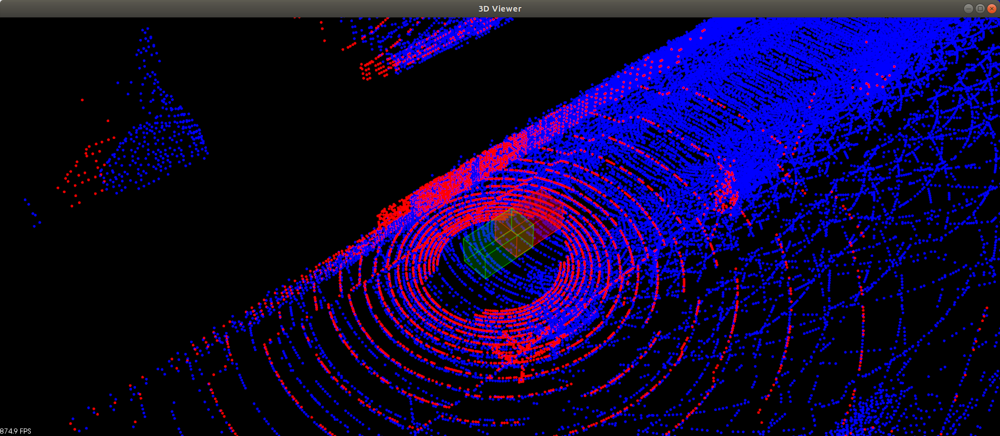

# Using ICP to Align

> Part of: **Utilizing Scan Matching**

## Video

[Watch on YouTube](https://www.youtube.com/watch?v=R6ad0E5c8cg)

## Summary

**Scan Matching with ICP: A Detailed Summary**

This lesson focuses on utilizing scan matching with Iterative Closest Point (ICP) to align 3D point clouds in real-time. The goal is to recover the true pose of a car from a given scan, while also optimizing performance by compressing the scan using a voxel filter.

**Key Concepts:**

* **Iterative Closest Point (ICP)**: an algorithm used for aligning two sets of 3D points.
* **Voxel Filter**: a technique used to compress point clouds and reduce processing time.
* **Scan Matching**: the process of aligning a given scan with a map or ground truth pose.
* **True Pose**: the actual position and orientation of the car in 3D space.

**Practical Notes:**

To complete this exercise, you will need to:

1. Reuse your code from the previous lesson on creating ICP, as it is similar to this exercise.
2. Create a voxel filter for the scan using PCL (Point Cloud Library).
3. Experiment with the number of iterations in the ICP algorithm to balance accuracy and performance.
4. Use the tester to measure the pose error and timing of the ICP transform.
5. Visualize the alignment of the green car (current scan) with the red ground truth pose.

Note: The lesson also introduces a new concept, the "tester", which is used to evaluate the performance of the ICP algorithm in real-time.

## Transcript

Let's go ahead and look at the first exercise or lesson to utilizing scan matching. Here we're utilizing ICP to align our 3D point clouds. In this exercise, it's actually really very similar to the starting exercise back in creating scan matching, where you'll be filling in ICP. Honestly, it's basically identical to that first exercise. But here you can see that in pcl using that ICP generalizes even from the 2D to 3D point cloud.

You can reuse your code from that section here to get your transform for ICP. Let's look at what's new in this exercise. We have this tester and it's going to be helping us out as we want to be doing scan matching in real-time. If we go down to main, some of the things happening here is creating that pcl viewer. It's loading up the map and displaying it.

Now there is this truePose and this is recorded here. This will be our ground truth, and at this truePose the car had a scan, and then we load up the scan here. We're starting off the car at this offset from this truePose and the goal of ICP, of course is to recover this truePose. The tester will measure how well it's doing this and how quickly is doing this as well. The other things you'll be doing in this exercise is you'll have this scanCloud and you'll be using a voxel filter to compress that scan.

We want to be able to do this in real-time, and from the previous lesson creating ICP, the number of points directly affects how long it's going to take to do ICP. If you have more points then you have more nearest neighbor calculations that you need to do, so voxel filter can compress that and make running ICP in real-time quicker as a result. You'll be creating a VG voxel filter using pcl. See the classroom notes for doing that. Also, I think you'll be experimenting with is the number of iterations.

In previous exercises, this is just generally set to a large number. But here actually, you really want to balance it. You want it to be large enough where you're getting a decent amount of that movement from the transform, but at the same time, you want it to be small enough so it's fast. You don't want to be taking all your cycle time doing one ICP transform. Actually, it's better to have this relatively small and you can play with this value and see the test, it'll tell you how long it takes.

You'll be changing this value, seeing what gives the best performance from the tester. If we just look at what's going on here, we have this pose that we're getting from doing our ICP transform that is being visualized down here in the scan. We have the scan car that's showing up in green that's using that transform pose. So we want it to overlap of our ground truth car that's being displayed up above and that one is right here in red. We want those to the overlap.

We're also visualizing that transform scan. The tester has this displacement function. When the ICP transforms, stop moving it from some distance threshold, that's when this we'll call stop and it'll stop on the timing and report the timing and see that up above and also show the pose error. Then if we look at testing, we can see where that is happening for calling the time. That's happening at this reset here.

The main things to do in this exercise is filling ICP, create a voxel filter for the scan, and then also play with this to see what gives the best results from tester. Happy coding. Let's look at what it looks like when we run this ICP scan matching program. This is the first exercise of lesson 2. Then if I go ahead and launch scan matching 1 from home workspace ICP matching L2, this is what it looks like.

I can see my current car in green and I can see the ground truth pose in red. So I want the two boxes to overlap by the end of this exercise. The red scan is my current scan, the blue one is my map. I can move around and check out the map. In this exercise, you can move the scan around here along with this green boxcar.

That's with the arrow keys on the keyboard. You can also rotate it with K and L. Then once you fill in the exercise when you hit "Space", you can see how the green car will align with red given any custom starting pose that you define. If I hit "Space" right now, it'll just reset.

## Images


*Point cloud map shown in blue and input scan in red. True pose is red box while estimated is green. *

## Additional Content

## Using ICP to Align: The Code
### ICP Alignment Demo
## Using ICP to Align

In this exercise you will be using PCL's ICP function to align a lidar input scan with a point cloud map. This exercise will also act as a test bench that can measure how fast ICP converges and what's the error to the actual scan pose. From the image below we can see the starting pose (green box with red scan) is behind the actual pose (red box) by 2.6m. The goal of ICP is to provide transformations that minimize this offset and get the green box to overlap with the red.
## Voxel Filtering for Input Scan

Your first task will be to filter the input scan. How quickly ICP converges is dependent on the size of the input scan. This is because each point in the input scan needs to search for an associated nearest point in the map point cloud. Since later in the final project you will be wanting to localize a moving object in real time, the faster ICP can return transformations the better. A voxel filter can be used to down sample  the input scan by breaking the 3D space into a grid of regular spaced cubes, which only includes one point per cell. Your first task will be to construct a PCL voxel filter and set its input as the measured scan. The cell leaf size for the grid can then be set, it should be set large enough so ICP can be as fast as possible but also small enough so there is still good definition in the scan to align with the map.

A PCL voxel filter can be created in just a couple of lines.

The pcl dependencies are already in an include declared at the top of the `sm1-main.cpp` file.

```
#include

```

#INPUT `pcl::PointCloud::Ptr` input point cloud pointer

#OUTPUT `pcl::PointCloud::Ptr` output point cloud pointer

#RES `double` size of the cell, ~1m can be a good starting value to test

```
pcl::VoxelGrid vg;
vg.setInputCloud( #INPUT );
vg.setLeafSize(#RES, #RES, #RES);
vg.filter( #OUTPUT);
```

For more details check out [the example in the link here](https://pointclouds.org/documentation/tutorials/voxel_grid.html).
## Implementing ICP function with PCL

Your next task will be to fill in the function `ICP` in `sm1-main.cpp`. Currently the function just returns an identity matrix. Any matrix multiplied by the identity matrix just remains the same.  The following steps can be done to complete the ICP function. The notation for **source** is the input scan and **target** is what you are trying to align the scan to, which in this case is the point cloud map.

```
Eigen::Matrix4d ICP(PointCloudT::Ptr target, PointCloudT::Ptr source, Pose startingPose, int iterations)
```

### 1. Transform the **source** to the **startingPose**

### 2. Create the PCL icp object

### 3. Set the icp object's values

### 4. Call align on the icp object

### 5. If icp converged get the icp objects output transform and adjust it by the **startingPose**, return the adjusted transform

### 6. If icp did not converge log the message and return original identity matrix

An example of using ICP in PCL can be found here which covers the steps above.

A transformation on a point cloud can be done by using `pcl::transformPointCloud` and providing a 4 x4 transformation matrix.  For example

#INPUT `pcl::PointCloud` input point cloud

#OUTPUT `pcl::PointCloud` output point cloud

#TRANSFORM `Eigen::Matrix4d` transformation matrix

```
pcl::transformPointCloud (#INPUT, #OUTPUT,  #TRANSFORM );
```

Also the function `transfrom3D` from `helper.h` can be used to convert the input `Pose` object to a matrix.
## Setting ICP Hyper-parameters

The main hyper-parameters for ICP are shown below. Along with these settings there are other parameters that are possible to change and experiment with to see which values give the best results. For the full list of ICP parameters see this link.

##ITERATIONS `int` set from the function header value **iterations**

##SOURCE `pcl::PointCloud::Ptr` set from the function header value **source**

##TARGET `pcl::PointCloud::Ptr` set from the function header value **target**

##DIS `double` if this value is too small then correspondences can't be made

```
icp.setMaximumIterations (##ITERATIONS);
icp.setInputSource (##SOURCE);
icp.setInputTarget (##TARGET);
icp.setMaxCorrespondenceDistance (##DIS);
```
