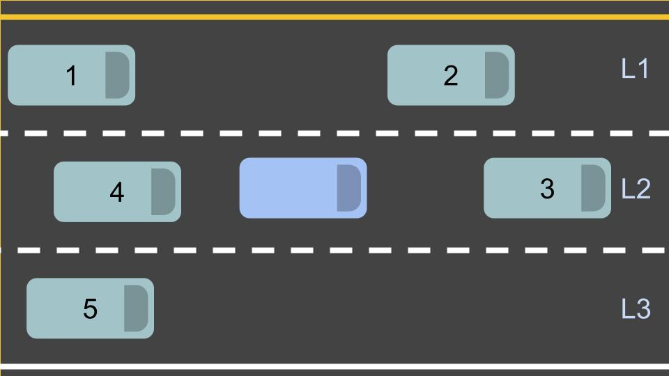

# Understanding Output

> Part of: **Behavior Planning**

## Images



## Additional Content

It's possible to suggest a wide variety of behaviors by specifying only a few quantities. For example by specifying only a target lane, a target vehicle (to follow), a target speed, and a time to reach these targets, we can make suggestions as nuanced as "stay in your lane but get behind that vehicle in the right lane so that you can pass it when the gap gets big enough."

Look at the picture below and 5 potential `json` representations of output and see if you can match the `json` representation with the corresponding verbal suggestion.
#### Output A

```json
{
	"target_lane_id" : 2,
	"target_leading_vehicle_id": 3,
	"target_speed" : null,
	"seconds_to_reach_target" : null,
}
```
---------
#### Output B

```json
{
	"target_lane_id" : 3,
	"target_leading_vehicle_id": null,
	"target_speed" : 20.0,
	"seconds_to_reach_target" : 5.0,
}
```
-----
#### Output C
```json
{
	"target_lane_id" : 2,
	"target_leading_vehicle_id": null,
	"target_speed" : 15.0,
	"seconds_to_reach_target" : 10.0,
}
```

-----
#### Output D
```json
{
	"target_lane_id" : 2,
	"target_leading_vehicle_id": 2,
	"target_speed" : null,
	"seconds_to_reach_target" : 5.0,
}
```

-----
#### Output E
```json
{
	"target_lane_id" : 1,
	"target_leading_vehicle_id": 2,
	"target_speed" : null,
	"seconds_to_reach_target" : 5.0,
}
```
