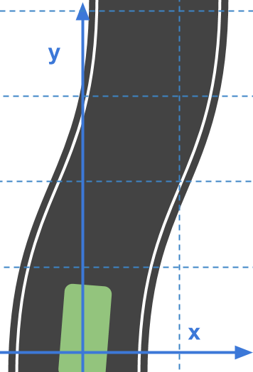
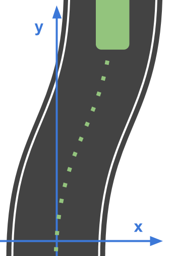
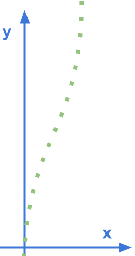
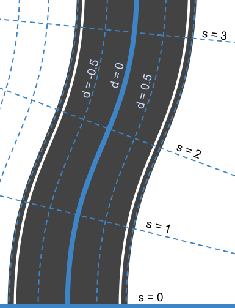
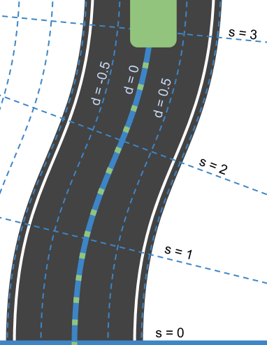
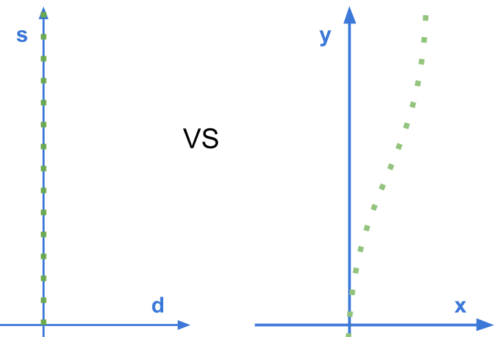

# Frenet Coordinates

> Part of: **Behavior Planning**

## Images

*Frenet Coordinates*

*Frenet Coordinates*

*Curved Path with Frenet Coordinate axes*

*New cartesian system*

*Typical Trajectory in Frenet coordinates*

*Straight trajectory with the `s` and `d` axes*

*Trajectory comparison*

## Additional Content

Before we further discuss the states, we should mention "Frenet Coordinates", which are a way of representing position on a road in a more intuitive way than traditional

$(x,y)$

Cartesian Coordinates.

With Frenet coordinates, we use the variables

$s$

and

$d$

to describe a vehicle's position on the road. The

$s$

coordinate represents distance *along* the road (also known as **longitudinal displacement**) and the

$d$

coordinate represents side-to-side position on the road (also known as **lateral displacement**). 

Why do we use Frenet coordinates? Imagine a curvy road like the one below with a Cartesian coordinate system laid on top of it...
Using these Cartesian coordinates, we can try to describe the path a vehicle would normally follow on the road...
And notice how curvy that path is! If we wanted *equations* to describe this motion it wouldn't be easy!

$x(t) = \text{?}$

$y(t) = \text{?}$

Ideally, it should be mathematically easy to describe such common driving behavior. But how do we do that? One way is to use a new coordinate system. Now instead of laying down a normal Cartesian grid, we do something like you see below...
Here, we've defined a new system of coordinates. At the bottom we have

$s=0$

to represent the beginning of the segment of road we are thinking about and

$d=0$

to represent the center line of that road. To the left of the center line we have negative

$d$

and to the right

$d$

is positive.

So what does a typical trajectory look like when presented in Frenet coordinates?
It looks straight!

In fact, if this vehicle were moving at a constant speed of

$v_0$

we could write a mathematical description of the vehicle's position as:

$s(t) = v_0t$

$d(t) = 0$

We'll be working with Frenet coordinates a good deal in the rest of the course, because...
...straight lines are so much easier than curved ones.
