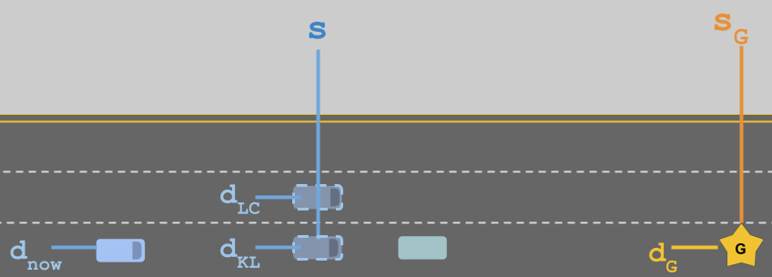

# Example Cost Function - Lane Change Penalty

> Part of: **Behavior Planning**

## Images

## Additional Content

In the image above, the blue self driving car (bottom left) is trying to get to the goal (gold star). It's currently in the correct lane but the green car is going very slowly, so it considers whether it should perform a lane change (LC) or just keep lane (KL). These options are shown as lighter blue vehicles with a dashed outline.

If we want to design a cost function that deals with lane choice, it will be helpful to establish what the relevant variables are. In this case, we can define:

* **

$\Delta s = s_G - s$

**       how much distance the vehicle will have before it has to get into the goal lane.
* **

$\Delta d = d_G - d_{LC/KL}$

**   the lateral distance between the goal lane and the options being considered. In this case $\Delta d_{KL} = d_G - d_{KL}$ would be zero and $\Delta d_{LC} = d_G - d_{LC}$ would not.

Before we define an actual cost function, let's think of some of the properties we want it to have...

So we want a cost function that penalizes large $|\Delta d|$ and we want that penalty to be bigger when $\Delta s$ is small. 

Furthermore, we want to make sure that the **maximum** cost of this cost function never exceeds one and that the **minimum** never goes below zero. 

Which of the following proposals meets these criteria?

**Option 1**:

$\text{cost} = |\Delta d| + \frac{1}{\Delta s}$

**Option 2**:

$\text{cost} = \frac{|\Delta d|}{\Delta s}$

**Option 3**:

$\text{cost} = 1 - e^{- \frac{|\Delta d|}{\Delta s}}$

In this example, we found that the ratio $\LARGE \frac{|\Delta d|}{\Delta s}$ was important. If we call that ratio $x$ we can then  use that ratio in any function with bounded range. These functions tend to be useful when designing cost functions. These types of functions are called Sigmoid Functions. You can learn more in the [Wikipedia article](https://en.wikipedia.org/wiki/Sigmoid_function) if you're interested.
