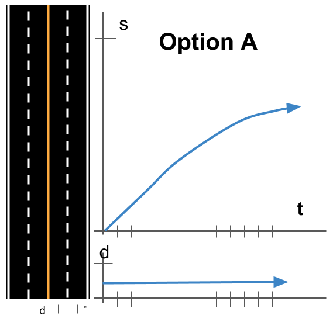
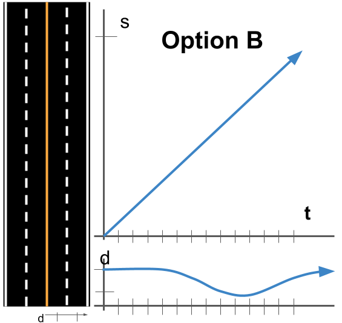
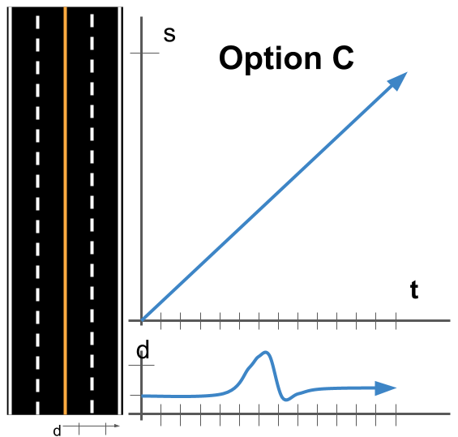
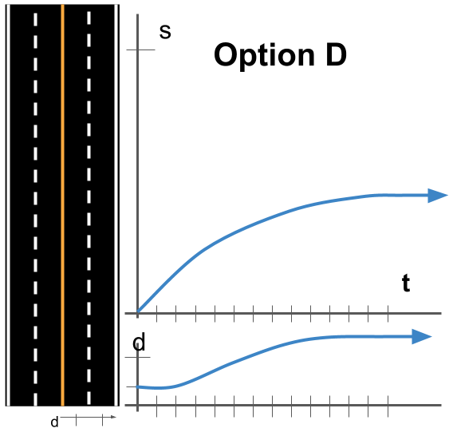

# Trajectory Matching

> Part of: **Trajectory Generation**

## Images

## Additional Content

Below you will see s vs. t and d vs. t graphs for four different trajectories (labeled Option A, B, C, and D). Match each set of graphs to the corresponding verbal description of the trajectory.
