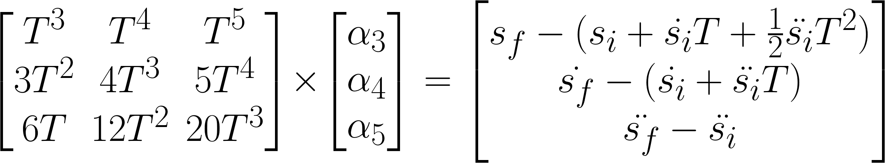

# Implement Quintic Polynomial Solver C++

> Part of: **Trajectory Generation**

## Images


*Problem in matrix form*

## Additional Content

## Implement a Quintic Polynomial Solver
In this exercise you will implement a quintic polynomial solver. This will let you take boundary conditions as input and generate a polynomial trajectory which matches those conditions with minimal jerk.

#### Inputs 
Your solver will take three inputs.

1. `start` -

$[s_i, \dot{s_i}, \ddot{s_i}]$

2. `end` -

$[s_f,  \dot{s_f}, \ddot{s_f}]$

3. `T` - the duration of maneuver in seconds.

#### Instructions

1. Implement the `JMT(start, end, T)` function in `main.cpp`
3. Hit `Test Run` and see if you're correct!

#### Tips
Remember, you are solving a system of equations: matrices will be helpful! The Eigen library used from Sensor Fusion is included.

The equations for position, velocity, and acceleration are given by:

$$s(t) = s_i + \dot{s_i}t + \frac{\ddot{s_i}}{2}t^2 + \alpha_3t^3 + \alpha_4t^4 + \alpha_5t^5$$

$$\dot{s}(t) = \dot{s_i} + \ddot{s_i}t + 3 \alpha_3t^2 + 4\alpha_4t^3 + 5\alpha_5t^4$$

$$\ddot{s}(t) = \ddot{s_i}  + 6 \alpha_3t + 12\alpha_4t^2 + 20\alpha_5t^3$$

and if you evaluate these at

$t=0$

you find the first three coeffecients of your JMT are:

$[\alpha_0,  \alpha_1, \alpha_2] = [s_i, \dot{s_i}, \frac{1}{2}\ddot{s_i}]$

and you can get the last three coefficients by evaluating these equations at

$t = T$

. When you carry out the math and write the problem in matrix form you get the following:
All these quantities are known except for

$\alpha_3, \alpha_4, \alpha_5$

>Note: 
1. The code for this exercise is present in the directory `/home/workspace/quiz/`. The solution files are present in `/home/workspace/solution/`
2. To run your code, you first need to compile all the **.cpp** files. For this exercise, you can compile the code by running the following commands from the workspace terminal:
	```bash
    cd /home/workspace/quiz/
    g++ -I ../eigen-3.4.0 main.cpp
    ```
3. The compiler will generate an executable file with the name **a.out**. Run the executable file from the workspace terminal as follows:
	```bash
    ./a.out
    ```
4. You can test your output against the output of the solution code. Run the solution code as follows:
	```bash
    cd /home/workspace/solution/
    g++ -I ../eigen-3.4.0 main.cpp
    ./a.out
    ```
