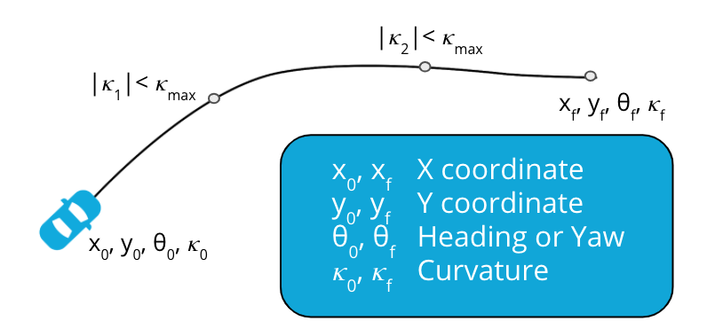

# Components of Path Planning

> Part of: **Motion Planning**

## Video

[Watch on YouTube](https://www.youtube.com/watch?v=gsANBIBBQXA)

## Summary

**Path Planning Problem Statement**
=====================================

This project aims to solve the path planning problem, which involves finding a path from a starting state to an ending state while satisfying vehicle's curvature constraints.

### Key Concepts

* **Parametric Curves**: A mathematical representation of curves in terms of parameters, used to describe the path.
* **Boundary Conditions**: The start and end states that define the path, including initial and final positions, heading, and curvature.
* **Kinematic Constraints**: Vehicle's minimum turning radius or maximum curvature it can perform.
* **Objective Function**: A mathematical function used in optimization methods to minimize or maximize a specific goal, such as accumulated curvature along the path.

### Practical Notes

To implement path planning, you will need to:

* Define the boundary conditions (start and end states) using initial and final positions, heading, and curvature.
* Apply kinematic constraints to ensure the vehicle's turning radius is within limits.
* If using optimization methods, define an objective function to minimize or maximize a specific goal, such as bending energy.

Example code for defining boundary conditions:
```python
import numpy as np

# Define start state
start_position = np.array([0, 0])
start_heading = np.pi / 4
start_curvature = 1.0

# Define end state
end_position = np.array([10, 0])
end_heading = np.pi / 2
end_curvature = 1.5

# Create boundary conditions array
boundary_conditions = {
    'start': {'position': start_position, 'heading': start_heading, 'curvature': start_curvature},
    'end': {'position': end_position, 'heading': end_heading, 'curvature': end_curvature}
}
```
Note: This is a simplified example and actual implementation may vary depending on the specific requirements of your project.

## Transcript

Let's now describe the path planning problem statement, to understand what we really need to solve. The path planning problem consists of, finding a path from a starting state to an ending state, and here a state is represented by a position, a heading, and curvature, while satisfying vehicle's curvature constraints. Mathematically speaking, this really means that we want to find the coefficients of the parametric curve equation or equations, that satisfy these two conditions. We're going to cover three components of path planning; boundary conditions, constraints, and objective function. First, we consider boundary conditions.

The start and end states are the boundary conditions. These states consists of our initial and final positions, heading, and curvature. Next, we consider the kinematic constraints. As we mentioned earlier, these constraints consists of the vehicle's minimum turning radius, or the maximum curvature the vehicle can perform. The third and final component is the objective function.

The objective function is only necessary when the approach used to solve the path planning problem is an optimization method. For example, we may want to minimize the accumulated curvature along the path to make it smooth and comfortable. If that's the case, we would want to use the bending energy of the curve, and find the coefficients that minimize it. Let's summarize what we have addressed in this section. We introduced the concept of parametric curves, and we presented two types; polynomial splines, and polynomial spirals.

Finally, we described the main components of the path planning problem; the boundary conditions, the curvature constraints, and the objective function if we end up using optimization methods.

## Images



## Additional Content

## Path Planning Problem Statement
The path planning problem statement aims to: 

- Find a path from a starting state to an ending state (position, heading and curvature)
- Satisfy the vehicle’s curvature constraints

In order mathematically satisfy the two conditions on reaching an end state and following the curvature limitations of the vehicle, we need to find the coefficients of the parametric curve equation. 

## Components of the Path Planning Problem
The below components of the Path Planning Problem we described above are as follows: 
- Boundary Conditions: Specified by the start and end states.

- Constraints: 
  - Curvature -

$\kappa_{max}$

which is represented in the image below. The vehicle has a minimum turning radius, which is also known as the maximum curvature a vehicle can perform. 


- Objective Function: This can be used to minimize the accumulated curvature (bending energy) along the path. This is only utilized when we use an optimization method that we'll discuss later in this lesson. We're not going to get into optimization method too much, but we wanted to let you know objective function can be a part of the equation when discussion the path planning problem if you choose the optimization method. 

We're going to go over boundary conditions and constraints in more detail throughout the rest of the lesson.
