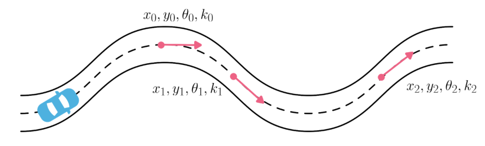

# Boundary Conditions: Goal Location

> Part of: **Motion Planning**

## Video

[Watch on YouTube](https://www.youtube.com/watch?v=BZaOvUFGs_c)

## Summary

**Path Planning Problem: Finding an Ideal Goal Position**

This README file provides a summary of the key concepts and practical considerations for finding an ideal goal position in path planning problems. The objective is to determine a goal position that satisfies the vehicle's curvature constraint, taking into account road structure, traffic conditions, and environmental factors.

### Key Concepts

* **Path Planning Problem**: Given a starting position, heading, and curvature, find a path to a goal position, heading, and curvature that satisfies the vehicle's curvature constraint.
* **Boundary Conditions**: The start and end points of the path planning problem represent critical tasks in determining the ideal goal position.
* **Road Structure**: Utilize road structure to locate the goal in the center line of the target lane, with tangential direction and matching curvature.
* **Goal Distance Calculation**: Dynamically calculate goal distance based on vehicle speed, leading vehicle's distance and speed, and environmental factors.
* **Pros and Cons of Goal Placement**:
	+ Placing the goal too close: computationally faster but may lose ability to plan a smooth curve around obstacles.
	+ Placing the goal too far: more computationally intensive but allows planning of a smooth path around objects.

### Practical Notes

To implement this concept, you will need to:

* Calculate the goal distance dynamically based on vehicle speed, leading vehicle's distance and speed, and environmental factors.
* Ensure that calculations have a minimum and maximum goal distance to find a compromise between computational efficiency and smooth curve planning.
* Utilize road structure data to locate the goal in the center line of the target lane with tangential direction and matching curvature.

Note: This summary is intended as a starting point for further development. Be sure to consult the original lesson transcript for additional details and context.

## Transcript

As we mentioned earlier when we described the path planning problem statement, the objective is; given a starting position, heading, and curvature, find a path to a goal position heading and curvature that satisfies the vehicles curvature constraint. These two points the start and the end, represent the boundary conditions of the path planning problem and that's why placing the goal is a critical task. To find the ideal goal position, heading, and curvature, we can resource to the road structure. We will locate the goal in the center line of the target lane, heading into tangential directions of the road and having the same curvature of the road at that point. The last thing we need to decide is how far ahead do we need to locate the goal.

Let's look at how we can answer this question. The goal distance should be calculated based on the vehicle's speed, the distance and speed of the vehicle ahead, and the road conditions, weather conditions, etc. Let's take a look now at the pros and cons of placing the goal too close or too far from the starting position. If we place the goal too close, generating a shorter curve will be always computationally faster than generating a longer one, but we will lose the ability to plan a smoother curve around an obstacle since we will do it only when it's just in front of us. On the other hand, if we place the goal too far, we will have a more computationally intensive generation process to the point where it might not be suitable for real-time planning, but we will have the ability to plan a smooth path around objects.

We will need to find a compromise and make sure that our calculations have a minimum and a maximum goal distance. Let's take a look at what we've learned in this section. We learn that fortunately, we can exploit the road structure to find a goal location, heading, and curvature. The goal would be in the center of the target lane, tangential to the lane curvature at that point. Goal distance from the current vehicle position should be dynamically calculated based on equal velocity, the distance and speed of any leading vehicle, and environmental factors.

Finally, we also discussed the pros and cons of close and long distance goal placement.

## Images

## Additional Content

## Boundary Conditions: Goal Location

Exploiting the road structure, the goal will be located in the *center-line* of the target lane, heading in the tangential direction of the road, and with the same curvature. The points at the start and the end represent the boundary conditions of the path planning problem.

In order to find ideal goal position, heading, and curvature - resource the road structure by: 

- Locating the goal in the centerline of the target lane, heading in the tangential direction of the road, **and** having the same curvature of the road at that point. 
- Deciding is how far ahead do we need to locate the goal.

### Goal Distance Calculation
To calculate the goal distance, you need to base it on: 
  - Ego velocity
  - Distance and speed of any vehicle ahead
  - Environmental factors, such as road conditions and weather

There is a trade-off to be made in terms of how far we place the goal that could be affected whether it's too close or too far.
## Pros and Cons: Placing the goal either *too close* or *too far* from the starting position

### Too close 

| Pro      | Con |
| ----------- | ----------- |
| Computationally fast      | Short sighted - loose ability to plan smooth obstacle avoidance paths.       |

### Too far
| Pro      | Con |
| ----------- | ----------- |
| Ability to plan smooth obstacle avoidance paths.   | Computationally too intensive - Might not be suitable for real-time applications.      |
## Other Resources
Take a look at this paper for more details on Path Planning using spirals: 
- “Motion Planning for Autonomous Driving with a Conformal Spatiotemporal Lattice” paper. https://www.ri.cmu.edu/pub_files/2011/5/20100914_icra2011-mcnaughton.pdf
