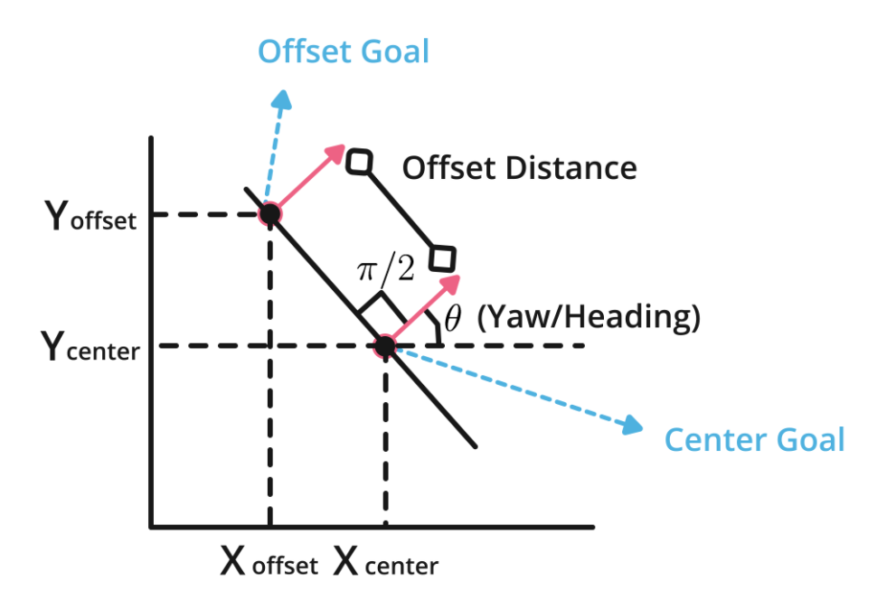

# Boundary Conditions: Offset Goals

> Part of: **Motion Planning**

## Video

[Watch on YouTube](https://www.youtube.com/watch?v=hBLKbkuyFFc)

## Summary

**README: Offset Goals in Road Structure**

This project focuses on generating alternative goals for a road structure by exploiting its geometry. The main goal is to create offset goals that are laterally positioned from the central goal, with their heading and curvature matching those of the center goal.

### Key Concepts

* **Offset goals**: Alternative goals generated at a constant distance from the center goal, with the same heading and curvature.
* **Perpendicular line**: A line perpendicular to the main goal's direction, used to position offset goals laterally.
* **Trigonometry**: Used to calculate x and y coordinates of offset goals based on their angle and distance from the center goal.
* **Goal numbering**: Goals are numbered from -3 to 3, with negative numbers indicating positions to the left of the center goal and positive numbers indicating positions to the right.

### Practical Notes

To generate offset goals, you will need to:

1. Calculate the perpendicular direction by adding `pi/2` (or 90 degrees) to the main goal's heading.
2. Use a for-loop to calculate the x and y coordinates of each offset goal based on their angle and distance from the center goal.

The equations used are:
```python
x = x_center + i * goal_offset * cos(theta + pi/2)
y = y_center + i * goal_offset * sin(theta + pi/2)
```
where `i` is the goal number, `goal_offset` is the distance between goals, and `theta` is the main goal's heading.

## Transcript

Since switching the center line goal might not be possible, we want to generate alternative that can be evaluated. To do so, we exploit again the road structure and select offset goals on each side of the center goal at a constant offset distance, their heading and curvature would be the same as the center goal. Now that we know we need offset goals, we next need to figure out where exactly to place them. In the previous slide, we mentioned that we want to place them laterally from the central goal on a perpendicular line to where they will be be heading. To get the perpendicular line, we just need to add 90 degrees or pi over two to the main goal heading.

Then we just need to calculate the x and y coordinates based on this angle and the offset distance we want them to be at. In this section, we focus on understanding the necessity of having offset goals and how to exploit the road structure to generate them. In this video, we'll go through the offset goals exercise. Let's try to go and check the problem statement first. As you can read in the beginning of your code, in this exercise you will generate "_num_goals" goals offset from the center goal, at a distance "goal_offset".

The offset goals will be aligned on a perpendicular line to the heading of the main goal. To get a perpendicular angle, just add 90 degrees or pi over 2 radians, to the main goal heading theta. After that, you will just need to calculate x and y coordinates for each offset goal using the equation presented in the lectures. Here, there's a hint of what we saw in the lectures, and we tell you that the x coordinate of the offset goal is the x-coordinate of the main goal plus goal number times the offset distance, times the cosine of theta, plus pi over 2. Let's take a look graphically to see how that looks.

This is where the offset goals that we're trying to generate. The main goal is located in the center, and what we're trying to do is calculate the x and y coordinates of every single offset goal on the left and on the right. The equations that we use were here, is basically using any trigonometry. We have the main goal as an example here, pointing in this direction, theta. Since this is the direction that it's pointing, we want it to generate offset goals on a perpendicular line to it, this is the perpendicular line.

To get this line, we just need to add 90 degrees to theta. The new offset goal should be located here, and if we try to use trigonometry to find out what this x and y coordinates would be, we'll realize that it's basically the x of the center goal times, and in this simple example would be one offset distance, 1 times offset distance times the cos of theta plus pi over 2. Now let's take a look at it to-dos on the code. Before we go to the to-dos, let's check the note here. The first note, it says that the goal number will go from minus 3, minus 2, minus 1, 0, etc.

If we wanted to generate seven goals, the goal numbers would be, the negative ones will go to the left side, and the positive ones will go to the right side, the zero, and this is the next note. When the goal number is zero, we'll get the center goal, which is one of the main goals also. Let's check the to-dos. The first to-do that we have here is asking us for how to calculate the perpendicular direction that we talked about earlier. The goal has a direction or it's pointing in a specific direction, and we want it to lay down the rest of the offset goals on a perpendicular line.

How do we do that? Well, we mentioned in the lectures and we also give you a hint here, that you should simply add pi over 2 to the main goal, or as we say here, the main goal is the goal state. The second to-do, it has to do with calculating the coordinates x and y of every single offset goal. As you can see, we do have a for-loop that goes from zero to the number of goals that we wanted to generate. The first thing we do is define goal offset and make it to the goal, basically to the main goal.

In the next to-do, you just need to calculate the coordinates x and y, for every offset goal. The way we do this is we have here created a for-loop, from i equal to 0 to the number of goals that allows you to actually generate the x and y coordinates for every single offset goal. In this case, what we need to do is, as we saw in the lectures and as we have a hint in here, we need to calculate the x and y coordinates of every single offset goal. These two to-dos are the ones that you need to complete this exercise. Let's summarize very quickly.

The first one had to do with calculating the angle that is perpendicular to the heading of the main goal, as you can see here. The second to-do is basically calculating the x and y coordinates of every goal offset, or every offset goal. As I told you before, we have the hint here on how to do that. If you have any trouble, you can go to the lectures and see this slide where it describes exactly how you can implement this.


## Additional Content

## Offset Goals

If you can't calculate the center line, that's when offset goals come into play by creating alternatives you can evaluate. The heading and curvature should be the same as the center goal, and select offset goals on each side of the center goal at a constant offset distance.

The next question is where to place the offset goals after selecting them? We already know two things about where they should be placed: 
1. Laterally from the center goal
2. On a perpendicular line to where they will be heading

If you add 90 degrees or pi over two to the main goal heading, then you should just need to calculate the X and Y coordinates based on this angle and the offset distance we want them to be at. This is how the equations are be represented mathematically:

X offset = X center + goal_number x Offset_distance x cos(ϴ+π/2)

Y offset = Y center + goal_number x Offset_distance x sin(ϴ+π/2)

goal_number =[-n,....0,....n] (Ex: for 5 total goals [-2, -1, 0, 1, 2])

Here is how they are represented graphically: 




## Boundary Conditions: Offset Goals Pre-Exercise Walkthrough

[Youtube Video](https://www.youtube.com/watch?v=5cyrCongmGM)

### Transcript

In this video, we'll go through the offset goals exercise.Let's try to go and check the problem statement first.As you can read in the beginning of your code,in this exercise you will generate "_num_goals" goals offset from the center goal,at a distance "goal_offset".

The offset goals will be aligned on a perpendicular line to the heading of the main goal.To get a perpendicular angle,just add 90 degrees or pi over 2 radians,to the main goal heading theta.After that, you will just need to calculate x and y coordinatesfor each offset goal using the equation presented in the lectures.Here, there's a hint of what we saw in the lectures,and we tell you that the x coordinate of the offset goal isthe x-coordinate of the main goal plus goal number times the offset distance,times the cosine of theta,plus pi over 2.

Let's take a look graphically to see how that looks.This is where the offset goals that we're trying to generate.The main goal is located in the center,and what we're trying to do is calculate the x and y coordinatesof every single offset goal on the left and on the right.The equations that we use were here,is basically using any trigonometry.We have the main goal as an example here,pointing in this direction, theta.Since this is the direction that it's pointing,we want it to generate offset goals on a perpendicular line to it,this is the perpendicular line.

To get this line, we just need to add 90 degrees to theta.The new offset goal should be located here,and if we try to use trigonometry to find out what this x and y coordinates would be,we'll realize that it's basically the x of the center goal times,and in this simple example would be one offset distance,1 times offset distance times the cos of theta plus pi over 2.Now let's take a look at it to-dos on the code.

Before we go to the to-dos,let's check the note here.The first note, it says that the goal number will go from minus 3,minus 2, minus 1, 0, etc.If we wanted to generate seven goals,the goal numbers would be,the negative ones will go to the left side,and the positive ones will go to the right side,the zero, and this is the next note.When the goal number is zero,we'll get the center goal,which is one of the main goals also.Let's check the to-dos.

The first to-do that we have here is asking usfor how to calculate the perpendicular direction that we talked about earlier.The goal has a direction or it's pointing in a specific direction,and we want it to lay down the rest of the offset goals on a perpendicular line.How do we do that?Well, we mentioned in the lectures and we also give you a hint here,that you should simply add pi over 2 to the main goal,or as we say here,the main goal is the goal state.

The second to-do, it has to do with calculatingthe coordinates x and y of every single offset goal.As you can see,we do have a for-loop that goes fromzero to the number of goals that we wanted to generate.The first thing we do is define goal offset and make it to the goal,basically to the main goal.In the next to-do, you just need to calculate the coordinates x and y,for every offset goal.

The way we do this is we have here created a for-loop,from i equal to 0 to the number of goals that allows you toactually generate the x and y coordinates for every single offset goal.In this case, what we need to do is,as we saw in the lectures and as we have a hint in here,we need to calculate the x and y coordinates of every single offset goal.

These two to-dos are the ones that you need to complete this exercise.Let's summarize very quickly.The first one had to do with calculatingthe angle that is perpendicular to the heading of the main goal, as you can see here.The second to-do is basically calculating the x and y coordinates of every goal offset,or every offset goal.As I told you before,we have the hint here on how to do that.If you have any trouble,you can go to the lectures and see this slidewhere it describes exactly how you can implement this.


## Other Resources

- Based on “Motion Planning for Autonomous Driving with a Conformal Spatiotemporal Lattice” paper. https://www.ri.cmu.edu/pub_files/2011/5/20100914_icra2011-mcnaughton.pdf
