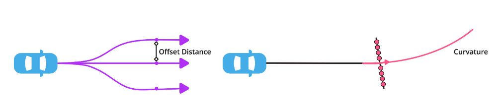
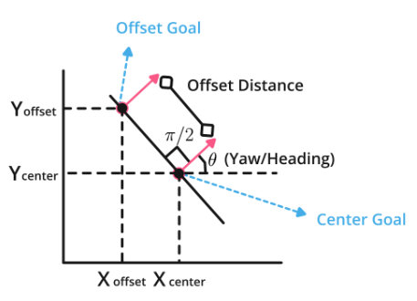

# Exercise: Boundary Conditions: Offset Goals 

> Part of: **Motion Planning**

## Images

*Offset goals*

*Offset goal x,y coordinates calculation based on know "center-goal"*

## Additional Content

## Boundary Conditions: Offset Goals Exercise
In this exercise you will generate "_num_goals" goals, offset from the
given center-goal at a distance "_goal_offset". The offset goals will be aligned on a
perpendicular line to the heading of the main goal. To get a perpendicular
angle, just add 90 degrees (or π/2 rad) to the main goal heading (ϴ). After
that you will just need to calculate the x and y coordinates for each offset
goal using the equations presented in the lectures: X offset = X center_goal + goal_number x Offset_distance x cos(ϴ+π/2); Y offset = Y center_goal + goal_number x Offset_distance x sin(ϴ+π/2)

NOTE:
1) goal_number will go from: -3, -2, -1, 0, 1 ,2 ,3  (for 7 total goals)
2) When goal_number = 0, we will get the "center" goal.
#### In order to compile the code, you'll need to create a new terminal and use the command `g++ -o output quiz.cpp`
