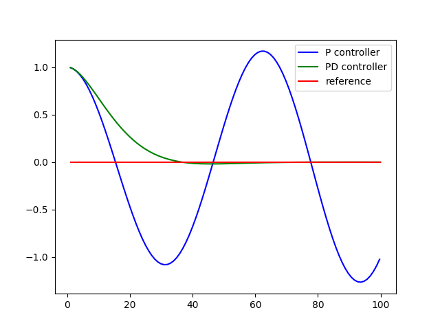

# PD Controller Solution

> Part of: **PID Control**

## Video

[Watch on YouTube](https://www.youtube.com/watch?v=YgomQgfFlTQ)

## Summary

**Summary of Differential Crosstrack Error Calculation**

This summary covers a technical approach to calculating differential crosstrack errors in navigation systems.

### Key Concepts

* **Crosstrack error**: The difference between the current position and the desired path, measured perpendicular to the direction of travel.
* **Momentary crosstrack error**: The current crosstrack error at any given time.
* **Differential crosstrack error**: A variable that calculates the change in crosstrack error over time, used to improve steering control.
* **Proportional control**: Steering adjustments made based on the magnitude of the crosstrack error and its rate of change.

### Practical Notes

To implement this approach:

1. Initialize a differential crosstrack error variable (`diffcrosstrackerror`) in your navigation system's differential calculation.
2. Update `diffcrosstrackerror` by subtracting the previous value from the current momentary crosstrack error.
3. In your steering control algorithm, adjust steering based on both the crosstrack error and its rate of change (`diffcrosstrackerror`) multiplied by a parameter (e.g., 2).

## Transcript

Here is my solution. I build a variable called "diffcrosstrackerror, which is in my differential, that is set to the momentary crosstrack error minus the previous one which I the very first time initialize to the present one. Then in the steering, I don't just steer proportionately to the crosstrack error, but also proportionately to the differential crosstrack error times the parameter 2. When I put this in and I run it, I will get exactly the output that I showed you.

## Images



## Additional Content

```python
def run(robot, tau_p, tau_d, n=100, speed=1.0):
    x_trajectory = []
    y_trajectory = []
    prev_cte = robot.y
    for i in range(n):
        cte = robot.y
        diff_cte = cte - prev_cte
        prev_cte = cte
        steer = -tau_p * cte - tau_d * diff_cte
        robot.move(steer, speed)
        x_trajectory.append(robot.x)
        y_trajectory.append(robot.y)
    return x_trajectory, y_trajectory
```

This is very similar to the P controller. We've added the `prev_cte` variable which is assigned to the previous CTE and `diff_cte`, the difference between the current CTE and previous CTE. We then put it all together with the new `tau_d` parameter to calculate the new steering value, `-tau_p * cte - tau_d * diff_cte`.
As we can see from the above image the PD controller performs much better!
