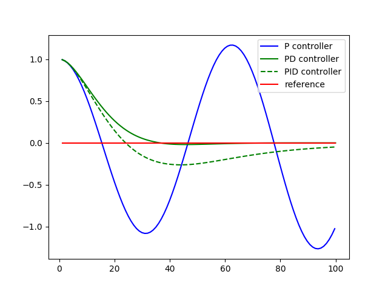

# PID Implementation Solution

> Part of: **PID Control**

## Video

[Watch on YouTube](https://www.youtube.com/watch?v=dgZnqCfyCoA)

## Summary

**PID Controller and Twiddle Algorithm**

This project involves implementing a PID (Proportional-Integral-Derivative) controller using Python. The goal is to control a system by adjusting parameters tau_p, d, and i to achieve optimal performance.

### Key Concepts

* **PID Controller**: A control algorithm that uses three terms: proportional, integral, and derivative, to adjust the output of a system.
	+ Proportional (P) term: adjusts based on current error
	+ Integral (I) term: adjusts based on accumulated error over time
	+ Derivative (D) term: adjusts based on rate of change of error
* **Twiddle Algorithm**: an optimization technique used to find optimal control gains by iteratively adjusting parameters.
* **Control Gains**: the parameters tau_p, d, and i that are adjusted in a PID controller.

### Practical Notes

To implement a PID controller using Python, you can use the following steps:

1. Initialize variables `crosstrack_error` and `tau_p`, `d`, `i` with zero.
2. In each iteration of the main loop, update `crosstrack_error` by adding the local error to it.
3. Use the PID formula to calculate the output: `output = tau_p * crosstrack_error + d * derivative + i * integral`
4. To find optimal control gains using Twiddle, iteratively adjust parameters tau_p, d, and i based on the performance of the system.

Note that this is a high-level summary, and you may need to refer to additional resources or code examples for more detailed implementation instructions.

## Transcript

<v English>Here is my solution. I implement a variable int crosstrack error outside my main loop</v> <v English>then initialize with zero.</v> <v English>I then add to the int crosstrack error my local crosstrack_error.</v> <v English>Then I have a controller that steers in proportion to the int&lt;u&gt;crosstrack&lt;/u&gt;error.</v> <v English>When I hit run, I find that my y variable slowly converges all the way down to 0 or 0.05.</v> <v English>I get even faster conversions when I set this parameter to 0.01,</v> <v English>looking down you can see a little overshoot, but my controller converges to 0.0 fairly quickly</v> <v English>and then tends to stay close to 0.0.</v> <v English>This PID controller is kind of the best solution for the control problem at hand.</v> <v English>You just implemented one.</v> <v English>Now, here's the big question for you.</v> <v English>How can we find good control gains</v> <v English>where control gains are these parameters tau p, d, and i.</v> <v English>Now, this is my favorite part of this class.</v> <v English>Every one of my students has made it through it, and every one of my students</v> <v English>is puzzled why I insist on this, but when they implement it they get to love what I'm just about to show you.</v> <v English>The answer is to called "twiddle."</v> <v English>Twiddle is my favorite algorithm that I have used in my entire life.</v> <v English>Some people call it "coordinate ascent" to make it sound a little more sophisticated,</v> <v English>but I just called it twiddle, because it really gets to the heart of what's happening.</v>

## Images



## Additional Content

```python
def run(robot, tau_p, tau_d, tau_i, n=100, speed=1.0):
    x_trajectory = []
    y_trajectory = []
    prev_cte = robot.y
    int_cte = 0
    for i in range(n):
        cte = robot.y
        diff_cte = cte - prev_cte
        prev_cte = cte
        int_cte += cte
        steer = -tau_p * cte - tau_d * diff_cte - tau_i * int_cte
        robot.move(steer, speed)
        x_trajectory.append(robot.x)
        y_trajectory.append(robot.y)
    return x_trajectory, y_trajectory
```

Ok. With the integral term we're keeping track of all the previous CTEs, initially we set `int_cte` to 0 and then add the current `cte` term to the count `int_cte += cte`. Finally we update the steering value, `-tau_p * cte - tau_d * diff_cte - tau_i * int_cte` with the new `tau_i` parameter.
This may not seem all that impressive. PID seems to do worse than the PD controller! The purpose of the I term is to compensate for biases, and the current robot has no bias.

In the next programming quiz we'll add steering drift and revisit this graph.
