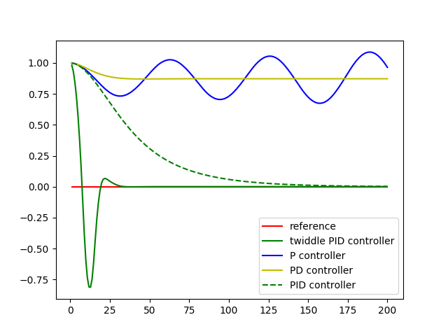

# Parameter Optimization Solution

> Part of: **PID Control**

## Video

[Watch on YouTube](https://www.youtube.com/watch?v=YQ5Pa-OKQm0)

## Summary

**Twiddle Algorithm Implementation**
=====================================

The twiddle algorithm is a routine used to optimize parameters by minimizing a single objective function. It can be applied to various applications that require adjusting multiple parameters.

**Key Concepts**
---------------

* **Objective Function**: A mathematical function that depends on the parameters and returns a single value (the "arrow") to be minimized.
* **Parameter Vector**: An array of parameters, including their values and deltas.
* **Tolerance**: A threshold value (0.001) used to determine when the optimization process is complete.
* **D Parameters**: The number of parameters being adjusted simultaneously.
* **Twiddle Algorithm Steps**:
	+ Initialize the best arrow and D parameters.
	+ Iterate through each parameter, adjusting its value and calculating the new arrow.
	+ If the new arrow is better than the current best, update the best arrow and increment D parameters.
	+ Otherwise, try adjusting the opposite direction or reduce D parameters by 0.9.

**Practical Notes**
------------------

* The twiddle algorithm can be used to optimize multiple parameters in various applications.
* In this implementation, the integral term is crucial for driving the arrow down to zero, especially in cases with systematic bias.
* Removing the D term results in a larger arrow, highlighting its importance in optimizing the objective function.

Note: This summary focuses on the main concepts and practical aspects of the twiddle algorithm implementation. For more detailed information, refer to the Udacity lesson video or additional resources.

## Transcript

Here is my implementation of twiddle. This is a routine that you can keep this way for many, many different applications. All it requires is a way to evaluate something that depends on the parameters and gives you a single arrow that you would like to minimize. We have three parameters in total, I set the parameters themselves to zero, but the deltas to one and it’s just the counter, its unimportant. If the sum of D params is still larger than our tolerance which we initially have as 0.001 and they go through all the parameter sequentially I increment that by D params, find out what the arrow is if the arrow is better than our best arrow, which I initialize with the initial arrow and I keep the best arrow and I even increment D params.

Otherwise, I try the other direction. One, find out the arrow, if that succeeds, I keep it, I increment D params. And here is my last case, I didn’t succeed, so going to set it back to the old parameter vector and decrease my D params by 0.9. I increase my counter, here is my little print out command for debugging and I will turn the parameter vector. So it will be comingout of the print vectors over here and play with this a little more .

If I want twiddle, compute the best parameters and then calculate the error using these parameters and print out the parameters along with the arrow, I get a parameter vector and I get an arrow that’s basically zero. Now let’s switch off the integral term. And I can do this with a little trick. I just set D params number two, which is the final one to 0.0 as if I’ve already learned the integral term. When I run this, I get a zero integral term, but the arrow that’s somewhat larger than the final arrow, the desired.

And that’s because the integral term is really required to drive the arrow, down to zero. Let’s also remove the D term and see what happens and the result is a really large arrow, 0.55. That large arrow, sustains even if I remove the over drift by commenting it out. You still get an arrow, of 0.10 if it does have a proportional controller, whereas if I add in the differential parameter again, by removing the D param 1 command the 0.103 goes down to 5.7 to the minus 11, which is practically zero. So you can see the importance of the D term for driving the arrow, down to zero, in the case without drift and for the integral term in cases for vowels with a systematic bias.

You play a little bit more with this code for the homework assignment. But this is it for now.

## Images



## Additional Content

```python
def twiddle(tol=0.2): 
    p = [0, 0, 0]
    dp = [1, 1, 1]
    robot = make_robot()
    x_trajectory, y_trajectory, best_err = run(robot, p)

    it = 0
    while sum(dp) > tol:
        print("Iteration {}, best error = {}".format(it, best_err))
        for i in range(len(p)):
            p[i] += dp[i]
            robot = make_robot()
            x_trajectory, y_trajectory, err = run(robot, p)

            if err < best_err:
                best_err = err
                dp[i] *= 1.1
            else:
                p[i] -= 2 * dp[i]
                robot = make_robot()
                x_trajectory, y_trajectory, err = run(robot, p)

                if err < best_err:
                    best_err = err
                    dp[i] *= 1.1
                else:
                    p[i] += dp[i]
                    dp[i] *= 0.9
        it += 1
    return p, best_err
```

This follows Sebastian's pseudocode very closely. Before each run we make a new `Robot` with `make_robot`, ensuring on each run the robot starts from the same position. You may find it fruitful to change the magic numbers altering `p` and `dp`.
Now the PID controller outshines PD controller! Also, with twiddle the PID controller converges faster but we overshoot drastically at first so it's a tradeoff. Try tuning twiddle and see if you can reduce the overshoot.
