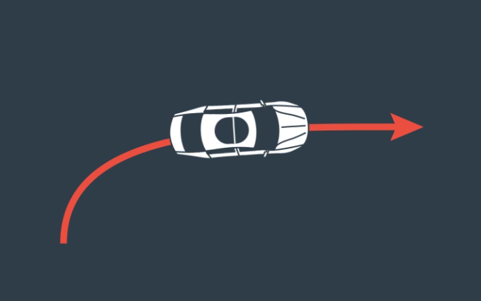

# The CTRV Model

> Part of: **Unscented Kalman Filters**

## Video

[Watch on YouTube](https://www.youtube.com/watch?v=g72HXEcSQHU)

## Summary

**Process Modeling with Constant Velocity: Limitations and Considerations**

This README file summarizes the key concepts and limitations of using a process model with constant velocity. A process model with constant velocity assumes that an object moves in a straight line at a constant speed, which is not representative of real-world scenarios where vehicles often turn.

### Key Concepts

* **Constant Velocity**: The assumption that an object's velocity remains constant over time.
* **Process Model Limitations**: Process models with constant velocity are oversimplified and do not accurately represent the movement of vehicles on roads with turns.
* **Turning Vehicles**: Vehicles that change direction, which can lead to incorrect predictions when using a process model with constant velocity.

### Practical Notes

When working with process models, it's essential to consider the limitations of assuming constant velocity. In real-world applications, vehicles often turn, making this assumption inaccurate. This can lead to incorrect predictions and outcomes in simulations or modeling scenarios. When designing process models, consider incorporating more complex movement patterns to improve accuracy.

Note: There are no code patterns or specific steps mentioned in this transcript, so there is no additional information to include under "Practical Notes".

## Transcript

<v English>In the last lesson we used a process</v>
<v English>model with constant velocity.</v> <v English>However, with the assumption that the</v>
<v English>velocity is constant you're simplifying</v> <v English>the way vehicles actually moves</v>
<v English>because most roads has turns.</v> <v English>But this is the problem because</v>
<v English>a process model with assumption of</v> <v English>constant velocity and direction will</v>
<v English>predict turning vehicles incorrectly.</v> <v English>In the next quiz, think about</v>
<v English>how assuming constant velocity</v> <v English>might effect the prediction for</v>
<v English>a vehicle that is turning.</v>

## Images

## Additional Content

### Motion Models and Kalman Filters

In the extended kalman filter lesson, we used a *constant velocity*  model (CV). A constant velocity model is one of the most basic motion models used with object tracking. 

But there are many other models including:
- constant turn rate and velocity magnitude model (CTRV)
- constant turn rate and acceleration (CTRA)
- constant steering angle and velocity (CSAV)
- constant curvature and acceleration (CCA)

Each model makes different assumptions about an object's motion. In this lesson, you will work with the CTRV model.

Keep in mind that you can use any of these motion models with either the extended Kalman filter or the unscented Kalman filter, but we wanted to expose you to more than one motion model.
### Limitations of the Constant Velocity (CV) Model
