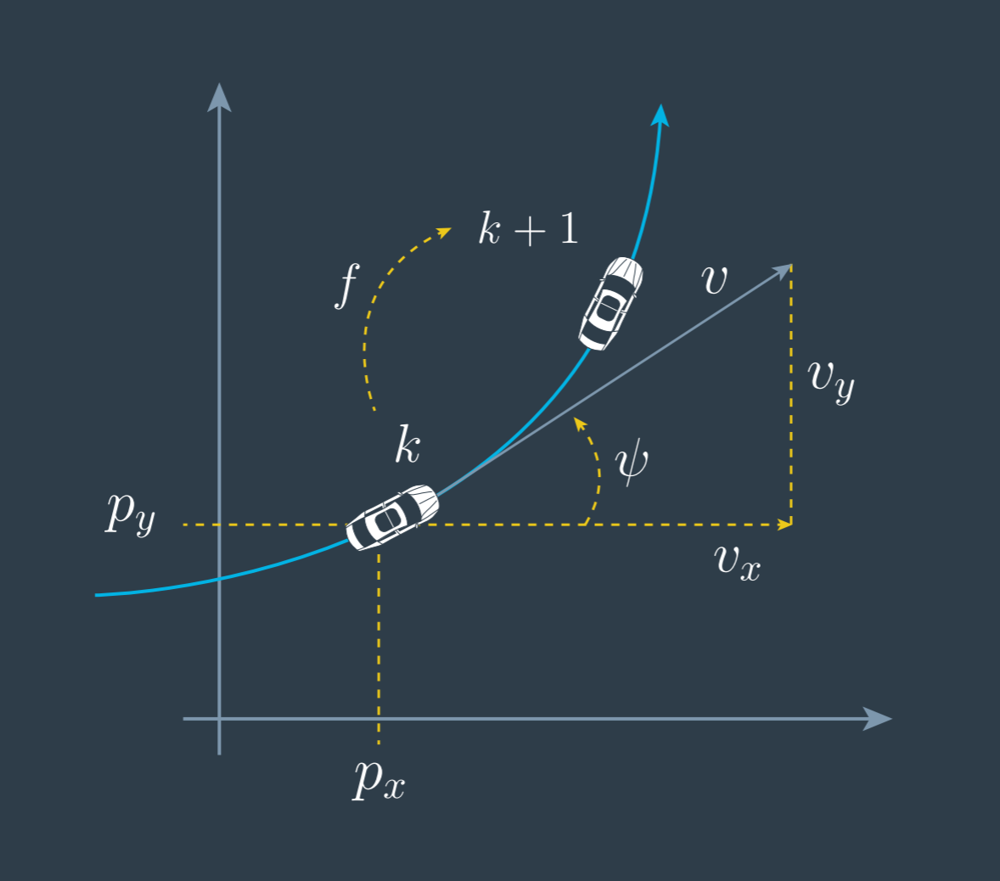

# CTRV Zero Yaw Rate

> Part of: **Unscented Kalman Filters**

## Video

[Watch on YouTube](https://www.youtube.com/watch?v=8gAsx7OAH6c)

## Summary

**Vehicle Dynamics: Handling a Special Case**

This README file summarizes the key concepts and practical notes from the lesson on handling a special case in vehicle dynamics. The main topic is how to derive a solution for a specific scenario where the yaw rate is zero, which occurs when driving on a straight road.

### Key Concepts

* **Division by 0**: When the yaw rate is zero, division by zero occurs in the original solution.
* **Special Case Solution**: Two methods are presented to handle this special case:
	+ Set the yaw rate to 0 from the beginning and solve the integral again.
	+ Directly observe the solution using a triangle diagram when the vehicle is driving in a straight line.
* **Triangle Diagram**: A visual representation of the vehicle's motion, which can be used to derive the solution for the special case.

### Practical Notes

When dealing with the special case where the yaw rate is zero:

* Set the yaw rate to 0 from the beginning and solve the integral again using the original method.
* Alternatively, use a triangle diagram to directly observe the solution when driving in a straight line.
* Be aware that this scenario occurs frequently in real-world driving, such as when driving on a straight road.

## Transcript

<v English>Now we have the solution</v>
<v English>of the integral.</v> <v English>It is a function that brings</v>
<v English>the state from time step k,</v> <v English>to time step k + 1, awesome.</v> <v English>There's only one problem</v>
<v English>with our solution and</v> <v English>that is the division by 0</v>
<v English>when the yaw rate is in.</v> <v English>And this is an important</v>
<v English>case because it means</v> <v English>the weakness driving on a straight road,</v>
<v English>which happens quite often.</v> <v English>There are two ways to derive</v>
<v English>the solution for this special case.</v> <v English>You can put the yaw rate to 0</v>
<v English>right from the beginning and</v> <v English>solve the integral again,</v>
<v English>for this special case.</v> <v English>But remember, when the yaw rate is 0,</v> <v English>it means the weaker drives</v>
<v English>in a straight line.</v> <v English>In this case,</v> <v English>you can also directly see the solution</v>
<v English>by looking at the triangle again.</v> <v English>In the next quiz, try to identify</v>
<v English>the correct process model for</v> <v English>the special case when the yaw rate is 0.</v>

## Images

*The CTRV model for your reference.*

## Additional Content

How should the process model change if the yaw rate,

$\dot{\psi_k}$

, is 0? Think it through for the first two components of the process model. (Why not the last three components? They all have the trivial solution of 0 when

$\dot{\psi_k}$

is 0.)
### Question 1: How should we calculate the change in the x-position over time when

$\dot{\psi_k} = 0$

?

A.

$v_k cos(\psi_k) \Delta t$

B.

$v_k tan(\psi_k) \Delta t$

### Question 2: How should we calculate the change in the y-position over time when

$\dot{\psi_k} = 0$

?

A.

$v_k sin(\psi_k) \Delta t$

B.

$v_k tan(\psi_k) \Delta t$
