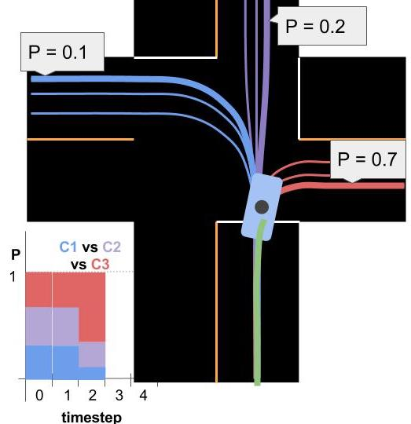
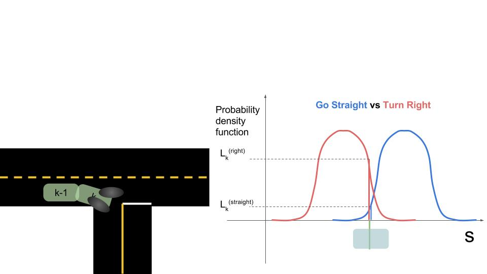

# Summary of Data Driven and Model Based Approaches

> Part of: **Prediction**

## Images

## Additional Content

## Summary so Far
So far you have learned about the two main approaches to prediction.
### 1. Data-Driven Approaches
Data-driven approaches solve the prediction problem in two phases:
1. Offline training
2. Online Prediction

#### 1.1 Offline Training
In this phase the goal is to feed some machine learning algorithm a lot of data to train it. For the trajectory clustering example this involved:

1. **Define similarity** - we first need a definition of similarity that agrees with human common-sense definition.
2. **Unsupervised clustering** - at this step some machine learning algorithm clusters the trajectories we've observed. 
3. **Define Prototype Trajectories** - for each cluster identify some small number of typical "prototype" trajectories.

#### 1.2 Online Prediction
Once the algorithm is trained we bring it onto the road. When we encounter a situation for which the trained algorithm is appropriate (returning to an intersection for example) we can use that algorithm to actually predict the trajectory of the vehicle. For the intersection example this meant:

1. **Observe Partial Trajectory** - As the target vehicle drives we can think of it leaving a "partial trajectory" behind it.
2. **Compare to Prototype Trajectories** - We can compare this partial trajectory to the *corresponding parts* of the prototype trajectories. When these partial trajectories are more similar (using the same notion of similarity defined earlier) their likelihoods should increase relative to the other trajectories.
3. **Generate Predictions** - For each cluster we identify the most likely prototype trajectory. We broadcast each of these trajectories along with the associated probability (see the image below).
### 2. Model Based Approaches
You can think of model based solutions to the prediction problem as also having an "offline" and online component. In that view, this approach requires:
1. *Defining* process models (offline).
3. *Using* process models to compare driver behavior to what would be expected for each model.
4. *Probabilistically classifying* driver intent by comparing the likelihoods of various behaviors with a multiple-model algorithm.
5. *Extrapolating* process models to generate trajectories.

#### 2.1 Defining Process Models
You saw how process models can vary in complexity from very simple...

$$\large
\begin{bmatrix}
\dot{s}\\ 
\dot{d}
\end{bmatrix} = 
\begin{bmatrix}
s_{0} \\
0
 \end{bmatrix} + 
\mathbf{w}$$

to very complex...

$$\large
\begin{bmatrix}
\ddot{s} \\
\ddot{d} \\
\ddot{\theta}
 \end{bmatrix} = 
\begin{bmatrix}
\dot{\theta}\dot{d} + a_s \\
-\dot{\theta}\dot{s} + \frac{2}{m}(F_{c,f}\cos\delta + F_{c,r}) \\
\frac{2}{I_z} (l_f F_{c,f} - l_rF_{c,r})
 \end{bmatrix} +
\mathbf{w}$$

#### 2.2 Using Process Models
Process Models are first used to compare a target vehicle's observed behavior to the behavior we would expect for each of the maneuvers we've created models for. The pictures below help explain how process models are used to calculate these likelihoods.
On the left we see two images of a car. At time

$k-1$

we predicted where the car would be if it were to go straight vs go right. Then at time

$k$

we look at where the car actually is. The graph on the right shows the car's observed

$s$

coordinate along with the probability distributions for where we *expected* the car to be at that time.  In this case, the

$s$

that we observe is substantially more consistent with turning right than going straight.

#### 2.3 Classifying Intent with Multiple Model Algorithm

In the image at the top of the page you can see a bar chart representing probabilities of various *clusters* over time. Multiple model algorithms serve a similar purpose for model based approaches: they are responsible for maintaining beliefs for the probability of each maneuver. The algorithm we discussed is called the **Autonomous Multiple Model** algorithm (AMM). AMM can be summarized with this equation:

$$\large
\mu_k^{(i)} = \frac{\mu_{k-1}^{(i)}L_k^{(i)}}{\sum_{j=1}^M\mu_{k-1}^{(j)}L_k^{(j)}}$$

or, if we ignore the denominator (since it just serves to normalize the probabilities), we can capture the essence of this algorithm with

$$\mu_k^{(i)} \propto \mu_{k-1}^{(i)}L_k^{(i)}$$

where the

$\mu_k^{(i)}$

is the probability that model number

$i$

is the correct model at time

$k$

and

$L_k^{(i)}$

is the **likelihood** for that model (as computed by comparison to process model).

The paper, ["A comparative study of multiple model algorithms for maneuvering target tracking"](https://d17h27t6h515a5.cloudfront.net/topher/2017/June/5953fc34_a-comparative-study-of-multiple-model-algorithms-for-maneuvering-target-tracking/a-comparative-study-of-multiple-model-algorithms-for-maneuvering-target-tracking.pdf) is a good reference to learn more.

#### 2.4 Trajectory Generation
Trajectory generation is straightforward once we have a process model. We simply iterate our model over and over until we've generated a prediction that spans whatever time horizon we are supposed to cover. Note that each iteration of the process model will necessarily add uncertainty to our prediction.
