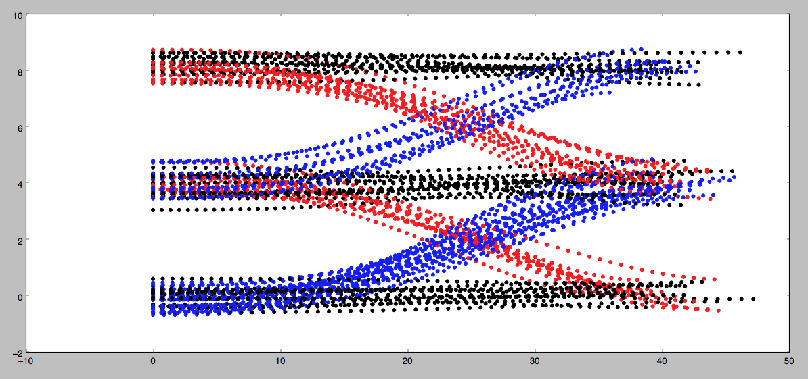

# Implement Naive Bayes in C++

> Part of: **Prediction**

## Images


*Behaviour of vehicles on a highway*

## Additional Content

## Implementing Naive Bayes
In this exercise you will implement a Gaussian Naive Bayes classifier to predict the behavior of vehicles on a highway. In the image below you can see the behaviors you'll be looking for on a 3 lane highway (with lanes of 4 meter width). The dots represent the d (y axis) and s (x axis) coordinates of vehicles as they either...

1. change lanes left (shown in blue)
2. keep lane (shown in black)
3. or change lanes right (shown in red)
Your job is to write a classifier that can predict which of these three maneuvers a vehicle is engaged in given a single coordinate (sampled from the trajectories shown below). 

Each coordinate contains 4 features: 

*

$s$

*

$d$

*

$\dot{s}$

*

$\dot{d}$

You also know the **lane width** is 4 meters (this might be helpful in engineering additional features for your algorithm).

#### Instructions

1. Implement the `train(data, labels)` method in the class `GNB` in `classifier.cpp`. 
  
  Training a Gaussian Naive Bayes classifier consists of computing and storing the mean and standard deviation from the data for each label/feature pair. For example, given the label "change lanes left” and the feature

$\dot{s}$

, it would be necessary to compute and store the mean and standard deviation of

$\dot{s}$

over all data points with the "change lanes left” label.

 Additionally, it will be convenient in this step to compute and store the prior probability

$p(C_k)$

for each label

$C_k$

. This can be done by keeping track of the number of times each label appears in the training data.
2. Implement the `predict(observation)` method in `classifier.cpp`. 

  Given a new data point, prediction requires two steps: 
    1. **Compute the conditional probabilities for each feature/label combination**. For a feature

$x$

and label

$C$

with mean

$\mu$

and standard deviation

$\sigma$

(computed in training), the conditional probability can be computed using the formula [here](https://en.wikipedia.org/wiki/Naive_Bayes_classifier#Gaussian_naive_Bayes):

$$p(x = v | C) = \frac{1}{\sqrt{2\pi\sigma^2}} \exp^{-\frac{(v-\mu)^2}{2\sigma^2}}$$

Here

$v$

is the value of feature

$x$

in the new data point.

 2. **Use the conditional probabilities in a Naive Bayes classifier.** This can be done using the formula [here](https://en.wikipedia.org/wiki/Naive_Bayes_classifier#Constructing_a_classifier_from_the_probability_model):

$$y =  \underset{k\in (1,\ldots, K)}{argmax } \,\,p(C_k) \prod^n_{i=1}p(x_i = v_i| C_k)$$

In this formula, the argmax is taken over all possible labels

$C_k$

and the product is taken over all features

$x_i$

with values

$v_i$

.

3. When you want to test your classifier, run `Test Run` and check out the results.

**NOTE**: You are welcome to use some existing implementation of a Gaussian Naive Bayes classifier. But to get the **best** results you will still need to put some thought into what **features** you provide the algorithm when classifying. Though you will only be given the 4 coordinates listed above, you may find that by "engineering" features you may get better performance. For example: the raw value of the

$d$

coordinate may not be that useful. But `d % lane_width` might be helpful since it gives the *relative* position of a vehicle in it's lane regardless of which lane the vehicle is in.
>Note:
1. The exercise files are present in the `/home/workspace/exercise` directory and the solution files are present in the `/home/workspace/solution` directory.
2. After completing the exercise assignments, you can run your code from the workspace terminal as follows:
	```bash
    cd /home/workspace/exercise/
    g++ -I ../eigen-3.4.0/ main.cpp classifier.cpp
    ./a.out
    ```
3. Test your output from Step 2 against the output of the solution code by running the solution code as follows:
	```bash
    cd /home/workspace/solution/
    g++ -I ../eigen-3.4.0/ main.cpp classifier.cpp
    ./a.out
    ```
>Note: Students have reported Load_State function in main.cpp is not loading data properly from train_states.txt and test_states.txt since istringstream is not implemented for comma (',') separated data.  Several students have found working solutions [here](https://github.com/udacity/sdc-issue-reports/issues/914), that may help in determining your own solution.
#### Helpful Resources
* [sklearn documentation on GaussianNB](http://scikit-learn.org/stable/modules/naive_bayes.html#gaussian-naive-bayes)
* [Wikipedia article on Naive Bayes / GNB](https://en.wikipedia.org/wiki/Naive_Bayes_classifier#Gaussian_naive_Bayes)

### Extra Practice
Provided in one of the links below is `python_extra_practice`, which is the same problem but written in Python that you can optionally go through for extra coding practice. The Python solution is available at the `python_solution` link. If you get stuck on the quiz see if you can convert the python solution to C++ and pass the classroom quiz with it. The last link `Nd013_Pred_Data` has all the training and testing data for this problem in case you want to run the problem offline.
##### Supporting Materials
*

[Nd013 Pred Data](https://video.udacity-data.com/topher/2017/July/59695c4b_nd013-pred-data/nd013-pred-data.zip)

*

[python_extra_practice](https://video.udacity-data.com/topher/2017/July/59750f3d_predictionexercise/predictionexercise.zip)

*

[python_solution](https://video.udacity-data.com/topher/2017/July/59751005_predicition-solution/predicition-solution.zip)
