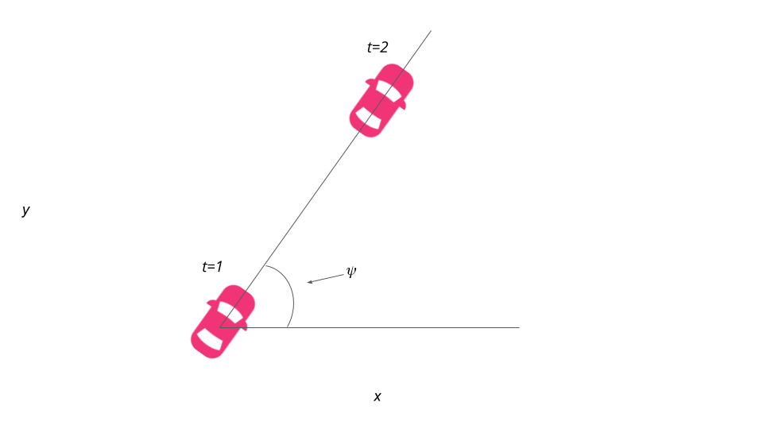
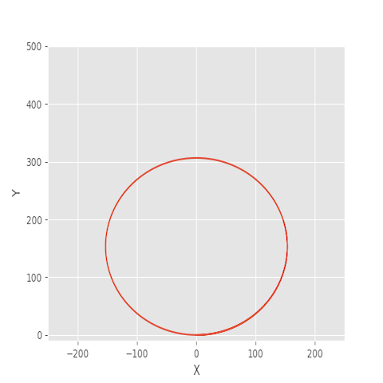

# Building a Kinematic Model

> Part of: **Vehicle Models**

## Video

[Watch on YouTube](https://www.youtube.com/watch?v=-Nnk8n81zr4)

## Images

## Additional Content

Based on the above visual answer the following quizzes:
Next, let's turn our attention to

$\psi$

:

$$\psi_{t+1} = \psi_{t} +  \frac{v} { L_f} * \delta * dt$$

In a nutshell, we add a multiplicative factor of the steering angle,

$\delta$

to

$\psi$

.

$L_f$

measures the distance between the center of mass of the vehicle and it's front axle. The larger the vehicle, the slower the turn rate.

If you've driven a vehicle you're well aware at higher speeds you turn quicker than at lower speeds. This is why

$v$

is the included in the update.

Finally, let's take a look at how the velocity, *v* is modeled:

$v = v + a*dt$

where *a* can take value between and including -1 and 1.

Awesome! We've now defined the state, actuators and how the state changes over time based on the previous state and current actuator inputs.

Here it is:

$x_{t+1} = x_t + v_t  cos(\psi_t) * dt$

$y_{t+1} = y_t + v_t  sin(\psi_t) * dt$

$\psi_{t+1} = \psi_t + \frac {v_t} { L_f} \delta_t * dt$

$v_{t+1} = v_t + a_t * dt$

## How

$L_f$

was chosen for this project:

On the topic of running a vehicle around in a circle, this is actually a good way to test the validity of a model! If the radius of the circle generated from driving the test vehicle around in a circle with a constant velocity and steering angle is similar to that of your model in the simulation, then you're on the right track.  This type of approach was used to tune

$L_f$

.

From the image below, we can see that the vehicle started at the origin, oriented at 0 degrees.  We then simulated driving with a

$\delta$

value of 1 degree and adjusted

$L_f$

to arrive at a final value of 2.67 .  This is the value that produced a circle, with all other variables held constant.
