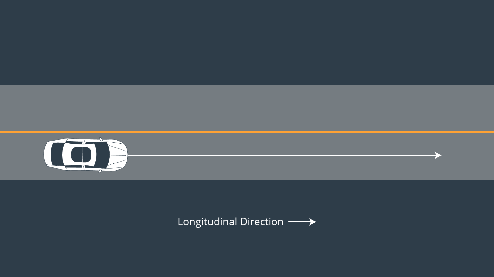
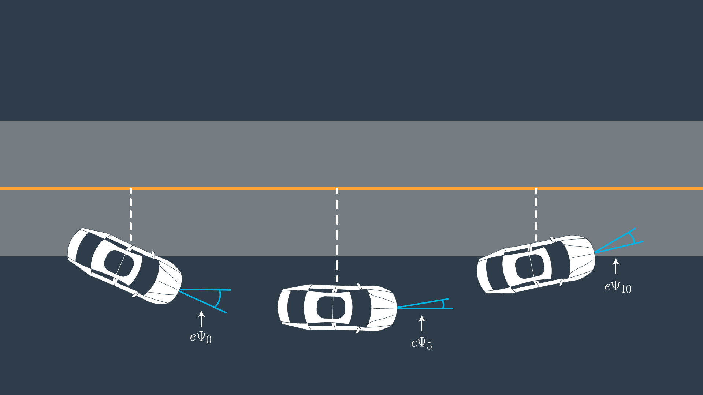

# Errors

> Part of: **Vehicle Models**

## Video

[Watch on YouTube](https://www.youtube.com/watch?v=qtg_HiqoGHY)

## Summary

**Vehicle Trajectory Tracking with Kinematic Models**
======================================================

This summary covers the key concepts and practical steps for using kinematic models to predict a vehicle's future state and track its trajectory.

### Key Concepts

* **Kinematic Model**: A mathematical model that predicts a vehicle's future state based on its current position, velocity, and acceleration.
* **Reference Trajectory**: The desired path that the vehicle should follow.
* **Actual Path**: The actual path taken by the vehicle.
* **Error Minimization**: The process of minimizing the difference between the reference trajectory and the actual path.
* **Predicted Area**: The area between the reference trajectory and the predicted path of the vehicle.

### Practical Notes

To implement this concept, you will need to:

* Define a kinematic model that predicts the vehicle's future state based on its current position, velocity, and acceleration.
* Calculate the predicted area between the reference trajectory and the predicted path of the vehicle.
* Use this prediction to adjust the control inputs and minimize the error over time.

Example code for defining a simple kinematic model:
```python
import numpy as np

def predict_vehicle_state(current_position, current_velocity, current_acceleration):
    # Define the kinematic equations of motion
    position = current_position + current_velocity * dt + 0.5 * acceleration * dt**2
    velocity = current_velocity + acceleration * dt
    
    return position, velocity
```
Note: This is a simplified example and actual implementation may vary depending on the specific requirements of your project.

## Transcript

<v English>A controller actuates the vehicle to follow</v> <v English>the reference trajectory within a set of design requirements.</v> <v English>One important requirement is to minimize the area between</v> <v English>the reference trajectory and the vehicle's actual path.</v> <v English>You can minimize this error by predicting the vehicle's actual path and then adjusting</v> <v English>the control inputs to minimize the difference between</v> <v English>that prediction and the reference trajectory.</v> <v English>That's how to use a kinematic model to predict the vehicle's future state.</v> <v English>Next, you'll define the predicted area between</v> <v English>the trajectory and that predicted path of the vehicle.</v> <v English>Once you've predicted the error you can actuate</v> <v English>with the vehicle to minimize the error over time.</v>

## Images




*The dashed white line is the cross track error.*

## Additional Content

We can capture how the errors we are interested in change over time by deriving our kinematic model around these errors as our new state vector.

The new state is

$[x, y, \psi, v, cte, e\psi]$

.
Let’s assume the vehicle is traveling down a straight road and the longitudinal direction is the same as the x-axis.

### Cross Track Error

We can express the error between the center of the road and the vehicle's position as the cross track error (CTE). The CTE of the successor state after time t is the state at t + 1, and is defined as:

$cte_{t+1} = cte_t + v_t* sin(e\psi_t) * dt$

In this case

$cte_t$

can be expressed as the difference between the line and the current vehicle position *y*. Assuming the reference line is a 1st order polynomial *f*,

$f(x_t)$

is our reference line and our CTE at the current state is defined as:

$cte_t =  f(x_t) - y_t$

If we substitute

$cte_t$

back into the original equation the result is:

$cte_{t+1} = f(x_t)  -  y_t + (v_t * sin(e\psi_t) * dt)$

This can be broken up into two parts:

1.

$f(x_t) - y_t$

being current cross track error.
2.

$v_t * sin(e\psi_t) * dt$

being the change in error caused by the vehicle's movement.
### Orientation Error

Ok, now let’s take a look at the orientation error:

$$e\psi_{t+1} = e\psi_t + \frac{v_t} { L_f} * \delta_t * dt$$

The update rule is essentially the same as

$\psi$

.

$e\psi_t$

is the desired orientation subtracted from the current orientation:

$$e\psi_t = \psi_t  - \psi{des}_t$$

We already know

$\psi_t$

, because it’s part of our state. We don’t yet know

$\psi{des}_t$

(desired psi) - all we have so far is a polynomial to follow.

$\psi{des}_t$

can be calculated as the [tangential angle](https://en.wikipedia.org/wiki/Tangential_angle) of the polynomial *f* evaluated at

$x_t$

,

$arctan(f'(x_t))$

.

$f'$

is the derivative of the polynomial.

$$e\psi_{t+1} = \psi_t  - \psi{des}_t  + (\frac{v_t} { L_f} * \delta_t * dt)$$

Similarly to the cross track error this can be interpreted as two parts:

1.

$\psi_t  - \psi{des}_t$

being current orientation error.
2.

$\frac{v_t} { L_f} * \delta_t * dt$

being the change in error caused by the vehicle's movement.
