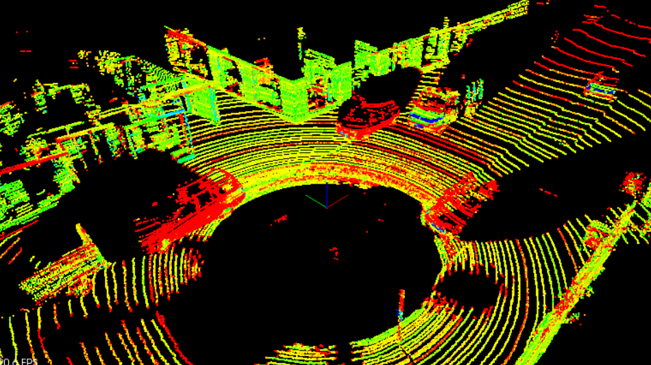

# Point Cloud Data Files

> Part of: **[Optional] Intro to PCL**

## Video

[Watch on YouTube](https://www.youtube.com/watch?v=ptExV1DFIbo)

## Summary

**Point Cloud Data Format**
=====================================

This lesson introduces the concept of point cloud data and its representation in a specific format called PCD (Point Cloud Data). The main topic is to understand how 3D points are stored and used in computer vision applications.

**Key Concepts**
---------------

* **PCD file**: A file format for storing point cloud data, which contains 3D points with their corresponding intensity values.
* **X, Y, Z Cartesian coordinates**: A coordinate system where X represents the horizontal axis (pointing forward), Y represents the vertical axis (pointing left), and Z represents the depth axis (pointing up).
* **Intensity value (I)**: A measure of the reflective properties of a material, represented by a color in the PCD file.
* **Coordinate system**: The same as the car's local coordinates, with X pointing forward, Y pointing left, and Z pointing up.

**Practical Notes**
-------------------

* In a PCD file, each point is represented by its X, Y, Z coordinates and an intensity value (I).
* For a single update of the BOP 64, there are 256,000 points.
* The color mapping in the PCD file represents the intensity values, giving information about the reflective properties of objects.
* The coordinate system used is the same as the car's local coordinates, which can be visualized using top-down and side views.

## Transcript

Cool. So now what are we going to be doing with these points? Now, let's talk about the point Cloud data. This is going to be the format for our points. So this is a.PCD file.

Then we're looking at the previous slide and we said okay, 256,000 points for every update. Well, each of these points is going to be represented in this format where we have this X, Y, Z Cartesian coordinates and we also have this I value. So before we're saying that we also have this signal strength of the laser and that tells us a little bit about the reflective properties of this material. So that's going to be this I. So we have this X, Y, Z, I and for a single update for the BOP 64, we have 256,000 of those.

This is actually what this PCD looks like. Here, we're seeing that the different intensity values are a different color. So this color mapping here is telling us about the reflective properties of the objects and then X, Y, Z is specially telling us where this point is located. Then in this running PCD video, we can see this bicyclists just writing out in front of the car and we're chasing after him. We were talking about this X, Y, Z Cartesian coordinates.

So what does that actually look like? What is this coordinate system? What's it in reference to? Well, this coordinate system is actually the same as the car's local coordinates. So here, we have this top-down view.

The X axis is defined pointing out towards the front of the car, while the Y axis is pointing out to the left, while Z axis then, is pointing straight up vertical. Then we have the side view. We can see the X axis pointing out and the Z axis pointing vertically, and then, this will really give us some nice details about how these different vertical layers are organized. So for the [inaudible] case, we have this top layer and it's had a minus 24.8 degree incline from the X axis, and then it covers this 26.8 degree range, then each of these 64 layers will be evenly spread across this 26.8 degree range here. So that's how we define this coordinate system for our X, Y, Z points.

## Images

*PCD of a city block with parked cars, and a passing van. Intensity values are being shown as different colors. The big black spot is where the car with the lidar sensor is located.*

## Additional Content

## Point Cloud Data (PCD) Files
Let’s dive into how lidar data is stored. Lidar data is stored in a format called Point Cloud Data (PCD for short). A .pcd file is a list of (x,y,z) cartesian coordinates along with intensity values, it’s a single snapshot of the environment, so after a single scan. That means with a VLP 64 lidar, a pcd file would have around 256,000 (x,y,z,i) values.
## PCD Coordinates
The coordinate system for point cloud data is the same as the car’s local coordinate system. In this coordinate system the x axis is pointing towards the front of the car, and the y axis is pointing to the left of the car. Also since this coordinate system is right-handed the z axis points up above the car.
