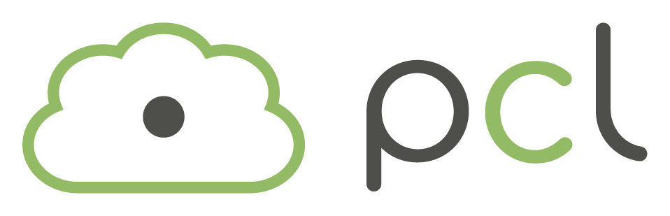

# The Point Cloud Library (PCL)

> Part of: **[Optional] Intro to PCL**

## Video

[Watch on YouTube](https://www.youtube.com/watch?v=Krl-LJi3Sis)

## Summary

**Point Cloud Library (PCL) Overview**
=====================================

The Point Cloud Library (PCL) is an open-source library for C++ that helps with processing and rendering 3D point clouds. It's widely used in the robotics community due to its extensive built-in functions.

### Key Concepts
* **Point Cloud**: A set of points in 3D space, often used to represent objects or scenes.
* **PCD files**: Files containing point cloud data, which PCL can read and process.
* **Filtering**: Removing noise or unwanted points from a point cloud.
* **Segmentation**: Dividing a point cloud into distinct regions or clusters.
* **Clustering**: Grouping similar points together in a point cloud.
* **Rendering**: Displaying a point cloud with added visual elements, such as boxes, shapes, and lines.

### Practical Notes
To work with PCL, you'll need to familiarize yourself with its built-in functions for filtering, segmentation, clustering, and rendering. You can use PCL's C++ library to read PCD files and perform various operations on the point cloud data. The lesson will cover practical examples of using PCL's capabilities in a robotics context.

## Transcript

Cool. Let's go ahead now and check out PCL library. So this is a Point Cloud Library. It's going to really help us out when working with PCD files. The reason that is, is because it's an open source library for C++ and it's very widely used in robotics community.

It's going to have a lot of built-in functions that we can check out for doing filtering, segmentation, and clustering, and what's really nice is it has this really cool rendering capabilities as well. So we can visually look at point clouds and we can do this really cool rendering where the different boxes, and shapes, and lines onto our viewer, and really play around with it visually. So PCL is great for all of this. That's what we'll mainly be working with in this lesson.

## Images

## Additional Content

## The PCL Library
In this lesson you will be working on processing point cloud data to find obstacles. All the code will be done in a  C++ environment, so some familiarity with C++ will definitely be helpful. PCL is an open source C++ library for working with point clouds. You will be using it to visualize data, render shapes, and become familiar with some of its built in processing functions. Some documentation for PCL can be found [here](http://pointclouds.org/).
PCL is widely used in the robotics community for working with point cloud data, and there are many tutorials available online for using it. There are a lot of built in functions in PCL that can help to detect obstacles, such as Segmentation, Extraction, and Clustering.
