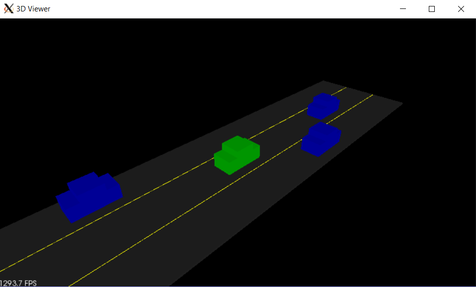

# Running the Simulator

> Part of: **[Optional] Intro to PCL**

## Video

[Watch on YouTube](https://www.youtube.com/watch?v=PBNYLldDV3w)

## Summary

**Summary of Running a Simulation Environment**

This README file provides an overview of running a simulation environment using a compiled executable. The process involves navigating to a specific directory and executing a command to launch the environment.

### Key Concepts

* **Compiled Executable**: A compiled version of the code that can be run directly without needing further compilation.
* **Simulation Environment**: A virtual environment where simulations can be run, allowing users to interact with the scene using mouse controls.
* **Environment Command**: The command used to launch the simulation environment, which is `environment` within the `/bell` directory.

### Practical Notes

To run the simulation environment:

1. Navigate to the `/bell` directory in your terminal or command prompt.
2. Execute the command `environment` to launch the simulation environment.
3. Use mouse controls to zoom around, orbit, and explore the scene.

Note: This is a basic summary of running the simulation environment, and you should refer to the original lesson for more detailed instructions and troubleshooting tips.

## Transcript

All right, cool. So we went through and compiled our executable, and now we're actually going to look at running the environment. This is what the output of that should look like, where here we have our ego car in green, we have these other traffic cars in blue, and it's all sitting nicely on this little virtual highway street. So for doing the instructions for running this simulation environment now. Once you actually compile that executable is actually pretty straight forward just to run it, all you have to do is do.

/environment within that bell directory. Then, we'll be able to look around this environment, we can use the mouse to zoom around, orbit and just check out our scene. So let's go ahead and check that out inside belt if we just do environment. We now have this highway environment to look at with our green car, and so go ahead and try this out for yourself now. Launch the environment, just go ahead and explore what that looks like.

## Images

## Additional Content

## Running the Simulator
### Instructions

Once you have built an executable file, you can launch it by doing `./environment`.
Now you should see a window popping up that looks like the image above.

Here you have a simple highway simulator environment with the ego car in green in the center lane (thats your car), and the other traffic cars in blue. Everything is rendered using PCL with simple boxes, lines, and colors.
You can move around your environment with the mouse. Try holding the left mouse button to orbit around the scene. You can also pan around the scene by holding the middle mouse button and moving. To zoom, use the middle scroll mouse button or the right mouse button while moving.

### Recap

- Using terminator in the virtual desktop, run the executable from the build directory using ./environment.
- You should see a 3D popup window with the road and cars.
- You can move around the environment.
- Zoom: hold the right mouse key and move the mouse forward/backwards, or use your mouse scroller.
- Pan: Hold down the middle mouse button (the scroller) and move the mouse.
- Rotate: Hold the left mouse button and move the mouse.

### Try Running the Simulator Yourself
