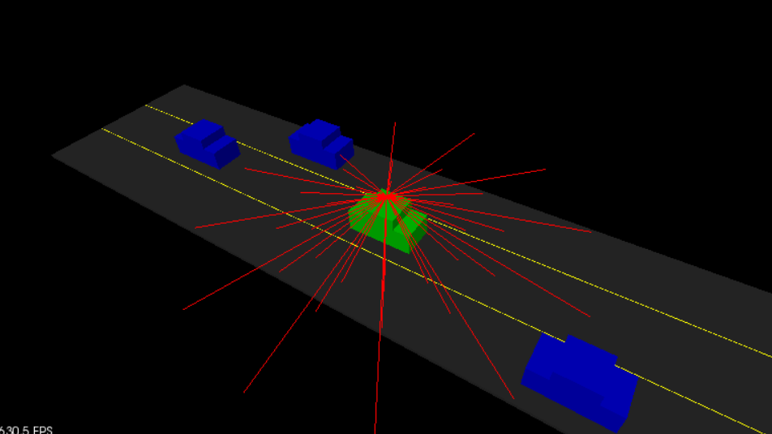

# Using the Lidar Object

> Part of: **[Optional] Intro to PCL**

## Video

[Watch on YouTube](https://www.youtube.com/watch?v=auAPb-NC2Xo)

## Summary

**Lidar Sensing with PointCloud Visualization**
=====================================================

This README file summarizes the key concepts and practical steps involved in using Lidar sensing to scan the environment and visualize the results as a PointCloud.

**Key Concepts**
---------------

* **Lidar Object**: A device that uses laser light to measure distances and create 3D point clouds of the environment.
* **Scan Function**: A function in `lidar.h` that generates a PointCloud without requiring any arguments, using the Lidar's internal state.
* **PointCloud**: A data structure representing a set of 3D points in space, generated by the Lidar scan.
* **renderRays Function**: A function in `render.cpp` that visualizes the rays cast from the Lidar origin to create a PointCloud.

**Practical Notes**
-------------------

To implement Lidar sensing and visualization:

1. Call the `Scan` function from `lidar.h` without any arguments, which generates a PointCloud.
2. Use the `renderRays` function in `render.cpp` to visualize the PointCloud, passing in the viewer, Lidar position (origin), and generated PointCloud as arguments.
3. In `environment.cpp`, use the `Scan` function to generate a PointCloud and then pass it to the `renderRays` function for visualization.

Example code:
```cpp
// Call Scan function to generate PointCloud
pcl::PointCloud<pcl::PointXYZ> inputCloud = lidar->scan();

// Visualize PointCloud using renderRays function
lidar->renderRays(viewer, lidar->getPosition(), inputCloud);
```
Note: This is a simplified example and may require modifications based on the specific project requirements.

## Transcript

Next, let's look at how we can actually use this Lidar object to scan the environment around us and tell us something about what the environment looks like. So for this next exercise, we're doing Lidar sensing and we're going to be looking at calling the "Scan" function from lidar.h. Then we're going to look at the results of the scan and we'll be seeing the rays that this creates, the Lidar lasers that are actually spanning from the Lidar sensor. So in order to do this, looking at lidar.h, there is a "Scan" function near the bottom. So "Scan" actually doesn't take in any arguments.

The Lidar has everything it needs to know. It has the cars and it has the ground slope. It's going to generate this PCL PointCloud for us. So when you're calling the "Scan" just make sure that you're using the same type for the variable that its generating. Then you can actually visualize what this looks like.

So this PointCloud that's generating and that's by using a function in render.cpp. So it has a function called "renderRays." Right here at line 24 in render.cpp. You can call "renderRays" and check out the arguments for it. So we have this viewer, we're passing it as a reference. We'll give "renderRays" the viewer that we're working with environment.cpp.

We'll also tell it about the origin of this Lidar. So that's because all the rays are being cast from this origin. So in order to do this visualization for the rays, we need to know this position. The last argument is just going to be that PointCloud that we generated from the scan. So if you pass that in, you can then visualize what that looks like.

So back in environment.cpp now, look at the documentation in lidar.h for how to use the "Scan", generate the PointCloud and then feed in that "renderRays" function, feed in the PointCloud there. Go ahead and compile and run and the results should look something like this. All right. Let's take a look at how we can actually set up our lidar to do the sensing. Now, let's go ahead and we're back in our Visual Studio Editor and environment.cpp.

We are going to call two commands. So the first one we are using the lidar scan. So since our lidar is a pointer here, we're going to be using the arrow that call the function. We just call scan with no arguments given. This is going to generate this pcl point Cloud, pcl point XYZ pointer, and we'll be talking a little bit more about this.

This is actually going to be a template. So what we can do, we can just call this inputCloud. We could call this rays, up to you. But if we want to visualize it, we'll call this render rays function. What we will be giving it is the viewer and the lidar.

So if we go into lidar.h, we have this origin that we can use for it or this position right here. So that's where the lidar is actually going to be located. So we can use that position that tell built rays basically where it'd be cast from. Then, we'll just go ahead and pass in that point Cloud that we just generated above. So we go ahead and save that.

Now, if we go into our build directory that we set up previously, we can recompile by running make and this is going through environment.cpp with our latest changes. It's going to rebuild that executable file for us. So it built environment. Now, if we do [inaudible] , we see that environment, we can go ahead and run that. Basically now, we have our lidar unit that sitting up on top of our green car.

So here this is where the lidar is that and it's shooting out all these different rays. So you can orbit around the scene. So we're going to be looking at increasing the resolution of this and a little bit, right now it's pretty sparse. We're not seeing the same definition that we were talking about earlier about the [inaudible]. So in a future exercise here in a little bit, we'll be looking at the parameters for lidar to get a more high resolution scan because right now only a couple, one ray is really hitting one in the blue cars and we'll increase the resolution and be able to see better all these cars around us.

So that is the solution for doing the lidar rays sensing.

## Images


*Lidar Sensing*

## Additional Content

## Using the Lidar Object
To go further with your newly created `Lidar` object, check out `src/sensors/lidar.h` to see how everything is defined. In this header file, you can see the ray object being defined. Lidar will use these rays to sense its surrounding by doing ray casting. The `scan` function from the lidar struct will be what is doing the ray casting.

Now let's call the lidar scan function and see how lidar rays look. Back in your environment file, right after the call to the Lidar constructor, you can use the scan function and then render the lidar rays. 
### Exercise

- To create a point cloud, call the lidar `scan()` method on your lidar object.
- You will store results in a PointCloud pointer object, `pcl::PointCloud

::Ptr`
- The type of point for the PointCloud will be `pcl::PointXYZ`.
- Call the `renderRays` function with generated PointCloud pointer.

#### Note

The syntax of PointCloud with the [template](http://www.cplusplus.com/doc/oldtutorial/templates/) is similar to the syntax of vectors or other std container libraries: `ContainerName`. 

The Ptr type from PointCloud indicates that the object is actually a pointer - a 32 bit integer that contains the memory address of your point cloud object. Many functions in pcl use point cloud pointers as arguments, so it's convenient to return the inputCloud in this form. 

The renderRays function is defined in `src/render`. It contains functions that allow us to render points and shapes to the pcl viewer. You will be using it to render your lidar rays as line segments in the viewer.

The arguments for the renderRays function is viewer, which gets passed in by reference. This means that any changes to the viewer in the body of the renderRays function directly affect the viewer outside the function scope. The lidar position also gets passed in, as well as the point cloud that your scan function generated. The type of point for the PointCloud will be `pcl::PointXYZ`. We will talk about some other different types of point clouds in a bit.

## Solution
In `environment.cpp`, still within the `simpleHighway` function, you'll add two more lines after your lidar object instantiation from before:

```cpp
// TODO: Create lidar sensor
Lidar* lidar = new Lidar(cars, 0);
pcl::PointCloud::Ptr inputCloud = lidar->scan();
renderRays(viewer, lidar->position, inputCloud);
```
