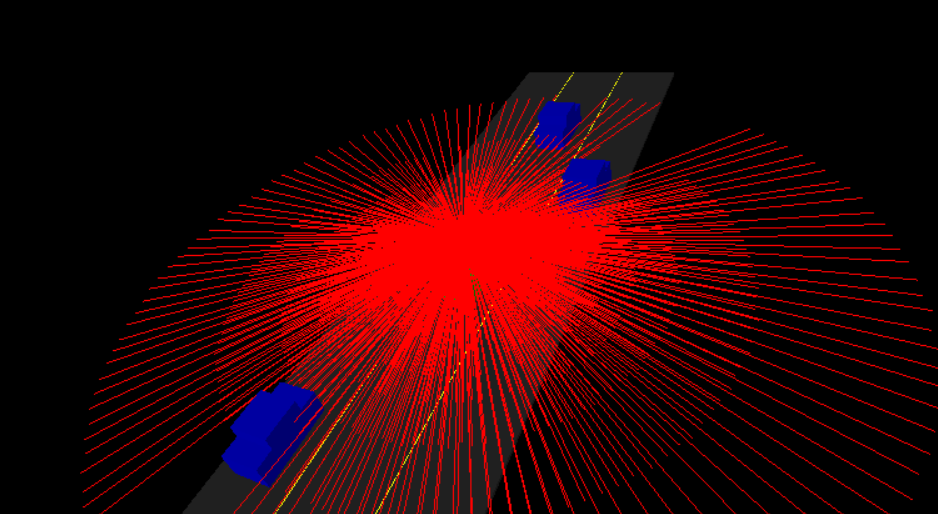

# Adjusting Lidar Parameters

> Part of: **[Optional] Intro to PCL**

## Video

[Watch on YouTube](https://www.youtube.com/watch?v=TwySby8ZZ3k)

## Summary

**README: Lidar Parameter Adjustments**

This project involves adjusting the lidar parameters to increase the scan resolution and improve data quality.

### Key Concepts

* **Lidar Scan Resolution**: The number of rays emitted by the lidar sensor, which affects the level of detail in the resulting point cloud data (PCD).
* **Horizontal Layer Increment Resolution**: The angle between consecutive horizontal layers, which determines the density of points in the PCD.
* **Min Distance**: The minimum distance at which a laser ray is considered valid, used to filter out noise and unwanted points.
* **Noise**: Random fluctuations added to the scan data to simulate real-world conditions and improve algorithm robustness.

### Practical Notes

To implement these changes:

1. Update `lidar.h` with the following modifications:
	* Increase `numLayers` from 3 to 8
	* Change `horizontalIncrement` from `M_PI / 6` to `M_PI / 64`
	* Set `minDistance` to 5 (to filter out roof points)
	* Add noise by setting `noise` to 0.2 (in meters)
2. Save the updated `lidar.h` file
3. Rebuild and re-run the project using `make` in the terminal

Note: These parameter adjustments are suggestions, and you're encouraged to experiment with different values to achieve optimal results.

## Transcript

Now, let's go ahead and look at adjusting our lidar parameters so we can have much higher lidar scan resolution. This is what we're shooting for. We want many more rays. We want lots of these rays hitting our traffic cars, and then we'll be able to use that data to discern where those cars are at in the environment. So here in this next exercise, we're going to go back to lidar.h and there'll be a couple of to-dos in that file.

These to-dos will include increasing the number of layers. So if we look at lidar.h. So inside the struct lidar, we'll see these to-dos, and we can see numLayers is currently three. I'll go ahead and increase it to eight, and then the other things to do is, we want a better horizontal layer increment resolution. So right now, it's doing increments of Pi over 6.

Instead, do Pi over 64, and then the last two are setting min distance. So why do you want to do that? Well, some of these lasers are actually going to be hitting the roof of your car, and those really don't tell you too much about the environment that tells you, "Hey, do you have this roof right there?" So go ahead. We can filter this out by saying if a point is too close to the lidar sensor, then we assume it's just the roof of the car and we don't worry about it. So there instead of using a min distance of zero, you can set it to five to remove points from the roof of the car.

The last thing is to add noise. Well, in any situation like in reality, we have lots of noise that we're working with, things aren't perfect, things aren't clean, and so just adding some noise to the scan will actually create some more interesting PCD data, and also allow you to have more robust algorithms for processing this data as well. So actually, let's do a noise that's quite high. Instead of using zero, we can do a 0.2, and this is in meters, so it'll be quite high but it'll give us some nice interesting PCD data later to look at. So go ahead and just take a couple minutes now to go through lidar.h and change these parameters, and then go ahead and compile and run and look at the increased resolution.

Then, the parameters being used here are just suggestions. These can work to see all the cars but these are also parameters that you are highly encouraged to play around with, and you could even see if you can match it up perfectly with the BOP 64 and really test the limitations of doing ray casting in this sense. Can you get like 256,000 laser rays? So yeah, go ahead and check it out. Alright.

So now let's go ahead and look at updating these lidar parameters. Let's go into our lidar.h and then here, we're just going to update the parameters. So minDistance let's change that to five. Let's increase the number of layers to eight. Let's have a higher resolution for the horizontal angle increment here.

So Pi over 64 and the last thing to change is the noise. Let's do that 0.2. So if we go ahead and save that for lidar.h and then we go into our terminator. So its home workspace go into build go ahead and make. That environment.cpp includes that lidar.h header so all the updates will show up for it.

Now we can go ahead and do the environment and we have a lot more laser rays and which is great and a lot of these lasers are actually hitting the cars. Cool. Yeah, you can definitely play around those lidar parameters and just see how high resolution you can get for doing your lidar scanning using ray casting here.

## Images

*Increasing Lidar Range*

## Additional Content

## Adjusting Lidar Parameters
You can orbit and move around the scene to see the different rays that are being cast. The current lidar settings will limit what you can do, however. The resolution is low, and as you can see from the scene, only one of the rays is touching a car. The next task for you will be to increase your lidar's resolution, so you can clearly see the other cars around. To do this, follow the instructions from the TODO statements in `lidar.h`. 

The changes include increasing the minimum distance so you don't include contact points from the roof of your car, increasing both the horizontal and vertical angle resolution, and finally, adding noise. The noise you will be adding is actually quite high since units are meters, but it will yield more interesting and realistic point data in the scene. Also feel completely free to experiment and play around with these lidar hyper parameters!

### Exercise 

- Now you will increase lidar resolution by increasing the number of vertical layers and the angular resolution around the z-axis.
  - `numLayers` should change from 3 to 8.
  - `horizontalLayerIncrement` should change from pi/6 to pi/64.
- Set `minDistance` to 5 (meters) to remove points from your vehicle's roof.
- Add noise, around 0.2 to get a more interesting pcd.

When you are finished with the exercise, your output should look like the image below.

### Solution
