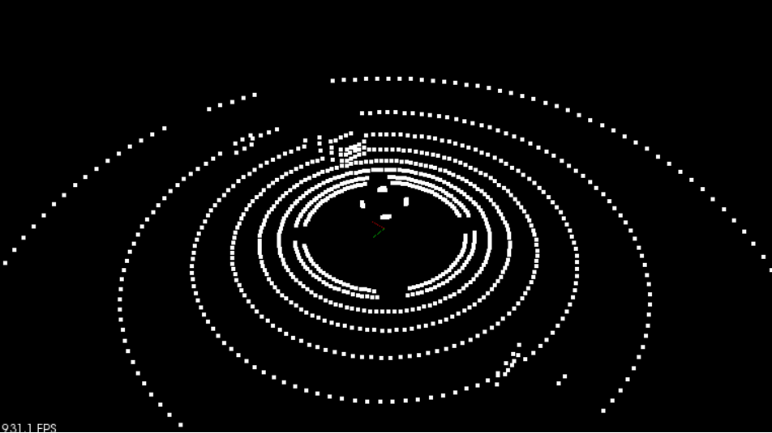

# Examining the Point Cloud

> Part of: **[Optional] Intro to PCL**

## Video

[Watch on YouTube](https://www.youtube.com/watch?v=_soZXKanuBk)

## Summary

**Examining Point Cloud Data**
=====================================

This README file provides an overview of key concepts and practical steps for examining point cloud data using LiDAR hyperparameters.

### Key Concepts

* **Point Cloud Data (PCD)**: A representation of 3D space as a collection of points, each with its own coordinates.
* **LiDAR Hyperparameters**: Adjustable settings that control the quality and resolution of LiDAR scans.
* **Render Point Cloud**: A function in `render.cpp` that visualizes point cloud data in a viewer.
* **Viewer**: A graphical interface for displaying 3D scenes, including point clouds.

### Practical Notes

To visualize point cloud data:

1. In `environment.cpp`, replace the call to `renderRays()` with `renderPointCloud()`.
2. Pass the viewer and input Cloud as arguments to `renderPointCloud()`.
3. Set `renderScene` to `false` to render only the point cloud.
4. Run the simulator to visualize the point cloud data.

Tips:

* Adjust LiDAR hyperparameters (e.g., mean distance) to improve scan quality.
* Experiment with different colors for point clouds.
* Use the viewer to move around and inspect the point cloud data.

Next steps:

* Separate ground plane points from other objects in the scene.
* Explore camera parameters for optimal viewing angles.

## Transcript

So let's check out examining the point cloud now. So we're able to change our LiDAR hyperparameters and get a higher resolution scan of our environment. Now, let's actually look at what this looks like as a PCD, point cloud data. This is what we're shooting for. In this image here, we went ahead and we are not rendering the highway environment anymore, but we are just rendering the point cloud data from it by itself.

What we see here, so in this particular PCD, there wasn't any noise. So you can tell it's very symmetric. Also, the min distance was left at zero, so we can see the roof points of our car here. Now, the important thing is we're seeing these kind of clusters being dealt up. There's one over here, there's a little bit over here, and there's something over here.

These are actually those three blue cars, and they're showing up in our PCD data. So later, we can use some processing to actually detect where those obstacles are at. So in this next exercise, we're going to be creating this point cloud data that we'll be later using in the other lessons to do some obstacle detection with. So in this exercise, we're going to be visualizing what this PCD data looks like. In order to do that, instead of calling render rays, there's another function called render point cloud, and this is also in the render.cpp file.

So if we look at render.cpp, there's a renderRays and there's a renderPointCloud. So go ahead, and instead of doing renderRays, call the renderPointCloud and also just look at some of the arguments for renderPointCloud. So it has a viewer. Anytime we're doing any sort of rendering, we'll have that viewer, we have that point cloud. So renderRays had that as well, but this time we don't have that position because renderRays knew that because it needs to know how the rays, the starting position of where the rays were being cast from.

We also have some color information. Now, by default it'll just rendersPointCloud is white, but you could also fill it in with different colors if you wish. So back in environment.cpp, change the renderRays to renderPointCloud. Then, also if you just want to render the point cloud by itself without any of the cars in the street, there's a flag environment.cpp, and there's this renderScene, and you can just turn renderScene to false, and then you'll just get the renderPointCloud by itself. So go ahead and generate this point cloud and visualize it in your window.

All right, let's go ahead and check out looking at this point Cloud data now. So back in environment.cpp, instead of calling render rays, we can call render Point Cloud which is defined in render.cpp, and we're going to be giving it our viewer and this input Cloud, and we'll just call it input Cloud as well. So it wants to have a name associated with it, this way you can have multiple point Clouds showing up in the viewer and each one can be identified. The other thing that we're going to do is not render our scene because we'll just want to render the point Cloud data by itself. So we'll make that false.

Now, if we go ahead and save our file, and then we go back into, let me go ahead and do full screen on this. We go into the terminator and we make our latest changes, we can then run the simulator and see what the point cloud data looks like. All right. Let's go ahead and launch the executable. Now you'll see that it's a little bit different from the image that we're showing back in the previous slide because we have a mean distance of five so we don't see any of the points from the roof of the ego car, and also we have noise.

So and you can see it's nice little scattering effect. It looks a little bit more realistic, not quite as like symmetric in clean. Also, we can move around and we can see where the lidar is picking up these cars on the road. So there's one car over here in this cluster. There is another car over here.

We're not seeing as much of it as that other one because it's not as close to the lidar. So this is something where you can play with the lidar hyper parameters and see if you can get higher resolution, better defined scans of your environment. Then that last car is back over here. It's right here, and so we can really CM if we tried to get it an orbit position where we can see the flat plane, and then these things poking up above the ground. That's what we'll be going into next, is really how to separate these ground plane points from everything else which includes our cars.

So, you can also look at the camera parameters too and see if you do it in a side view, you can get a nice glimpse of them there maybe. But that's what our point Cloud data looks like.

## Images


*Simulated PCD*

## Additional Content

## Examining the Point Cloud
Now that you can see what the lidar rays look like, what about the actual point cloud data that you will be using and processing? You can view the point cloud data using the `renderPointCloud` function in render. You can also choose to turn off the rendering for the highway scene so you can see what the point cloud looks like by itself.

The result in the image above is without noise and with lidar `minDistance` set to zero. With a high lidar `minDistance`, you can remove the points above that are hitting the roof of your car, since these won't help you detect other cars. Also, some noise variance helps to create more interesting looking point clouds. Additionally, adding noise will help you to develop more robust point processing functions.

### Exercise

Now you will view the lidar's point cloud by itself, without the rays.

- To do this, call `renderPointCloud` instead of `renderRays` in the `simpleHighway` function. 
- You can also view the point cloud without obstacles by setting `renderScene` to `false` in `environment.cpp`.

When you are finished, your output should look like the image below.
### Solution
*Note: At approximately 2:28, Aaron notes the "next" step would be segmenting these points; as noted previously, we will instead be segueing into localization techniques next.*
In `environment.cpp`, within `simpleHighway`, remove the previous call to `renderRays` and instead make use of `renderPointCloud`:

```cpp
Lidar* lidar = new Lidar(cars, 0);
pcl::PointCloud

::Ptr inputCloud = lidar->scan();
//renderRays(viewer, lidar->position, inputCloud);
renderPointCloud(viewer, inputCloud, "inputCloud"); // You can also use other names than just "inputCloud"
```

Additionally, further up in the function, change `renderScene` to hide the object boundaries:
```cpp
// RENDER OPTIONS
bool renderScene = false;
```
