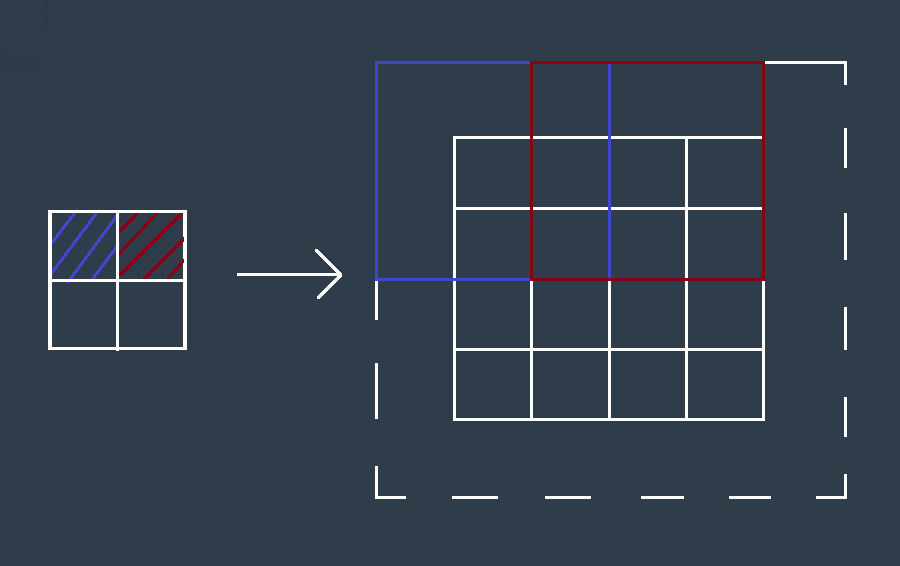

# Transposed Convolutions

> Part of: **Fully Convolutional Networks**

## Video

[Watch on YouTube](https://www.youtube.com/watch?v=K6mlLX8ZZDs)

## Summary

**Transposed Convolution for Decoder Networks**
=====================================================

This summary covers the concept of transposed convolution, a technique used to create decoders in Fully Connected Neural Network (FCN) architectures.

### Key Concepts

* **Transpose Convolution**: A reverse process of convolution where the forward and backward passes are swapped.
* **Deconvolution**: An alternative term for transpose convolution, as it "undoes" the previous convolution operation.
* **Differentiability**: The property that is retained when using transposed convolution, allowing training to proceed similarly to traditional neural networks.

### Practical Notes

Transposed convolution can be used to create decoders in FCN architectures by swapping the order of forward and backward passes. This process has the same mathematical properties as traditional convolution, making it suitable for use in neural network training.

## Transcript

<v English>Now, using the second special technique,</v> <v English>we can create decoder of FCN's using transposed convolution.</v> <v English>A transpose convolution is essentially</v> <v English>a reverse convolution in which the forward and the backward passes are swapped.</v> <v English>Hence, we call it transpose convolution.</v> <v English>Some people may call it deconvolution because it undoes the previous convolution.</v> <v English>Since all we're doing is swapping the order of forward and backward passes,</v> <v English>the math is actually exactly the same as what we've done earlier.</v> <v English>The property of differentiability is thus</v> <v English>retain and training is simply the same as previous neural networks.</v>

## Images

## Additional Content

Transposed Convolutions help in [upsampling](https://en.wikipedia.org/wiki/Upsampling) the previous layer to a higher resolution or dimension.  Upsampling is a classic signal processing technique which is often [accompanied by interpolation](https://dspguru.com/dsp/faqs/multirate/interpolation/).  The term transposed can be confusing since we typicallly think of transposing as changing places, such as switching rows and columns of a matrix.  In this case when we use the term [transpose](http://www.dictionary.com/browse/transpose), we mean transfer to a different place or context.  

We can use a transposed convolution to transfer patches of data onto a sparse matrix, then we can fill the sparse area of the matrix based on the transferred information.  Helpful animations of convolutional operations, including transposed convolutions, can be found [here](https://github.com/vdumoulin/conv_arithmetic).  

As an example, suppose you have a 3x3 input and you wish to upsample that to the desired dimension of 6x6. The process involves multiplying each pixel of your input with a kernel or filter. If this filter was of size 5x5, the output of this operation will be a weighted kernel of size 5x5. This weighted kernel then defines your output layer. 

However, the upsampling part of the process is defined by the strides and the padding. In TensorFlow, using the tf.layers.conv2d_transpose, a stride of 2, and "SAME" padding would result in an output of dimensions 6x6. 

Let's look at a simple representation of this. If we have a 2x2 input and a 3x3 kernel; with "SAME" padding, and a stride of 2 we can expect an output of dimension 4x4. The following image gives an idea of the process.
The 3x3 weighted kernel (product of input pixel with the 3x3 kernel) is depicted by the red and blue squares, which are separated by a stride of 2. The dotted square indicates the padding around the output. As the weighted kernel moves across, the stride determines the final dimension of the output. Different values for these will result in different dimensions for the upsampled output.
In the next quiz, you will test this out yourself!
### Property of Differentiability
A [differential function](https://en.wikipedia.org/wiki/Differentiable_function)  is a function whose derivative exists at each point in its domain, with continuity as one of its most critical properties.
