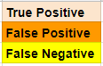
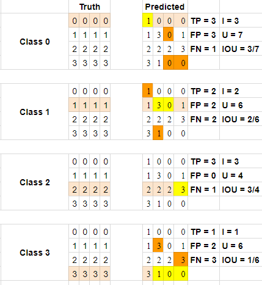

# IOU Example

> Part of: **Scene Understanding**

## Images

## Additional Content

Let's walk through an example IOU calculation.

## Steps

+ count true positives (TP)
+ count false positives (FP)
+ count false negatives (FN)

- Intersection = TP
- Union = TP + FP + FN
- IOU = Intersection/Union

In the above, the left side is our ground truth, while the right side contains our predictions. The highlighted cells on the left side note which class we are looking at for statistics on the right side. The highlights on the right side note true positives in a cream color, false positives in orange, and false negatives in yellow (note that all others are true negatives - they are predicted as this individual class, and should not be based on the ground truth).

We'll look at the first class, Class 0, and you can do the same calculations from there for each.

For Class 0, only the top row of the 4x4 matrix should be predicted as zeros. This is a rather simplified version of a real ground truth - in reality, the zeros could be anywhere in the matrix. On the right side, we see 1,0,0,0, meaning the first is a false negative, but the other three are true positives (aka 3 for Intersection as well). From there, we need to find anywhere else where zero was falsely predicted, and we note that happens once on the second row, and twice on the fourth row, for a total of three false positives.

To get the Union, we add up TP (3), FP (3) and FN (1) to get seven. The IOU for this class, therefore, is 3/7.

If we do this for all the classes and average the IOUs, we get:

**Mean IOU = [(3/7) + (2/6) + (3/4) + (1/6)] / 4 = 0.420**
