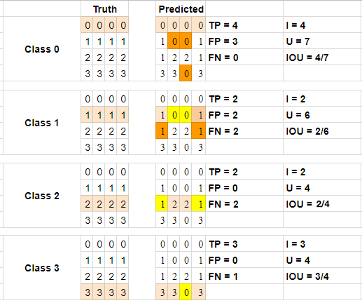

# IOU Solution

> Part of: **Scene Understanding**

## Images




## Additional Content

## IoU Calculation Quiz

### Steps

* count true positives (TP)
* count false positives (FP)
* count false negatives (TN)
* Intersection = TP
* Union = TP + FP + FN
* IOU = Intersection/Union
**Mean IOU = [ (4/7) + (2/6) + (2/4) + (3/4)]/4 = 0.539**
## TensorFlow IoU Quiz

### Test 1
```python
def mean_iou(ground_truth, prediction, num_classes):
    iou, iou_op = tf.metrics.mean_iou(ground_truth, prediction, num_classes)
    return iou, iou_op
```

### Test 2
```python
iou, iou_op = mean_iou(ground_truth, prediction, num_classes)
```
