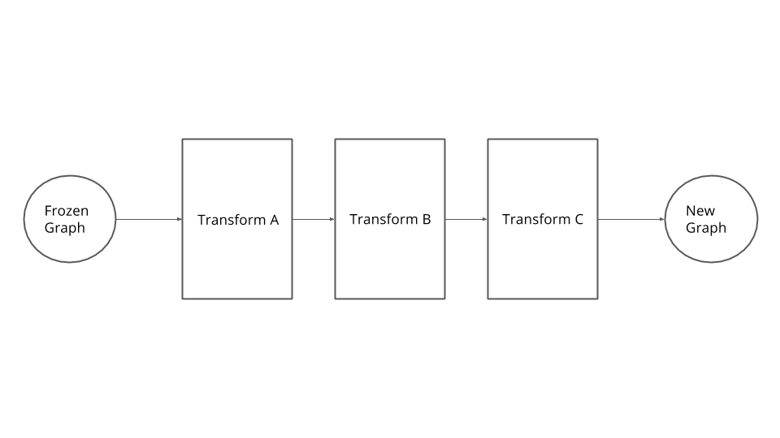

# Graph Transforms

> Part of: **Inference Performance**

## Images

## Additional Content

A TensorFlow model is defined as a static graph through which data flows. Graphs are versatile data structures that can be mutated in various ways. TensorFlow takes advantage of this through graph transforms.  A transform takes a graph as input, alters it, and returns a new graph as output. Note the original graph used as input is not mutated in place, so remains unaltered.  A detailed discussion of many available transforms and how to apply them is found [here](https://github.com/tensorflow/tensorflow/tree/master/tensorflow/tools/graph_transforms/#introduction).  While this information is not required for this lesson, it is worth a read to become familiar with the topic.

Several transforms can be chained together, typically this is done with a theme in mind. For example, we might want to reduce the graph size, optimize it for inference, create an 8-bit version of the graph, etc. In the following sections we'll discuss two sequences of transforms:

1. Optimizing for Inference
2. Performing 8-bit Calculations
