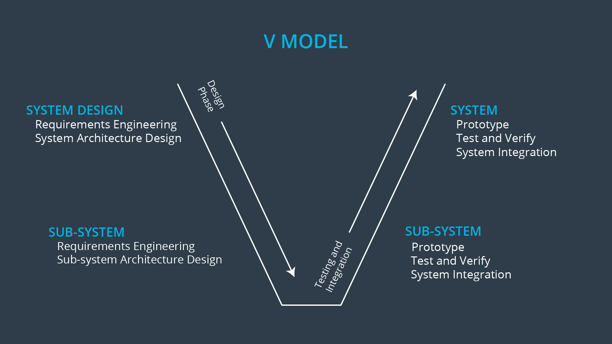
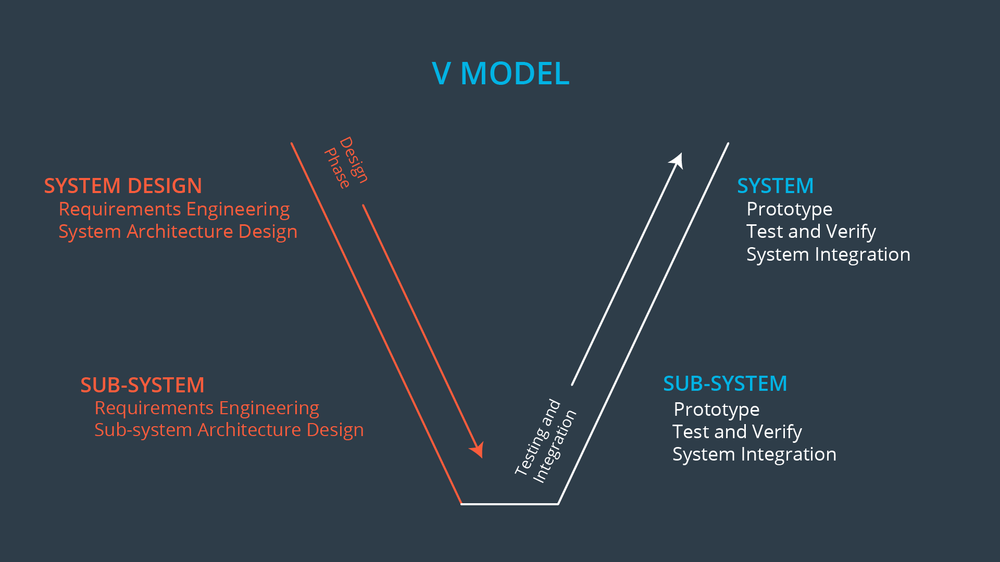
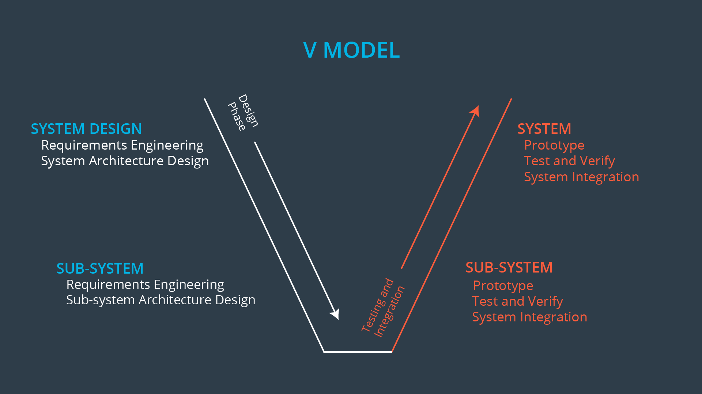
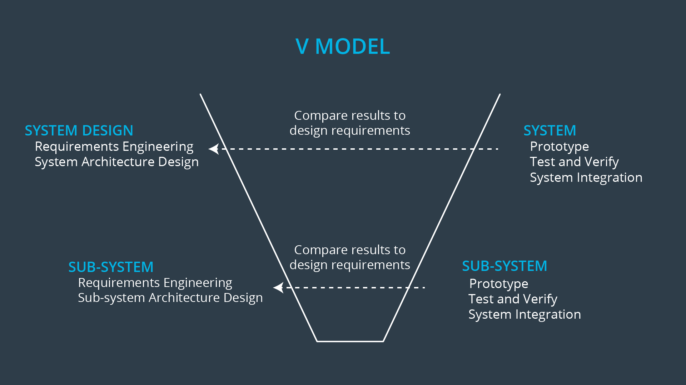

# Reducing Risk with Systems Engineering

> Part of: **Introduction to Functional Safety**

## Video

[Watch on YouTube](https://www.youtube.com/watch?v=tFxkJKcujhQ)

## Summary

**Reducing Risk with Systems Engineering**
=====================================

This project focuses on using systems engineering to reduce risk in complex systems, such as vehicles. The goal is to prevent and control accidents by designing a system that meets the required safety standards.

### Key Concepts

* **Systems Engineering**: A methodical framework for figuring out what a system needs to do (requirements engineering) and allocating requirements to different parts of the design.
* **Requirements Engineering**: Identifying and documenting the functional and performance requirements of a system.
* **System Architecture**: The overall structure and organization of a system, including its components and interfaces.
* **Testing and Verification**: Ensuring that a system meets its requirements by testing and verifying its functionality.
* **System Integration**: Integrating all the different parts of a system so that they work together seamlessly.

### Practical Notes

When using systems engineering to reduce risk in complex systems, consider the following practical steps:

* Identify the functional and performance requirements of the system (requirements engineering).
* Allocate requirements to different parts of the design (system architecture).
* Test and verify the system to ensure it meets its requirements.
* Integrate all the different parts of the system so that they work together seamlessly.

Example: A safety engineer is working on a lane departure warning function. They use systems engineering principles to identify the maximum vibration level of the steering wheel, allocate this requirement to the system architecture, and test and verify the system to ensure it meets its requirements. Finally, they integrate their design into the rest of the vehicle.

Note: This project uses a hypothetical example to illustrate the application of systems engineering principles in reducing risk in complex systems.

## Transcript

<v English>We've discussed how to recognize hazards and motor risks.</v> <v English>But how exactly do we reduce risk to acceptable levels?</v> <v English>Engineers use systems engineering to reduce risk in order to</v> <v English>prevent and control accidents. Vehicles are complex.</v> <v English>Think about all of the different mechanical elements, electric elements,</v> <v English>hydraulic components, hardware components and software components that go into a vehicle.</v> <v English>All of these functions have to work together in a variety of driving conditions,</v> <v English>like freeway driving, driving in the desert heat and driving below freezing temperatures.</v> <v English>Now, think about the different players involved in designing and producing a vehicle.</v> <v English>Product engineers, finance managers,</v> <v English>project managers, safety engineers,</v> <v English>testing engineers and car body designers.</v> <v English>Players will impose different constraints on</v> <v English>the design as they figure out what the vehicle needs to do.</v> <v English>For example, a product engineer will want</v> <v English>the lane keeping system to always be on and available for use.</v> <v English>A safety engineer, will find cases where</v> <v English>the lane keeping system needs to shut off or be limited.</v> <v English>Besides safety and availability constraints,</v> <v English>other constraints include costs,</v> <v English>productivity, market demands and limits of current technology.</v> <v English>This is where systems engineering comes into play.</v> <v English>Systems engineering gives you a methodical framework to figure out</v> <v English>what your vehicle needs to do which is also called requirements engineering.</v> <v English>Come up with a design that matches your requirements</v> <v English>and allocate requirements to different parts of your design.</v> <v English>This is called designing a system architecture and allocating requirements to the system.</v> <v English>Test and verify your system to make sure that it really does what it is supposed to do.</v> <v English>Which we will refer to as testing and verification.</v> <v English>And finally, integrate all of the different parts so that everything plays well together.</v> <v English>This is known as system integration.</v> <v English>How will we use system engineering?</v> <v English>Let's say a product engineering team is working on the lane departure warning function.</v> <v English>The warning function vibrates</v> <v English>the steering wheel if the driver crosses the lane by mistake.</v> <v English>You, the safety engineer,</v> <v English>look all the lane wanting functions design,</v> <v English>you quickly realize that if the steering wheel vibrates too hard,</v> <v English>the driver could loose control of the vehicle and crash.</v> <v English>What are you going to do about it?</v> <v English>You will use systems engineering.</v> <v English>First, figure out what the vehicle needs to do.</v> <v English>The vehicle needs to limit the maximum vibration of the steering wheel.</v> <v English>If the vibration exceeds the maximum,</v> <v English>the lane departure warning system should shut off.</v> <v English>This is requirements engineering.</v> <v English>Now, you adjust the design of the lane departure wanting</v> <v English>function so that it includes your new functionality.</v> <v English>We call this, allocating requirements to the system architecture.</v> <v English>The next step, is to test your design to make sure it works properly.</v> <v English>You verify that the system turns off when vibration levels get too intense.</v> <v English>This is the testing and verification phase.</v> <v English>Finally, you integrate your design into the rest of the vehicle.</v> <v English>For instance, you'll make sure that</v> <v English>the lane keeping system plays well with the automatic cruise control system.</v> <v English>This is the system's integration step.</v> <v English>Your job as a functional safety engineer,</v> <v English>is to insert yourself into the design and</v> <v English>testing process as your company develops a vehicle.</v> <v English>You will use systems engineering principles to guide</v>

## Images

*Generic V Model*

## Additional Content

### Introduction to the Lane Assistance System

Throughout the functional safety module, you will use a lane assistance system as a practical example. The lane assistance system will be the basis of the final project as well. 

Lane assistance technology is relatively new in the automotive world. A lane assistance system generally has two functions:
* lane departure warning
* lane keeping assistance

If a driver departs a lane without using a turn signal, the system assumes that the driver has become distracted and did not mean to leave the lane. The system will vibrate the steering (lane departure warning) and also move the steering wheel back towards the lane center (lane keeping assistance). 

Lane assistance technology represents an intermediate step on the way to fully autonomous driving. In this video, you will hear references to the lane assistance system, lane departure warning and lane keeping assistance. The Hazard Analysis and Risk Assessment lesson will go into more detail about how this system works.  While multiple fields use the approach described in this concept, we offer systems engineering as an example.  [Systems engineering](https://en.wikipedia.org/wiki/Systems_engineering) is an interdisciplinary field of engineering and engineering management that focuses on the design and management of complex systems.
### The Basics of Systems Engineering
### What is a System?

What exactly is a system? ISO 26262 defines a system as a:

> *[1.129] set of elements that relates at least a sensor, a controller and an actuator with one another.
The related sensor or actuator can be included in the system, or can be external to the system.
An element of a system can also be another system.*

(Note that an *element* is defined by ISO 26262 [1.32] as a *system or part of a system including components, hardware, software, hardware parts, and software units*).

Admittedly, the definition of a system is a little bit hard to pin down. 

For the purposes of the rest of this module, a system will be a part of the vehicle that provides some functionality. 

We will specifically look at a simplified version of an advanced driver assistance lane keeping system that helps the driver stay centered in a lane. 

### The V Model

To organize a system analysis, system engineers use what are called process models. These process models provide a framework for conducting a methodical systems analysis. 

ISO 26262 uses a process model called the V model. Before we introduce ISO 26262 and its specific version of the V model, let's discuss the characteristics of a generic V model.

The V model starts in the upper left corner, moves down to the bottom center, and then moves back up to the upper right corner. 

The left side of the V represents the design phase; this is where you 
* plan what your system needs to do (requirements engineering)
* plan what the system needs to look like (system architecture design). 
##### Left Side of the V Model
The right side of the V represents the testing, verification and integration; on the right side, you Build prototypes Test and verify prototypes to see if they do what you said they would do in the design phase Integrate your prototype with other parts of the vehicle.
##### Right Side of the V Model
The top part of the V represents the entire vehicle as a single system. As you traverse down the left side of the V, you focus on smaller and smaller subsystems. As you go up the right side of the V, you integrate your subsystems into larger and larger systems.

At the top left, you start with a bird's eye view of your entire vehicle. As you move down the left side, you start to split your vehicle into subsystems like climate control, entertainment system, steering system, braking system, etc. You then define requirements and system architectures for each sub-system.

Then you focus on a sub-system, like the climate control system, and break down the climate control system into its own sub-systems like the electronic control unit, the temperature sensor, the fan, the air filter, etc. Each sub-system will have its own design requirements and design architecture.
Notice as well that you can connect the right side of the V and the left side of the V. For every prototype you make or test you run, you can check back to see if the results match the design specifications.

##### Connecting the right and left side of the V
### Other Process Models

Two other popular process models include the [Spiral model](https://en.wikipedia.org/wiki/Spiral_model) and the [Waterfall model](https://en.wikipedia.org/wiki/Waterfall_model). They are not, however, part of the ISO 26262 standard.

Although we will not be covering them in the functional safety module, these two other models are also commonly used in systems engineering.
### V Model Quiz
### Engineering Requirements and the ISO 26262 Standard

Requirements engineering is a sub-discipline of systems engineering. Because ISO 26262 is based on systems engineering principles, defining requirements comes up repeatedly in the standard.

Throughout the V model, one of the most important steps is defining requirements. In layman's terms, a requirement says what a system is supposed to do. What is the system's function? Requirements almost always start off with the phrase, "X shall …..". 

As you travel down the left side of the V model, you will generally take requirements from the previous step and then refine them in the current step. It makes sense that requirements would be refined at each level; as you travel down the V, you dive into sub systems with increasing detail.

Then you start to move up the right side of the V. First, you'll test your temperature sensor to make sure it functions correctly according to its design requirements. You will do the same for all of the air conditioning subsystems. Then you will integrate the temperature sensor with the electronic control unit and run more tests to make sure they play well together. 

You move up the V until you have a complete air conditioning system that functions according to its design specifications. You move up the V and integrate the air conditioning system with the other electronic systems in the vehicle, and then you test again. Eventually, when you get to the top right side of the V, you will have a complete car ready for production!

For every design step on the left side of the V, there is a corresponding test and integration step on the right side of the V. You test your system and then go back and see if the test results match the design requirements and specifications. The correspondence between the left and rights sides of the V is one of the advantages of the V model.
