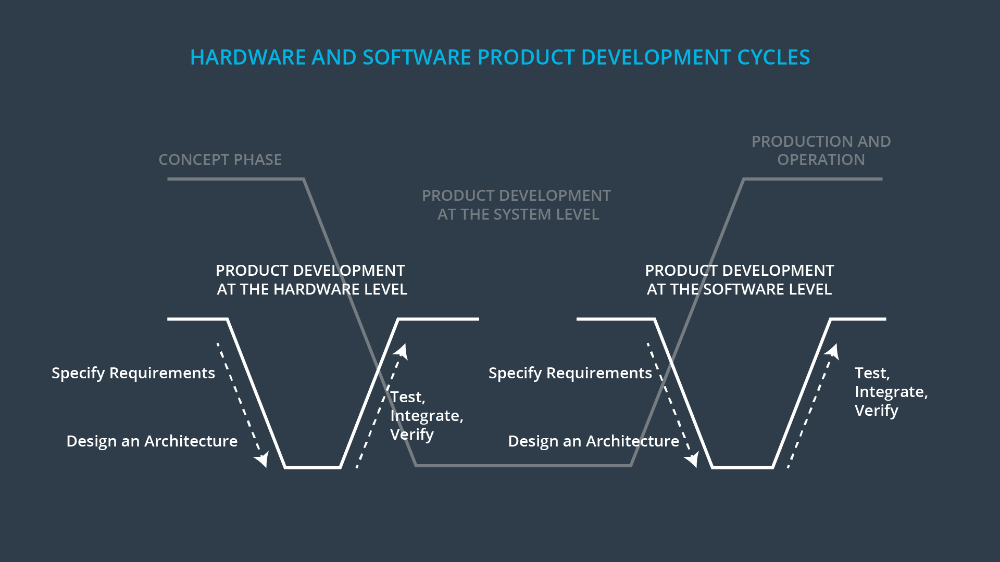

# The Full V Model

> Part of: **Introduction to Functional Safety**

## Images

*Flattened V model*

## Additional Content

### Full V Model

If you search the internet for the ISO 26262 V model, you'll see that it is a bit more complex than how we've presented it. This [link](https://www.iso.org/obp/ui/#iso:std:iso:26262:-9:ed-1:v1:en) has a preview of one part of the ISO 26262 standard, and it contains the full V model. You'll notice that the model we have presented so far is somewhat simplified. Here is the model that we showed in the previous video:

As you go through the functional safety course, you will become familiar with the different parts of the ISO 26262 V model. Keep in mind that although the ISO 26262 model looks relatively complex, underlying principles of the V model remain the same:
* the left side represents product development like specifying requirements and designing a system architecture
* the right side represents prototyping, testing and integration
* higher up in the V model represents integrated systems
* lower down in the V model represents sub systems
### Vocabulary

This section contains definitions of each section of the complete ISO 26262 V model for your reference. The functional safety module goes into depth about some of these sections: item definition, hazard analysis and risk assessment, functional safety concept, technical safety concept, hardware and software development:

##### Management of Functional Safety

Here, the standard discusses overall planning. Planning involves designing a safety plan, which you will learn about in the Safety Plan lesson. 

##### Concept Phase

The concept phase contains four parts:
* **Item definition** The item definition specifies which vehicle system is being considered. The Hazard Analysis and Risk Assessment lesson goes into more depth about item definition.
* **Initiation of the safety lifecycle** If your project only involves modifying an existing system, you figure out which parts of the functional safety will be affected. That way, you do not have to repeat work that was already done.
* **Hazard analysis and risk assessment** In the hazard analysis and risk assessment (HARA), you figure out situations in which your system could malfunction and then evaluate risk. The output of the HARA are high level engineering requirements called safety goals.
* **Functional safety concept**  In this section, the safety goals are refined into safety requirements. These safety requirements are then allocated to the appropriate parts of the item's architecture.

##### Product development at the system level

This is the main design phase. You develop a technical solution that leads to a safe system. In this section, you specify technical safety requirements, system architecture and the system design according to the left side of the V model. 

Then you test, integrate, verify and validate your system according to the right side of the V model.

##### Product development at the hardware level

Based on the system level technical requirements from the previous step, you develop the hardware. The hardware development process has its own V model;  hardware design happens on the left side of the branch. The right side of the V model includes integration and testing.

##### Product development at the software level

Again, based on the system level technical requirements, you develop the software. The software also has its own V model with design on the left side and then integration as well as testing on the right side

##### Production and Operation

This section has two parts:
* **Production** Discusses functional safety as it relates to manufacturing the vehicle (production). This part also discusses what to keep in mind once the vehicle is in consumers' hands (operation). 
* **Operation, service (maintenance and repair), and decommissioning**  Operation is functional safety after customers have purchased the vehicle. Service refers to functional safety when the vehicle is being maintained and repaired. Decommissioning discusses what happens to a vehicle when no longer in service.

##### Supporting processes

The supporting processes contains a mix of different techniques. For example, the supporting processes section discusses how to approach changing a system that already exists. It also gives strategies for managing safety requirements.

##### ASIL-oriented and safety-oriented analysis

This section goes into depth about ASIL decomposition and other analysis tools. You will learn about ASIL decomposition in the module.

##### Guideline on ISO 26262

This section gives an overview of the functional safety standard.
### Flattened V Model

You can also flatten out the V model to see it from a more linear perspective. The image below gives the major steps involved in a functional safety project:
