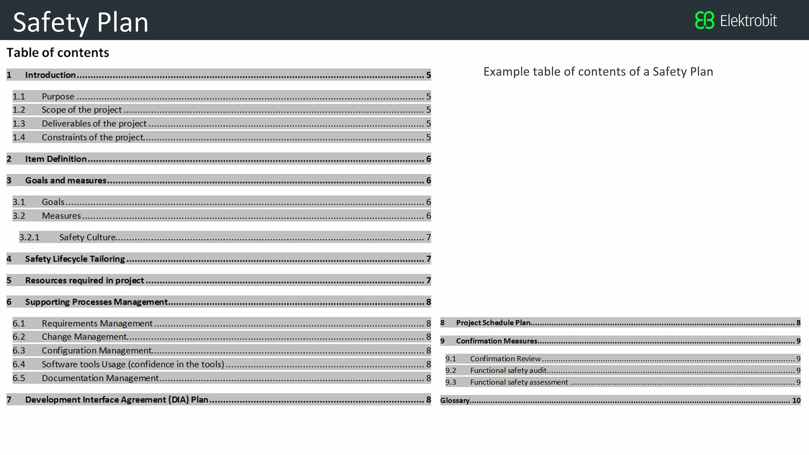

# Introduction

> Part of: **Functional Safety: Safety Plan**

## Video

[Watch on YouTube](https://www.youtube.com/watch?v=nQD8NgwXuj4)

## Summary

**Creating a Safety Plan for Functional Safety**
====================================================

A safety plan is an essential step in designing safe vehicles, especially when working under the guidelines of ISO 26262. This plan requires more than just analyzing hardware and software components; it involves understanding both technical and sociological requirements.

### Key Concepts

* **Functional Safety**: The process of ensuring that a vehicle's systems operate safely to prevent harm to people or damage to property.
* **ISO 26262**: A standard for functional safety in the automotive industry, which outlines guidelines for designing safe vehicles.
* **Safety Plan**: A document that outlines roles and responsibilities, as well as steps taken to achieve functional safety.

### Practical Notes

A safety plan is not just a theoretical exercise; it's a practical step towards ensuring the safety of your vehicle. To create an effective safety plan:

1. Define roles and responsibilities within your team or company.
2. Outline the steps you will take to achieve functional safety, including any necessary design changes.
3. Document your safety plan in detail, using clear language and concise formatting.

By following these guidelines, you can develop a comprehensive safety plan that helps ensure the safe operation of your vehicle.

## Transcript

<v English>Before analyzing a system under ISO 26262,</v> <v English>you need to create a plan.</v> <v English>Designing a safe vehicle requires more than</v> <v English>a methodical analysis of hardware and software components.</v> <v English>Vehicles are complex systems with both sociological and technical requirements.</v> <v English>If your company or team does not take safety seriously,</v> <v English>how can you expect to design a safe vehicle?</v> <v English>If roles and responsibilities haven't been defined,</v> <v English>important design steps might be missed.</v> <v English>So our first step in functional safety is to write a safety plan.</v> <v English>The safety plan forces us to define roles</v> <v English>then outline the steps we will take to achieve functional safety.</v> <v English>In this lesson we will teach you</v> <v English>the basic parts of a safety plan so that you can document your own.</v>

## Images

*Elektrobit Safety Plan Outline*

## Additional Content

### Project Repo

Each of the next five lessons (Safety Plan, Hazard Analysis and Risk Assessment, Functional Safety Concept, Technical Safety Concept, Functional Safety at the Software and Hardware Levels) has a matching document in the [final project repo](https://github.com/udacity/CarND-Functional-Safety-Project) template folder. The final project will involve filling out the template files.

Here are two suggestions for tackling the functional safety lessons. You can either 
* watch all lessons first. After the final lesson, you can download the project repo and fill out the templates. You will most likely need to rewatch the videos and re-read the text nodes to find the right answers
* download the project repo now. As you go through the lessons, you can follow along with the template files and fill them out as you go. Each lesson has its own template file.
### Introduction to the Safety Plan Lesson
### Lesson Outline

In this lesson, you will learn to document a functional safety plan. This is a task often performed by a functional safety manager.

Once you understand the motivation behind documentation, you will learn about the different parts of a safety plan:
* Safety Culture 
* Safety Lifecycle
* Safety Management Roles and Responsibilities
* Development Interface Agreements
* Confirmation Measures

While a lot of these terms might seem foreign, you will become familiar with them as you progress through this lesson and the rest of the module.

Some parts of the safety plan are more intuitive than others. For example, the **project schedule plan** would be a calendar. Filling out much of the **confirmation measures** section, on the other hand, requires knowledge about testing and verification that goes beyond what's covered in the module.

Part 2 of the ISO 26262 standard, *Management of Functional Safety*, defines the safety plan.

Note that Safety Culture, Safety Lifecycle, Development Interface Agreements, and Confirmation Measures are important safety plan elements, but are not part of the work product called "safety plan" defined by ISO 26262.  Rather, they are considered separate work products.  ISO 26262 allows tailored safety plan processes which includes multiple work products.
### Safety Plan Outline

Here is an actual outline that Elektrobit uses for their safety plans:

The project at the end of this module requires writing a safety plan. After going through this lesson, you will be ready to write the safety plan.

Here is an overview of the different sections:

The **Introduction** section gives an overview of the project and discusses the documentation that will be included in the entire report.

The **Item Definition** describes which particular vehicle system will be under analysis. 

**Goals and Measures** discuss the goals of the project and what activities will be included.

**Safety LifeCycle Tailoring** mentions which parts of the V model will be included in the project.

**Resources Required In Project** defines the different roles on the team.

**Supporting Process Management** talks about the systems engineering management methods to be used.

**Project Schedule Plan** gives a calendar of when tasks will be completed.

**Confirmation Measures** reports what will be done to prove that functional safety has been achieved.
In the [final project GitHub repository](https://github.com/udacity/CarND-Functional-Safety-Project), you will find a template for the safety plan that you will make in the final project. You can look at the template as you go through the safety plan lesson. 
### Why Document?

ISO 26262 requires independent audits. The audits check if the project followed the steps outlined in the standard. Auditors will rely on the documentation to assess your work.  An audit may be followed by a safety assessment, used to determine if the decisions made and steps taken achieve appropriate safety.  

Documentation also provides a reference when modifying a system. If, for example, you are modifying a brake system, you can use prior documentation to help guide the current project.

What happens if the vehicle you helped design is being sold to the public and then has a safety issue? Government authorities will probably expect to see documentation for how the system was designed and tested. You'll want to prove that you followed best practices. The proof is in the documentation.

The main goal in functional safety is to reduce risk to acceptable levels. But how do you prove that your design solutions actually lower risks? Much like a lawyer would argue a case in court, you would provide your arguments in a final document called a **safety case**.

A safety case would provide evidence that your project has made the vehicle safer.

The evidence would include all the ISO 26262 documentation such as the safety plan, design plans, functional safety concept, technical safety concepts, as well as evidence documenting testing and integration.

The safety case would discuss what elements you added to the system in order to make it safe. And it would provide testing evidence that shows the system functioning properly. The documentation provides evidence that what you added to the system really does make the vehicle safer. Somebody who is completely independent from the functional safety team should evaluate the validity of the safety case.
