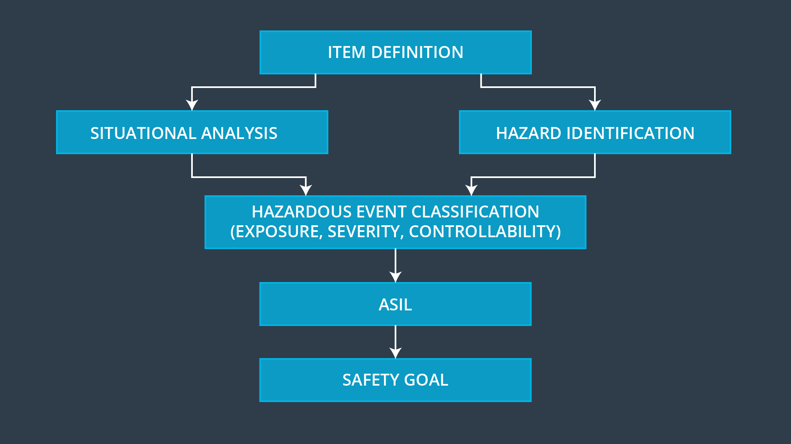

# Introduction

> Part of: **Functional Safety: Hazard Analysis and Risk Assessment**

## Video

[Watch on YouTube](https://www.youtube.com/watch?v=6rojuFZJ4Os)

## Summary

**Refining Hazard Analysis and Risk Assessment for Advanced Driver Assistance Systems (ADAS)**

This project focuses on refining the process of analyzing hazards and assessing risks, particularly in the context of Advanced Driver Assistance Systems (ADAS). The goal is to develop a more comprehensive understanding of how ADAS can be designed to prevent hazardous situations.

**Key Concepts**

* **Situational Analysis**: Identifying different driving scenarios that an ADAS may encounter, such as driving on a highway or parking in a lot.
* **Malfunction Identification**: Brainstorming ways in which the vehicle's ADAS system can malfunction and cause hazards.
* **Risk Factor Calculation**: Evaluating malfunctions on various driving scenarios to calculate a risk factor called ASIL (Automotive Safety Integrity Level).
* **Hazard Analysis and Risk Assessment Process**: A systematic approach to identifying, analyzing, and mitigating potential hazards in ADAS systems.

**Practical Notes**

To apply this knowledge, you will need to:

* Choose an ADAS system to investigate
* Brainstorm driving scenarios and potential malfunctions for that system
* Evaluate the risk factors associated with each malfunction on different driving scenarios
* Use ASIL calculations to determine the safety integrity level of the ADAS system

Note: This project is focused on refining hazard analysis and risk assessment processes, but does not provide specific code or implementation details.

## Transcript

<v English>Now, we are going to refine how we analyze hazards and assess risks.</v> <v English>Before we start, we need to define which part of vehicle will be under consideration.</v> <v English>We are going to use an Advanced Driver Assistance System,</v> <v English>in short ADAS, as an example.</v> <v English>Once we have chosen a system to investigate,</v> <v English>we need to brainstorm and come up with</v> <v English>different driving scenarios like driving in</v> <v English>the snow on a highway or parked in a parking lot.</v> <v English>We call this situational analysis.</v> <v English>Separately, we'll think about different ways that the vehicle can malfunction.</v> <v English>We'll brainstorm again to identify what could go wrong with the ADAS.</v> <v English>We will then evaluate malfunctions on</v> <v English>the various driving scenarios and calculate a risk factor called ASIL,</v> <v English>automotive safety integrity level.</v> <v English>The ultimate goal of hazard analysis and risk assessment is to define</v> <v English>requirements specifying what ADAS needs to do in order to avoid hazardous situations.</v>

## Images

*Hazard Analysis and Risk Assessment Lesson Outline*

## Additional Content

### Introduction to the Lesson
### Outline of the Hazard Analysis and Risk Assessment
Here is a description of the main parts of this lesson:

**Item Definition**

You will determine which vehicle system or systems are under consideration. The item definition describes which vehicle system is under consideration. Part of the definition includes the system boundaries clarifying what is inside versus outside the system. 

**Situational Analysis**

In a situational analysis, you choose different driving scenarios like driving on a bumpy road, being towed, and driving on the freeway. 

**Hazard Identification**

This is where you figure out what could go wrong with your system: in other words, how the system could malfunction. Remember that ISO 26262 only looks at electrical and electronic malfunctions. An electronic parking brake failure, for example, could be a potential malfunction.

**Hazardous Event Classification According to Exposure, Severity and Controllability**

You then combine situations and hazards together. Essentially, you take a malfunction and then think about the malfunction under different driving scenarios. Like if the electronic parking brake failed while the vehicle was parked on a steep hill.

You can then calculate three metrics called exposure, severity and controllability. The values for these three metrics will depend on the hazard, the driving scenario and what might happen when the hazard occurs under the scenario.

**ASIL**

After you have calculated exposure, severity and controllability, you can now determine the ASIL. There is a table to facilitate this calculation.

**Safety Goal**

Finally, you derive safety goals based on the hazard analysis and risk assessment. A safety goal is a type of engineering requirement specifically for vehicle functional safety; for example, "The electronic parking brake system shall always be engaged when the vehicle is in park on a gradient that is greater than 10 degrees".  
Please note that HARA is subjective and different groups may define values differently based on their view of severity, occurrence, and exposure.  This may result from geographical or cultural factors. For example in countries where the vast majority of automobile use is in well lit, urban, area, with low speed limits, headlights may not be considered safety critical.
