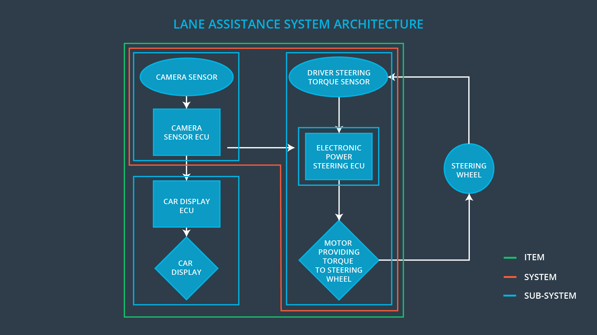
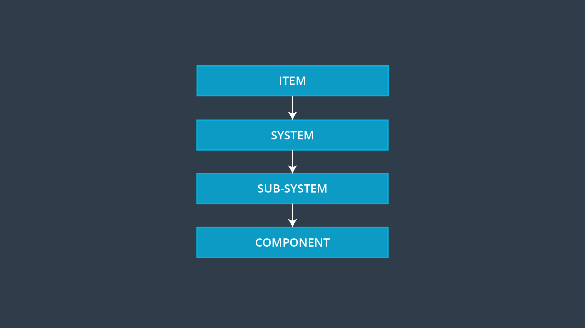
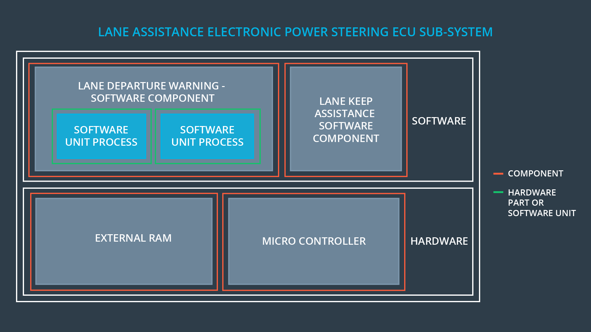
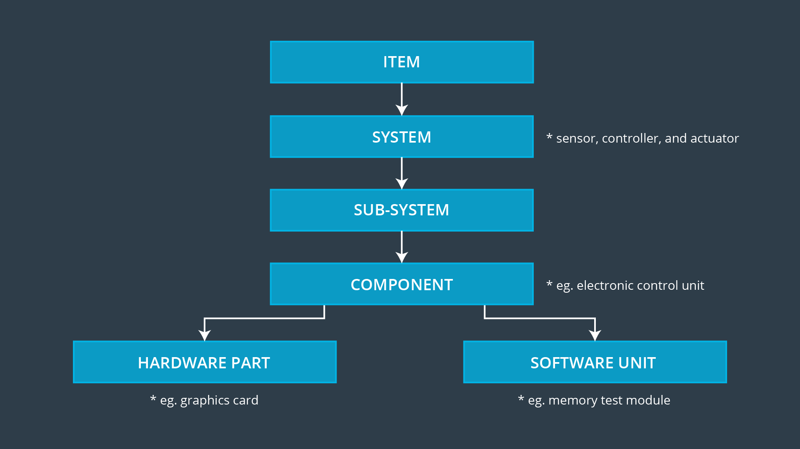

# Advanced Driver Assistance System

> Part of: **Functional Safety: Hazard Analysis and Risk Assessment**

## Images

*System Hierarchy*

*Subsystem Architecture*

*Full System Hierarchy*

## Additional Content

### ADAS (Advanced Driver Assistance System)

For the rest of the functional safety module, we will use an Advanced Driver Assistance System as a concrete example. Advanced Driver Assistance Systems, often called ADAS systems, have two functions:
* Alert the driver to potentially dangerous situations
* Take control over the vehicle to prevent accidents from occurring 

You are already familiar with some of the technology used in ADAS systems such as LiDAR, radar, and cameras with computer vision and deep learning algorithms.

Because ADAS systems can actually take over control from the driver, these systems represent an intermediate step in the development of fully autonomous vehicles.

Here are a few examples of ADAS systems that you can already find in passenger vehicles today:
* Adaptive Cruise Control 
* Automatic Parking
* Blind Spot Monitoring
* Lane Departure Warning
* Lane Keeping Assistance
* Tire Pressure Monitoring
* Pedestrian Protection

### Lane Assistance System Functionality

For the functional safety module, we are going to look at a simplified version of a Lane Assistance System. 

We want to make sure that you understand how the technology works and what the system architecture looks like.

The Lane Assistance System will have two functions:
1. Lane departure warning
2. Lane keeping assistance

When the driver drifts towards the edge of the lane, two things will happen:
* the **lane departure warning function** will vibrate the steering wheel
* the **lane keeping assistance function** will move the steering wheel so that the wheels turn towards the center of the lane 

To state the **lane departure warning** engineering requirement more formally: "the lane departure warning function shall apply an oscillating steering torque to provide the driver a haptic feedback." In other words, the vehicle quickly moves the steering wheel back and forth to create a vibration. You can assume that the engineering requirement came from a product engineering team, and your job will be to add extra requirements to ensure functional safety.

The **lane keeping assistance functionality** will automatically **assist** the driver; the steering wheel turns towards the center of the lane. We will formally list the requirement as "the lane keeping assistance function shall apply the steering torque when active in order to stay in ego lane". Ego lane refers to the lane in which the vehicle currently drives. 

When the camera senses that the vehicle is leaving the lane, the camera sends a signal to the electronic power steering system asking to turn and vibrate the steering wheel.

The camera sensor will also request that a warning light turn on in the car display dashboard. That way the driver knows that the lane assistance system is active. 

What if the driver wants to leave the lane? If the driver uses a turn signal, then the lane assistance system deactivates so that the vehicle can leave the lane. The driver can also turn off the system completely with a button on the dashboard.

The driver is still expected to have both hands on the steering wheel at all times. The electronic power steering subsystem has a sensor to detect how much the driver is already turning. The lane keeping assistance function will merely add the extra torque required to get the car back towards center. The extra torque is applied directly to the steering wheel via a motor.

### Lane Assistance System Architecture

Now we will look at what the system looks like from a bird's eye view. 
Take a look at this diagram of the system architecture. 

An architecture is a block diagram of the main parts of a system. This high level overview allows us to see how the system works without yet needing to know the details of the hardware and software implementations. 

ECU stands for Electronic Control Unit. An ECU is a small computer that contains the hardware and software for a specific vehicle functionality. The camera ECU, for example, might have the hardware and software required for deep learning or for computer vision techniques like the Hough transform.

To summarize the functionality, the camera system detects lane departures and tells the steering wheel how hard to turn. The driver receives a warning on the vehicle display and also receives a warning via a steering wheel vibrating. Simultaneously, the wheel adds extra steering torque to help the driver move back towards the center of the lane.
### System Hierarchy

Notice the system diagram has outlines in three different colors. ISO 26262 has a specific vocabulary for referring to different parts of the system. In the diagram, you can see how ISO 26262 defines the terms “item”, “system” and “subsystem”.

An **Item** is just a high level system in the vehicle; in this case, the item is the lane assistance system. For clarity, throughout the lesson, you will see references to the "lane assistance item" rather than the "lane assistance system".

According to ISO 26262, a **system** is a set of **elements** that have at least a sensor, controller and an actuator. In the system outline in red, we have two sensors: a camera sensor and a driver steering torque sensor. The ECUs are the controllers, and the actuator is the motor that turns the steering wheel. The sensors, ECUs, and motor would all be considered **elements**. **Element** is a generic term for any part of a system. A system will generally have more than one element.

A **sub-system** is a smaller piece of a **system**.  

So an **item** can be thought of as a system made up of systems made up of systems …. etc.

The hierarchy is:
And as you can see, these labels are fluid depending on the context. If you were looking at the entire lane assistance item from a bird's eye view, you could call the camera sensor an element. 

If you looked inside the camera sensor, you would find that the camera sensor has its own internal sensors, controllers and actuators. So you could also think of the camera sensor as a system depending on what level you place your focus.

Please note that the there is room for interpretation in the allocation of elements to the ISO hierarchy.  For example, a graphics card is not a hardware component from the perspective of a person developing the components which are on board the graphics card. 
### Lane Assistance System: Sub System Architecture

If we dig down further into the power steering ECU sub-system, we divide the ECU into its hardware and software components. We can further subdivide the software and hardware into components, parts, and units as shown in the diagram below. As we traverse down the V model, the architecture diagrams become more focused and detailed.

Here is a summary how ISO 26262 labels system hierarchies with typical examples for each part:
