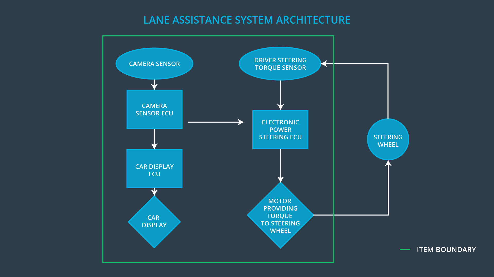

# Item Definition

> Part of: **Functional Safety: Hazard Analysis and Risk Assessment**

## Images

*Lane Assistance System Architecture*

## Additional Content

### Item Definition
When you analyze a vehicle system's functional safety, you first need to understand the item's functionality and define the boundaries of the item. In our example, the item is the lane assistance system.

Looking at the lane assistance system architecture, 
you can see that the item boundary was drawn to include three sub-systems:
* Camera system
* Electronic Power Steering system
* Car Display system

Your job in functional safety is to further refine the system to take into account potential malfunctions. To ensure functional safety, you might end up adding additional subsystems or elements to the original system architecture provided to you.

In general, the **item definition** will mention which systems are part of the **item** as well as any other information known about the item such as:
* *Functional concept* of the product, which describes what the item is supposed to do; recall that functional safety engineering involves analyzing what happens when the system malfunctions, and the item does not do what it is supposed to do. So it is important to understand the product's purpose. 
* *Operational and Environmental Constraints*
* *Legal Requirements*
* *National and International Standards Related to the Item*
* *Records of previously known safety-related incidents or behavioral short-falls*

### Quiz: Lane Keeping Item
