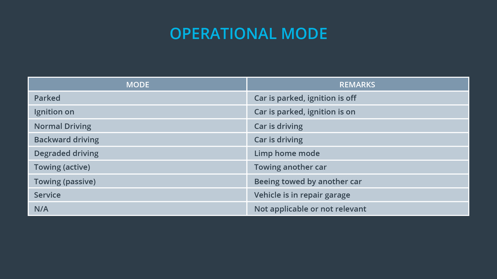
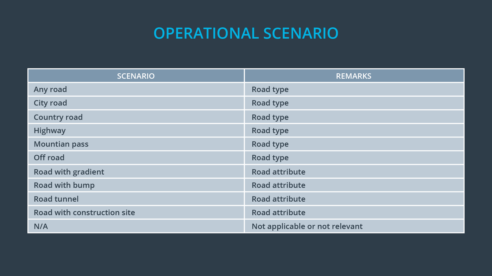
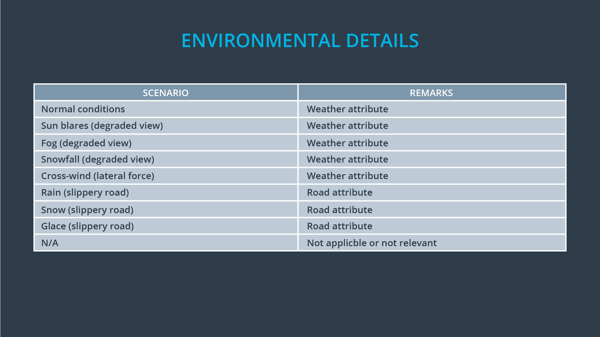
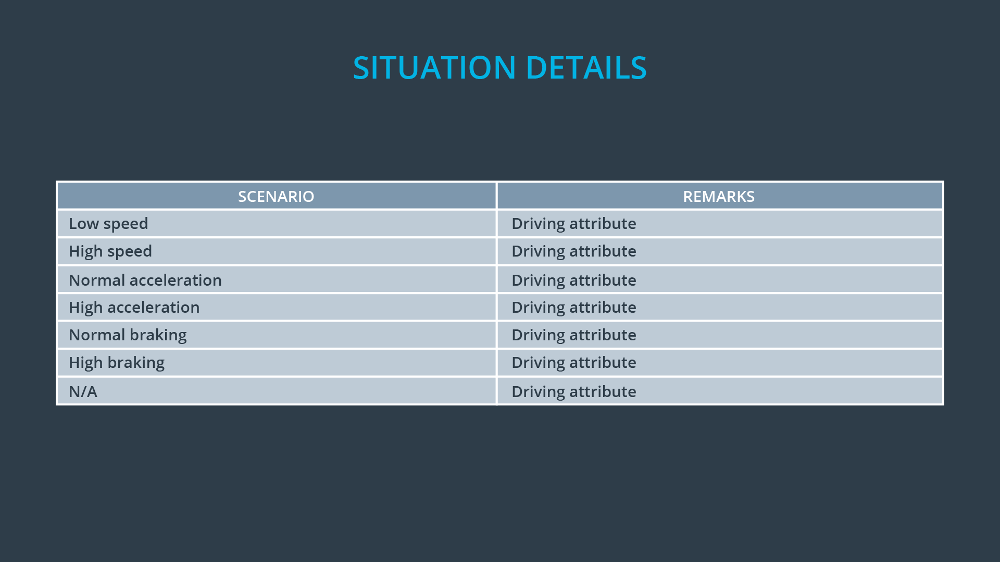
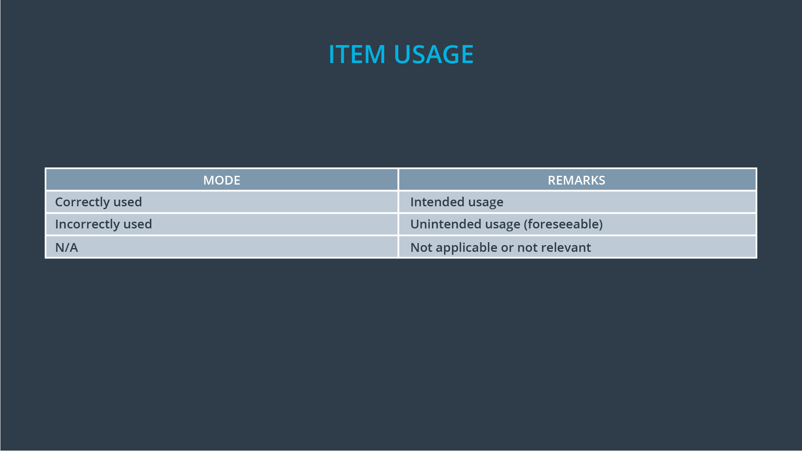

# Situational Analysis

> Part of: **Functional Safety: Hazard Analysis and Risk Assessment**

## Video

[Watch on YouTube](https://www.youtube.com/watch?v=o9iBiz7IQ_k)

## Summary

**Lane Keeping Resistance System Situational Analysis**
======================================================

This project involves analyzing a lane keeping resistance system and identifying potential accident scenarios. The goal is to anticipate and prevent accidents by imagining hypothetical driving situations and analyzing what would happen if the vehicle malfunctions.

### Key Concepts
* **Situational analysis**: A method of anticipating potential accidents by imagining hypothetical driving situations.
* **Driving scenarios**: Hypothetical driving situations that can be used to analyze the behavior of a vehicle in different conditions.
* **Guide words**: Predefined phrases used to create a scenario and guide the situational analysis process.
* **Item usage**: Considering whether the driver is using the system as intended, such as driving a sedan on urban roads or off-road at high speeds.

### Practical Notes
To perform a situational analysis, follow these steps:

1. Brainstorm potential driving scenarios using predefined guide words to create a scenario.
2. Fill in the blanks with specific details, such as:
	* Operational mode: e.g., normal driving, reverse driving
	* Scenario: e.g., city road, country road
	* Environmental details: e.g., fog, rain, high-speed
	* Situational details: e.g., low speed, correct system usage
	* Item usage: e.g., driver using the system as intended or misusing it
3. Analyze the scenario to identify potential malfunctions and accidents.
4. Use a combination of critical thinking and guide words to focus on the most critical scenarios where the item could malfunction.

Example scenario:
Normal driving on a highway with a wet slippery road at high-speed and correctly used system.

Note: This is just one example, and there may be other critical situations that need to be considered.

## Transcript

<v English>We are going to analyze the lane keeping resistance system,</v> <v English>and discuss how to do a situational analysis.</v> <v English>Remember that we want to anticipate what accidents</v> <v English>might occur and prevent those accidents from ever happening.</v> <v English>So we need to imagine hypothetical driving situations and</v> <v English>analyze what would happen if the vehicle malfunction in each situation.</v> <v English>Here is an example of a driving situation.</v> <v English>Driving in reverse on a country road with</v> <v English>normal driving conditions at high-speed and correct use of the system.</v> <v English>We could come up with hundreds or thousands of driving scenarios through brainstorming.</v> <v English>To help with the brainstorming process,</v> <v English>we can use predefined guide words to create a scenario.</v> <v English>A situation analysis can then be like a fill-in-the-blank exercises that goes like this.</v> <v English>Operational mode on operational scenario,</v> <v English>during environmental details with situational details and item usage system.</v> <v English>For example, backward driving on</v> <v English>a city road during fog with low speed and correctly used system.</v> <v English>We have provided guide words for you below.</v> <v English>When you think about item usage,</v> <v English>consider whether on not the driver is using the system as intended.</v> <v English>For example, a sedan is meant to drive in urban areas.</v> <v English>A misuse would be driving off road at high-speed.</v> <v English>Analyzing every possible driving scenario would not be possible.</v> <v English>So we want to be smart about how we choose our scenarios.</v> <v English>We need to take into account the item's purpose,</v> <v English>combined similar situations, and concentrate on</v> <v English>the most critical scenarios where the item could malfunction.</v> <v English>For the lane departure warning function that vibrates the steering wheel,</v> <v English>let's focus on highway driving in the rain.</v> <v English>We will use the guide words to define our situation.</v> <v English>Normal driving on a highway with</v> <v English>a wet slippery road at high-speed and correctly used system.</v> <v English>There may be other critical situations besides the one that we have identified.</v> <v English>But we will use this situation as an example throughout the rest of the lesson.</v> <v English>Now that we can identify driving situations,</v> <v English>we can start to think about how the vehicle could malfunction.</v>

## Images

*Operational Mode*

*Operational Scenario*

*Environmental Details*

*Situation Details*

*Item Usage*

## Additional Content

Here are possible values for operational mode, operational scenario, environmental details, situational details and item usage:
### Operational Mode
### Operational Scenario
### Environmental Details

### Situation Details
### Item Usage

### Situational Analysis for Lane Keeping Assistance

Let's do a situational analysis for the lane keeping assistance function. We'll focus on the driver misusing the item. Because the lane keeping assistance function takes control of the vehicle, we'll imagine that a driver takes both hands off of the steering wheel and treats the vehicle as if it were autonomous (in fact, you can find youtube videos of people misusing their lane keeping assistance like this); however, the lane keeping assistance function was not designed to drive the vehicle with full autonomy. 

Using the guide words, the situation will be "Normal driving on country roads during normal conditions with high speed (the driver is misusing the lane keeping assistance function as an autonomous function)". 

We will use this driving situation throughout the lesson for the lane keeping assistance function.
### Quiz
Please note that [SAE J2980](http://standards.sae.org/j2980_201505/) provides extensive examples and further recommendations on how to perform hazard and risk assessment.
